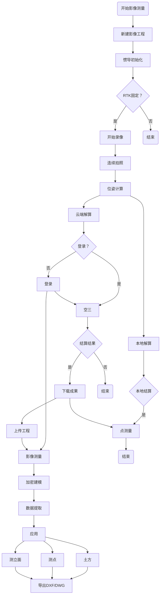

### 一、熟悉项目开发内容

每日鸡汤9.8
>“过去的33年里，我每天早上看着镜子问自己：“今天是我生命的最后一天吗？我是否要去做今天该做的事？”一天一天太多次是“不是”，我知道这需要改变…所有的事情——所有身外的期望，所有的骄傲，所有的对困难和失败的恐惧——这些东西在死亡面前立刻消失的无影无踪，只剩下真正重要的东西。想着自己即将死去，这是让我避免落入担心失去什么的陷阱里的最好的方法。” —— Steve Jobs

自己的想法
>当一个人越精于技术，越会发现技术是有限的，所以！我不做技术啦
---

* 学习目标：了解项目开发的需求、业务流程、技术方案、验证方案、标定方案。
* 时间背景：在9月1、2、3号都进行了PPT学习，实际执行时间9月7号到9月10号。
* 包括：技术方案、测试方法、竞品资料、技术原理、数据模型等。

---

#### 1.1技术方案

该项目名称：影像RTK技术-X16PRO项目
1.使用OpenCV+Kalibar进行内外参标定，将IMU位姿传递至图像位姿，方案可行；
2.基于OpenMVG的已知POS解算功能作为影像RTK算法的基础架构，使用SHIF方法提取特征，利用本质矩阵剔除误匹配，BA只优化图像位姿可行，性能达标可行；
3.使用块匹配和灰度相似性匹配技术寻找同名点技术可行；
4.基于开源建模目前看不可行；建模需要集成外部资源，实现风险较大；

技术流程图(ps:应该先定义每一个节点，再组织他们之间的关系)

#### 1.2测试方法

1.使用Pix4d利用GCP解算图像的精确位姿，仿真位置和姿态误差对OpenMVG解算结果的影响，位置误差容忍值约为3.5cm，水平姿态误差的容忍值约为0.3°；
具体操作步骤：

2.全局式曝光相机的解算结果优于卷帘式曝光相机的解算结果，主要差异体现在外参标定的结果；

1.参考:Pix4D+GCP解算作为真值
2.算法:基于openMVG已知Pose解算

相机1:0804-1、0804-2
相机2:1222-1、1222-2、1222-3

相机1:200w/彩色/卷帘；
相机2:130w/黑白/全局

#### 1.3竞品资料

(待补充)
1.GS18I性能指标符合datasheet,用户交互可借鉴，但需优化；
2.国内无人机航测数据处理相关公司多为高校背景，空三技术比较成熟，但针对影像RTK的场景数据其软件无法直接使用，需要专项开发优化；
3.SFM技术在国内还不算太成熟，以三维建模应用为主，测绘领域很少涉及；
中海达影像小蝶：精度较差

#### 1.4技术原理

详见论文：An Innovative Image-Based Surveying Approach for Globally Referenced Remote Point Measurements

#### 1.5数据模型

### 二、影像RTK代码学习

学习目标：熟悉代码，能够修改BUG、会发布版本。
时间背景：实际执行时间9月6号到9月20号。
包括：
重要工作任务：
1、已有的场景，基于新设备，做2轮测试。50组+数据。算法测试工作-点测量验证测试报告.docx
2、基于Pix4D验证新设备POS精度，验证速度对POS精度影像。算法测试工作-POS精度检验测试报告.docx

### 三、VSLAM学习

学习目标：基于影像RTK数据集跑通ORBSLAM3，得到点云数据。
时间背景：实际执行时间9月1号到9月30号。
包括：
