### 一、熟悉项目开发内容

* 学习目标：了解项目开发的需求、业务流程、技术方案、验证方案、标定方案。
* 时间背景：在9月1、2、3号都进行了PPT学习，实际执行时间9月7号到9月10号。
* 包括：技术方案、测试方法、竞品资料、技术原理、数据模型等。

---

#### 1.1技术方案

该项目名称：影像RTK技术-X16PRO项目
1.使用OpenCV+Kalibar进行内外参标定，将IMU位姿传递至图像位姿，方案可行；
2.基于OpenMVG的已知POS解算功能作为影像RTK算法的基础架构，使用SHIF方法提取特征，利用本质矩阵剔除误匹配，BA只优化图像位姿可行，性能达标可行；
3.使用块匹配和灰度相似性匹配技术寻找同名点技术可行；
4.基于开源建模目前看不可行；建模需要集成外部资源，实现风险较大；

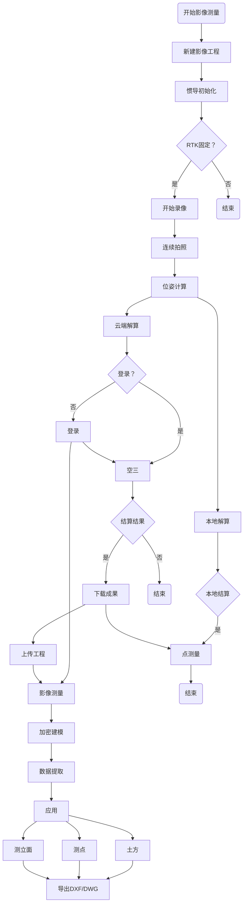

技术流程图(ps:应该先定义每一个节点，再组织他们之间的关系)

#### 1.2测试方法

* 技术方案验证：
1.使用Pix4d利用GCP解算图像的精确位姿，仿真位置和姿态误差对OpenMVG解算结果的影响，位置误差容忍值约为3.5cm，水平姿态误差的容忍值约为0.3°；
具体操作步骤：
2.全局式曝光相机的解算结果优于卷帘式曝光相机的解算结果，主要差异体现在外参标定的结果；
* 测量精度可行性分析：
1.参考:Pix4D+GCP解算作为真值
2.算法:基于openMVG已知Pose解算

相机1:0804-1、0804-2
相机2:1222-1、1222-2、1222-3

相机1:200w/彩色/卷帘；
相机2:130w/黑白/全局

#### 1.3竞品资料

* 总体上

1.GS18I性能指标符合datasheet,用户交互可借鉴，但需优化；
2.国内无人机航测数据处理相关公司多为高校背景，空三技术比较成熟，但针对影像RTK的场景数据其软件无法直接使用，需要专项开发优化；
3.SFM技术在国内还不算太成熟，以三维建模应用为主，测绘领域很少涉及；

* 中海达影像小蝶

影像处理的业务流程和关键技术

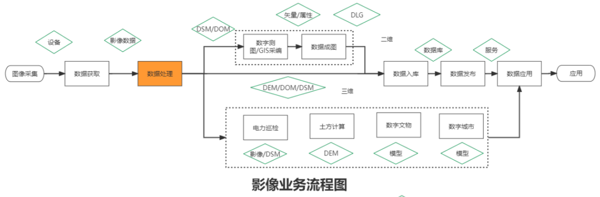

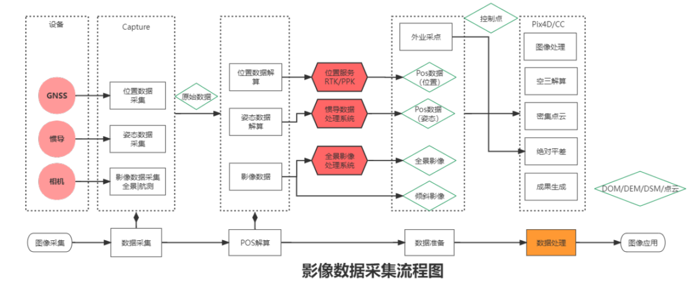

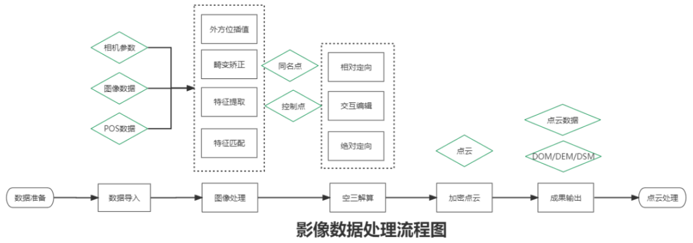

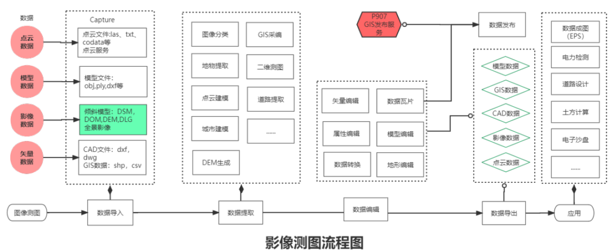
中海达几个软件在数据处理流程中的关系
1.数据采集    --->     2.空三加密    --->     3.建模矢量化     --->      4.编辑制图
Hi-Survery   --->       DP-Smart    --->       DP-Modeler     --->       HiData

初步测试结论：
1.影像测量距离2~3米，有时可以做到RTK测量精度，但是不稳定；
2.影响测量距离超过5米，水平精度超过5cm；
下面摄像头:50w
侧面摄像头:300w

* 天硕奥斯卡远景版 GNSS 接收机

测量精度：2cm-4cm(2D)
作业距离：2m-10m
传感器：230w像素
视场角：D:152°V:63°H:114
帧率：高达 120fps
焦距：3.2mm

#### 1.4技术原理

详见论文：An Innovative Image-Based Surveying Approach for Globally Referenced Remote Point Measurements

##### 1.4.1概述

借助GNSS/INS系统，结合3D位置和姿态估计与照相机和计算机视觉算法相结合，提供厘米级的全球参考位置，实现精确远程测量

解决的问题：GNSS信号差的地方进行测量，提高生产效率，改善用户体验
解决的问题具体来说：需要接触但是危险的地方、测量时间不够、信号差
优点：短时间、大量点、安全、灵活

实时估计ti时刻的位置和姿态，如果从不同角度和不同时期（ti、ti+1、ti+2、...）捕获对象，则可以在记录场景后立即在图像中通过摄影测量确定对象的位置。

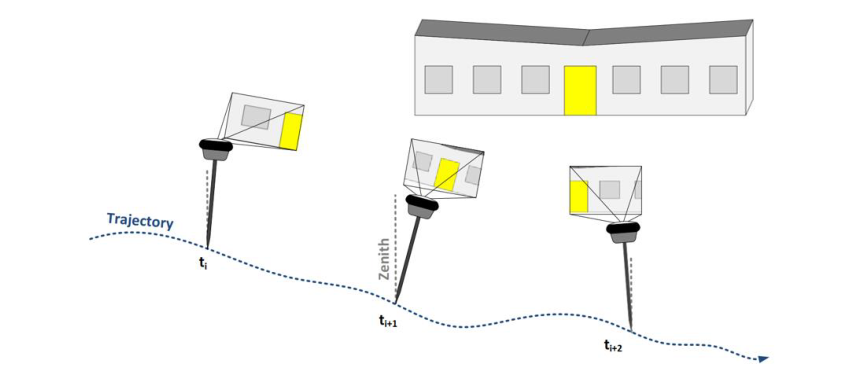

这种测量方法的核心要素是具有与捕获图像时的时期相对应的准确相机位姿信息。

##### 1.4.2相机位姿估计

最终精确相机位姿的估计通过两个步骤成功。首先，初始相机位姿通过 GNSS/INS 集成确定。
同时，从收集的图像中提取特征并从一张图像跟踪到下一张图像。
之后，提取的特征和相机位姿的初始估计被用于BA光束法平差以优化相机位姿确定。
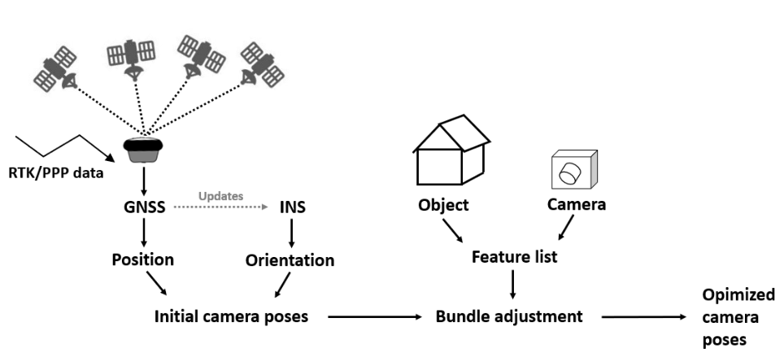

表示相机位姿估计优化过程的流程图

###### 1.4.2.1GNSS/INS 集成——初始化pose

GNSS定位信息定义了世界坐标系，其优点是摄影测量测量没有参考系转换。

随后的 GNSS/INS 集成提供了传感器的地理参考位置和方向，用于初始相机位姿信息。

每张图像都有一定的曝光时间，在几毫秒内变化。

图像的专用**时间戳**是曝光时间的中间，并且必须在同一时期估计相机位姿以确保时间同步

###### 1.4.2.2 BA优化位姿

在图像捕获过程中，传感器**同时**通过兴趣点检测算法从图像中提取特征

生成相应的特征以建立图像之间的几何连接

BA算法迭代优化相机姿态和从特征计算的3D对象点之间的几何结构

##### 1.4.3 影像点测量

在图像中捕获的目标点的坐标可以通过应用摄影测量方法获得，而无需与测量设备进行物理接触。

###### 1.4.3.1 影像点测量摄影测量前方交会——测量目标点

如果在两幅或多幅图像中捕获了一个目标点，则可以通过应用近景摄影测量方法确定目标点的坐标

图3示意性地说明了测量两个目标点P10和P20的过程。这些点在三个不同的图像（KF0、KF1和KF2）中捕获，相关的摄像机姿态（O0、O1和O2）可用。通过选择KF0、KF1和KF2中目标点的对应图像坐标，通过前方交会确定P10和P20的坐标
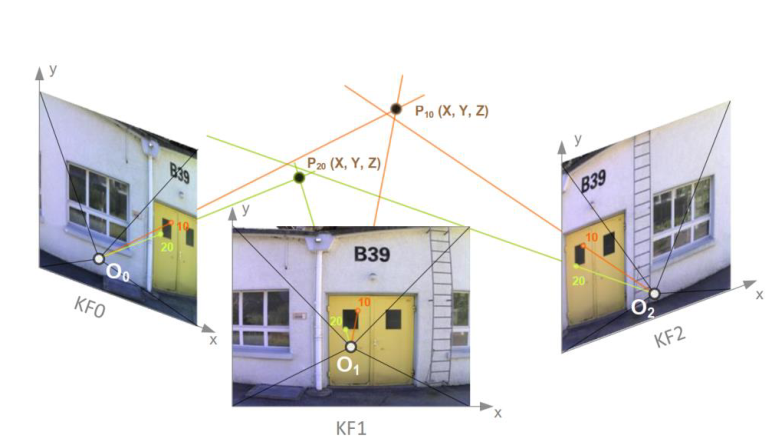

用于测量物点 P10 和 P20 的摄影测量前方交会点示意图

由于这种基于图像的测量方法直接估计了 GNSS 给出的全局参考框架中的相机位姿，因此确定的对象坐标会自动在同一坐标系中进行地理参考。

###### 1.4.3.2 匹配

核线是图像与核平面的交点，连接不同图像中的对应点（Hartley 和 Zisserman，2003）。匹配算法沿核线在不同图像中搜索由参考图像块定义的相似图案，并能够自动从不同图像中提取同一对象点的图像坐标。

为了总结整个工作流程，用户在单个图像中选择一个对象点，该对象点是最容易看到的。

匹配算法自主检测最多五个图像中的选定点，其中对象可见且可识别。

考虑相邻图像之间的最小视差以确保良好的交叉角。

最后，使用摄影测量前交点计算全局参考坐标。这种方法允许通过单击来测量对象点，从而提高可用性和生产力。
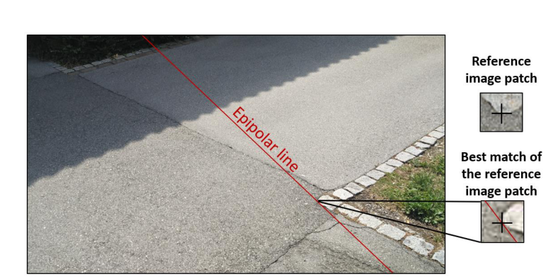

匹配算法沿着核线搜索参考图像块的最佳匹配以找到对应点

###### 1.4.3.3 性能分析

共收集到 149 个图像组，其中一个图像组是同一场景的一组图像和相机位姿。当系统靠近感兴趣的对象行走以记录场景时，所有数据集在几何、动态和环境条件方面都显示出不同的轨迹。在这 149 个图像组中，测量了 1075 个对象点。

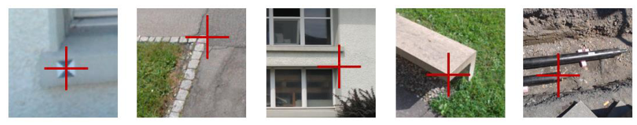
图 5 测量对象点的示例，例如摄影测量标记、石头边缘、窗角、混凝土边缘和管道

大约 80% 的 3D 误差在 5 cm 以内，其中相机到物体的距离在 2 m 到 10 m 之间。 3D 误差的中位数为 3.3 厘米，50% 的 3D 误差在 2.2 厘米到 4.6 厘米之间。

* 全局精度

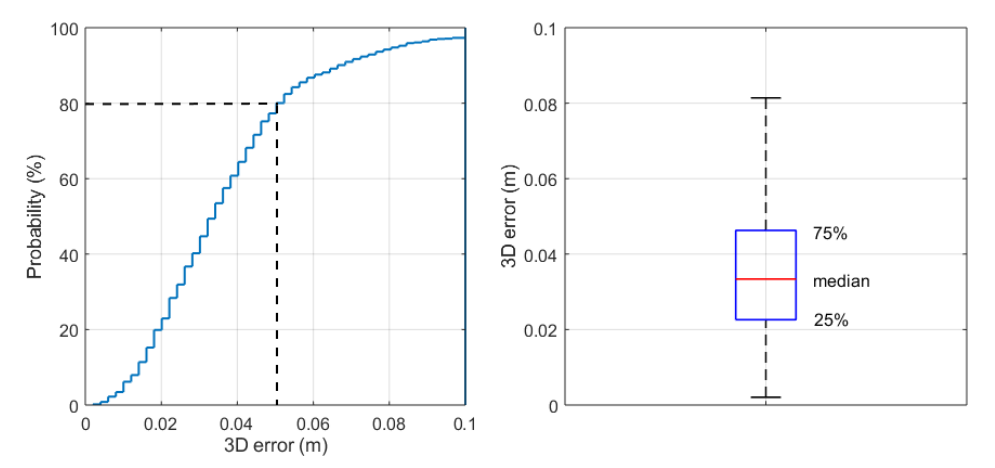

以米为单位的 1075 个基于图像的远程点测量的误差统计
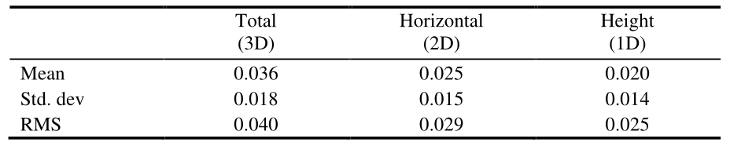

2D 和 1D RMS 误差分别为 2.9 cm 和 2.5 cm。整体 3D 精度为 4.0 厘米

* 可靠性

坐标质量（CQ）是测量点不确定性的指标

导出 CQ 值使得计算的位置与真实位置的偏差分别小于 1×CQ 或 3×CQ 的概率约为 68% (1-sigma) 或 99% (3-sigma)。术语可靠性计算为位置误差小于相应 CQ 值的一倍或三倍的百分比。考虑到所有 1075 个远程点测量，表 2 提供了 1×CQ 和 3×CQ 可靠性值。

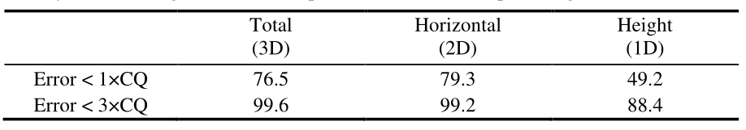

* 相对精度

所提出的基于图像的测量解决方案的另一个主要优点是可以实现两点之间距离的高相对精度，因为影响全局坐标估计的误差源通过差分大大减少。

如第 2.2 节所述，从收集的图像中提取的特征在后续图像之间建立几何连接，并且捆绑调整细化了相机位姿的相对方向和位置。

因此，同一图像组中两个物点之间距离的测量可以达到毫米级精度，因为例如影响 GNSS 定位的系统误差对相对精度的影响很小。

为了评估可实现的相对精度，测量了同一图像组中两点之间的距离。图 7 显示了建筑立面上不同方向的三个参考距离（2.098 m、1.410 m、9.212 m）。这些距离是在 42 个图像组数据集中测量的，其中地面实况是通过高精度全站仪获得的。
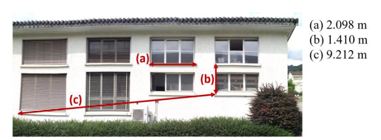

在建筑物立面上定义的参考距离，用于评估基于图像的测量系统的相对精度。

##### 1.4.4 总结

- 摄影测量测量直接在 GNSS 定义的全球参考框架中进行地理参考，无需额外耗时的后处理步骤或地面控制点。

- 以前 GNSS 漫游车无法进入的区域现在可以直接测量，无需任何额外设备。

- 使用这种基于图像的测量方法可以进行高精度远程点测量，其中 2D 和 1D RMS 误差分别为 2.9 cm 和 2.5 cm。

- 质量指标 (CQ) 是位置精度的可靠度量。测试结果表明，3D误差小于CQ的三倍，概率为99.6%。

- 可以高精度地执行同一图像组内的距离和面积测量。对测试用例的分析表明，大约 85% 的距离测量显示出小于 1 厘米的误差。

### 二、影像RTK代码学习

学习目标：熟悉代码，能够修改BUG、会发布版本。
时间背景：实际执行时间9月6号到9月20号。
包括：
重要工作任务：
1、已有的场景，基于新设备，做2轮测试。50组+数据。算法测试工作-点测量验证测试报告.docx(截至9月22日周四还未拿到仪器进行测量)
2、基于Pix4D验证新设备POS精度，验证速度对POS精度影响。算法测试工作-POS精度检验测试报告.docx(9月19日-9月21日已经完成，但未输出报告)

### 三、VSLAM学习

学习目标：基于影像RTK数据集跑通ORBSLAM3，得到点云数据。
时间背景：实际执行时间9月1号到9月30号。
包括：(由于还未拿到仪器，先学习如何自己建立数据集)

具体方式：
1、将影像按帧抽取，并以时间命名

2、修改yaml文件

3、./Monocular/EuRoC_TimeStamps/MH01.txt  时间戳，用第一步修改的影像帧文件名代替

4、运行命令即可

### 问题
中海达测量方式，好像是绕圈，天硕不知道