本月的学习笔记总结了10月、11月两个月的问题和经验

## 工作上

### 10月(8号国庆回来)

大部分时间在测试影像精度
关于如何查找影像RTK的影像测量功能精度不对的原因：

1. 首先用表格总结当天影像测量任务单点测量的精度，寻找误差较大的影像组；
2. 排除选点错误和刺点错误的情况，随后使用pix4空三解算查看pix4d空三的结果与原始测量的角度、坐标差值、VRTK代码空三与原始测量值、VRTK代码空三与pix4d空三结果比较；
3. 分析是什么因素导致其误差较大的原因，反馈给老师；
4. 利用修改后的算法继续测试；

目前最好的精度测量方式：
**走动一段距离后再测量**
在一共40组测量数据中，单点测量的平面和3D误差小于5cm的比例达到97.5%，仅有一组超过5cm小于10cm。

### 11月

学习了rosbag的解析办法，并尝试解析了影像RTK数据，ORBSLAM3跑通影像RTK数据。
暂时目标：接入实时影像数据跑orbslam

跑的结果
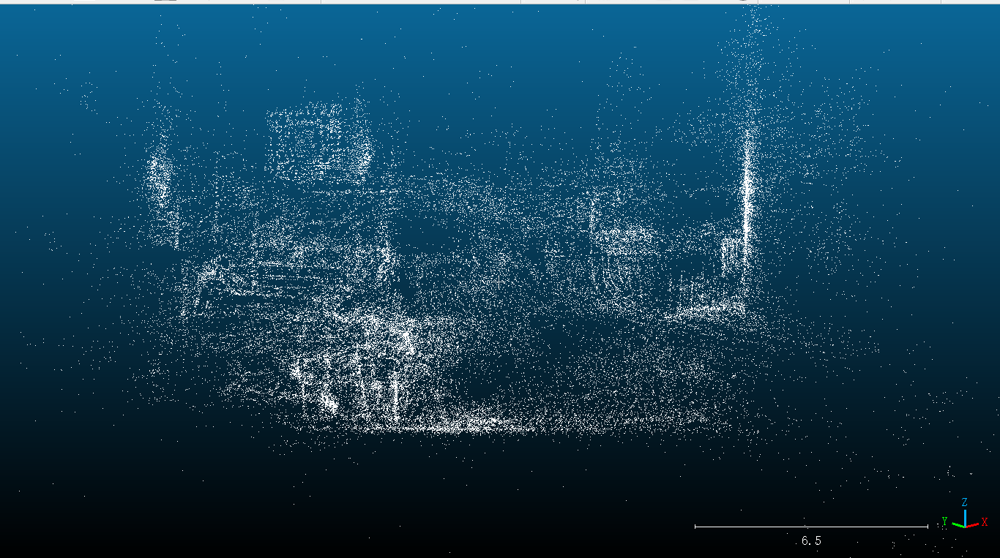

### 完成Smart3D CC 大势智慧-建图大师 CoPre2的安装和数据处理

## 学习上

### C++基本语法学习

首先是学习C++的类
输出了udp Demo

然后是C++的设计模式

1. 创建型模式

- 单例模式
- 简单工厂
- 工厂模式
- 抽象工厂
- 建造者模式
- 原型模式
Demo还在写

2. 结构型模式

3. 行为型模式

### 视觉SLAM十四讲

已经看到第9讲，习题正在补充中
补充

2022.11.20还剩最后一讲13讲：设计SLAM系统

SLAM习题等待补充

#### 实践前的准备

**CMake的学习**
关于CMAKE目前只学习了一些简单的编译库和内置变量，相关资料有CMake practice和CMake cookbook

> <https://www.bookstack.cn/read/CMake-Cookbook/content-preface-preface-chinese.md>

1. 关于slambook2的克隆
由于这本书在克隆的时候包含第三方子模块，这时候想要完整克隆第三方库的话，需要在克隆时加上 --recursive

>某一个项目仓库的一些子模块是通过链接的方式链接到主项目目录上的。而这些子模块的仓库是单独建立在另外的目录下（更多是因为版权问题，使用别人的模块时，并没有直接把源码和自己的项目代码一起上传到自己的仓库，而是通过链接的形式链接到三方

```git
git clone --recursive  https://github.com/gaoxiang12/slambook2.git
```

当然也会遇到一些网速问题导致其他某些子模块克隆失败

可以采用下面这个命令更新所有子模块，单独更新某一具体的子模块我还没找到，以后更新吧。

```git
git submodule update --init --recursive
```

参考：
> <https://blog.csdn.net/toopoo/article/details/104225592>

我到最后还有一个3rdparty/Pangolin/external/pybind11没有克隆完成，不过这个不影响，在配置orbslam3的时候已经克隆好Pangolin0.6了

2. 完成所有第三方库的编译和安装

其实slambook里面坑也蛮多的例如CMakelists的问题

当然本节主要讨论如何把需要的第三方库安装到Ubuntu18.04.6的/usr/local等目录下(也可以不安装，但是安装这样做的好处就是不需要修改每个代码的#include "xxx/xxx.h")

**我的安装过程唯一用slambook2内部的的3rdParty/g2o，其他的都未用slambook2内部克隆下来的库**
本来我的想法是与slambook2保持一致，结果他的好多库编译都出错，所以记录一下

**步骤1：ceres库安装**
若使用slambook2内部的ceres目录下的ceres编译则会报 ' variable or field ‘it’ declared void'
原因我的Eigen3.3.90与之版本不对应，需要用Eigen3.3.7

服了Eigen卸载有点让人难受，所以直接克隆最新版ceres
编译和安装过程都很正常

**步骤2：DBoW3库安装**
也是直接克隆最新版的，没有使用slambook2的
原因：我当时发现slambook2里面有，因为没有用--recursive克隆

**步骤3：g2o库安装**
正常编译安装即可

**步骤4：Sophus库安装**
使用最新的git clone
先安装fmt，再安装Sophus

#### 第二章实践

暂时先放置，相对简单

#### 第三章实践

3.2 实践：Eigen
学会使用 Eigen的相关变量及其函数

> 参考网址：<http://eigen.tuxfamily.org/dox-devel/modules.html>

3.6 实践：Eigen 几何模块

> Eigen 几何模块参考：<http://eigen.tuxfamily.org/dox/group__TutorialGeometry.html>

| 矩阵      | Eigen类型 | 具体使用例子    |  备注 |
| ----------- | ----------- | --------- | ------ |
| 3D旋转矩阵(3x3)      | Matrix3d |  `Matrix3d r = Matrix3d::Identity()` 归一化|
| 旋转向量(3x1)   | AngleAxisd   | 有很多构造函数：`AngleAxisd r(M_PI/4,Vector3d(0,0,1));` |
| 欧拉角(3x1) |  Vector3d [旋转矩阵.eulerAngles(2,1,0)] | ZXY顺序| roll pitch yaw|
| 欧氏变换矩阵(4x4) |  Isometry3d | `Isometry T = Isometry::Identity();//虽然称之为3d，实际上是4*4的矩阵` |
| 四元数(4x1) | `Quaterniond q = Quaterniond(r_v)` `q = Quaterniond(r_m)` | 直接把AngleAxis赋给四元数，反之也可以| `q.coeffs()` (x,y,z,w),w为实部 `q*v`:数学上是qvq^-1,等于`q*v*q.inverse()` |
| 仿射变换(4x4) | Affine3d | | |
| 射影变换(4x4) | Projective3d | | |

关于欧式变换矩阵的旋转和平移：
`T.rotate(r);T.pretranslate(Vector3d(1,3,4))`

3.7 轨迹可视化
利用plotTrajectory程序稍作修改，可以将ORBSLAM3跑园区的数据存储下来的关键帧轨迹和相机轨迹显示出来

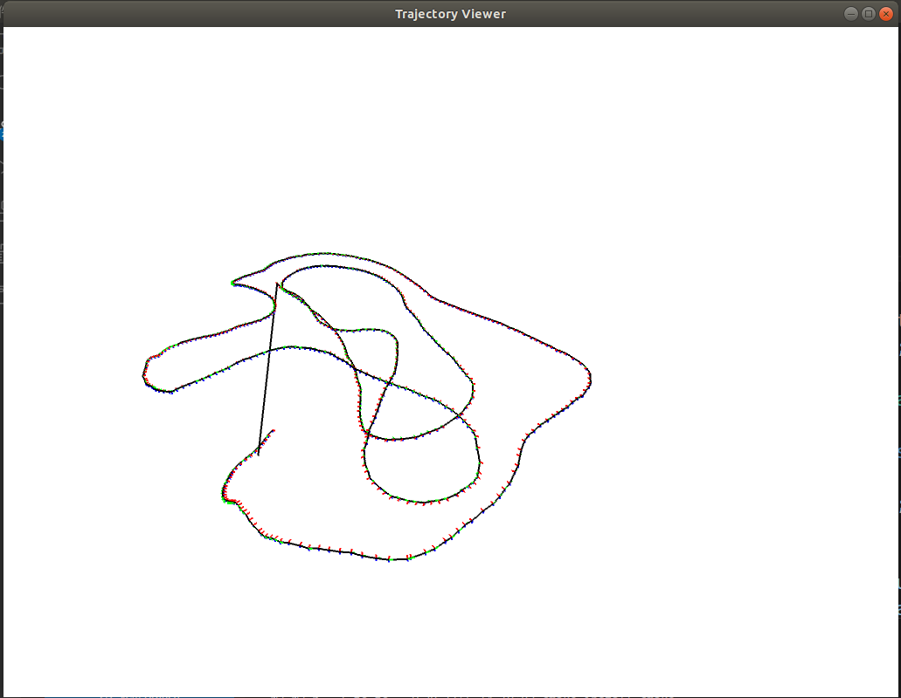
         KeyFrameTrajectory.png
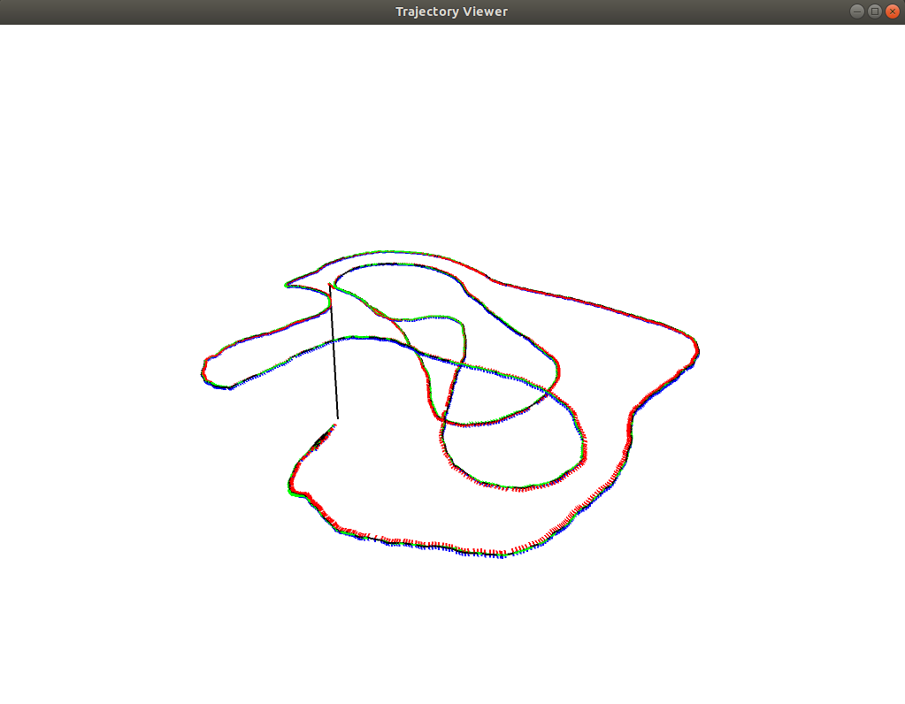
CameraTrajectory.png
可以看出来相机的轨迹图比关键帧的轨迹更加稠密（废话）

存储格式：time,tx,ty,tz,qx,qy,qz,qw

严格的说，存储的是相机坐标系原点OR在世界坐标系中的坐标OW

OW = TWR * OR = tWR

从TWR中可以直接看到相机在何处，所以可视化程序中，为了直观，轨迹文件存储了TWR而不是TRW

使用的可视化库为Pangolin支持OpenGL

> OpenGL 参考：<https://www.bookstack.cn/books/OpenGL>

#### 第四章实践 - Sophus

CMakelists 里需要链接fmt库，具体使用办法：
find_package(fmt REQUIRED)
set(FMT_LIBRARIES fmt::fmt)

target_link_libraries(trajectoryError ${Pangolin_LIBRARIES} ${FMT_LIBRARIES})

> <https://blog.csdn.net/CSSDCC/article/details/121854773>

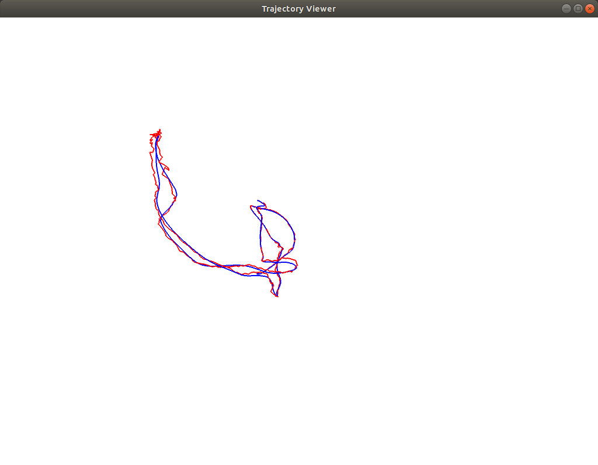

#### 第五章实践 - 相机与图像

暂时先把结果图放上来，有关CMakelists的修改如下
参考第四章的fmt
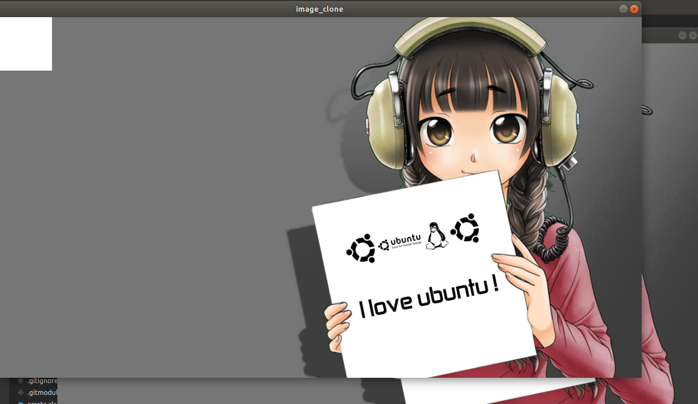

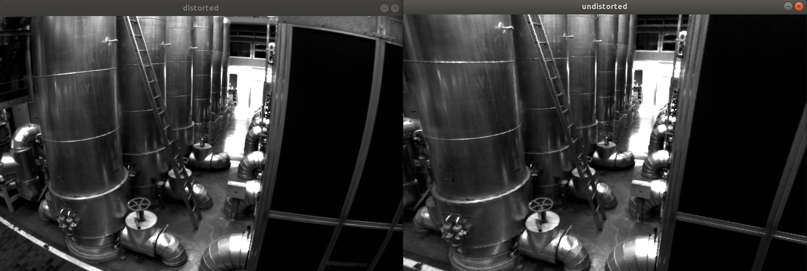

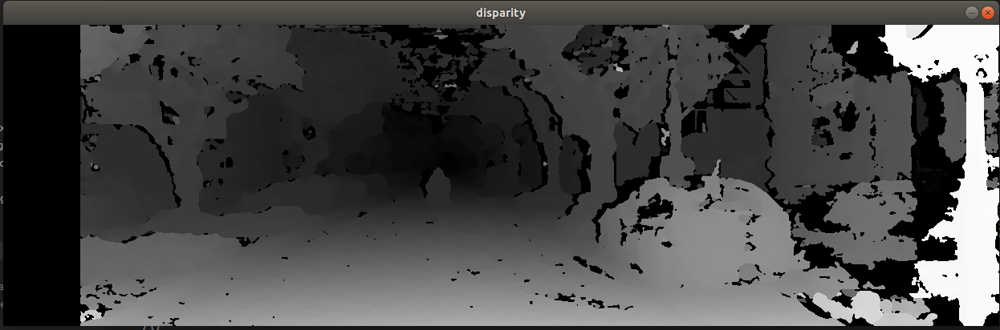

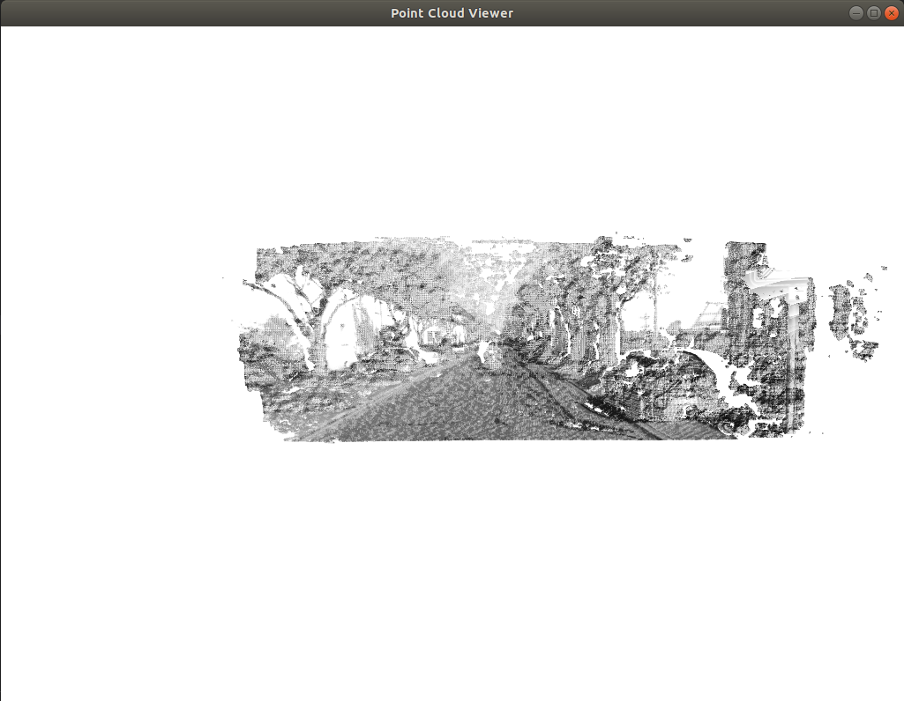

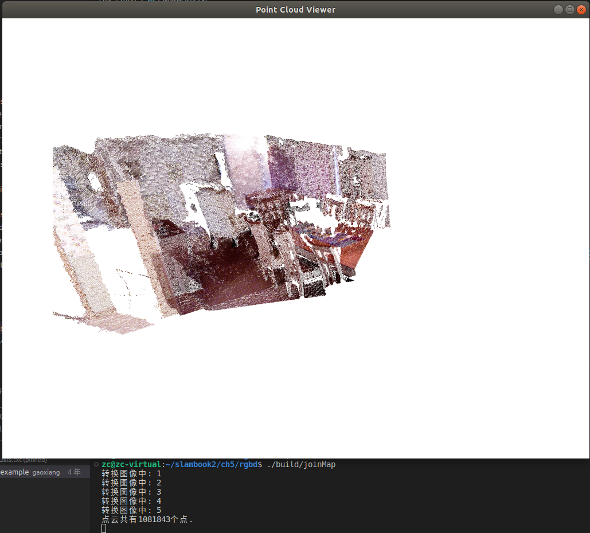

#### 第五章实践 - 非线性优化

参考第四章的fmt

实践的结果就是和书上一样

> ceres 参考：https:ceres-solver.org/tutorial.html

> g2o 参考：doxygen doxy.config生成的

#### 第七章实践 - 视觉里程计1

再参考第四章链接fmt库即可
每一个可执行文件都需要链接

#### 第八章实践 - 视觉里程计2

```CMake
find_package(OpenCV 4 REQUIRED)
#find_package(OpenCV 3.0.0 REQUIRED)# 2个opencv的使用办法
```

再参考第四章链接fmt库即可

编译如果报error: 'CV_GRAY2BGR' was not declared in this scope的错误
只需要在cpp文件中加入#include <opencv2/imgproc/types_c.h>这句话即可完美编译

**如何在项目中区分使用opencv3和opencv4而不会产生冲突**

> <https://blog.csdn.net/qq_43525260/article/details/104152392>

#### 第九章实践 - 后端1

fmt

#### 第十章实践 - 后端2

fmt

#### 第十一章实践 - 回环检测

改成opencv4

#### 第十二章实践 - 建图

**编译前的事情**

1. 安装PCL点云库

sudo apt-get install libpcl-dev pcl-tools

2. 安装octmap

> <https://blog.csdn.net/zhiwei121/article/details/90605096>
书上说18.04版本之后，可用按照书上的命令行，我的是18.04.6，没有尝试
sudo apt-get install liboctomap-dev octovis
**编译程序**

##### 12.3 单目稠密重建

首先需要去下载数据，然后运行数据集

下载结束解压后我放在ch12/dense_mono/ 下

运行程序：
zc@zc-virtual:~/slambook2/ch12/build$ ./dense_mono/dense_mapping ../dense_mono/test_data/

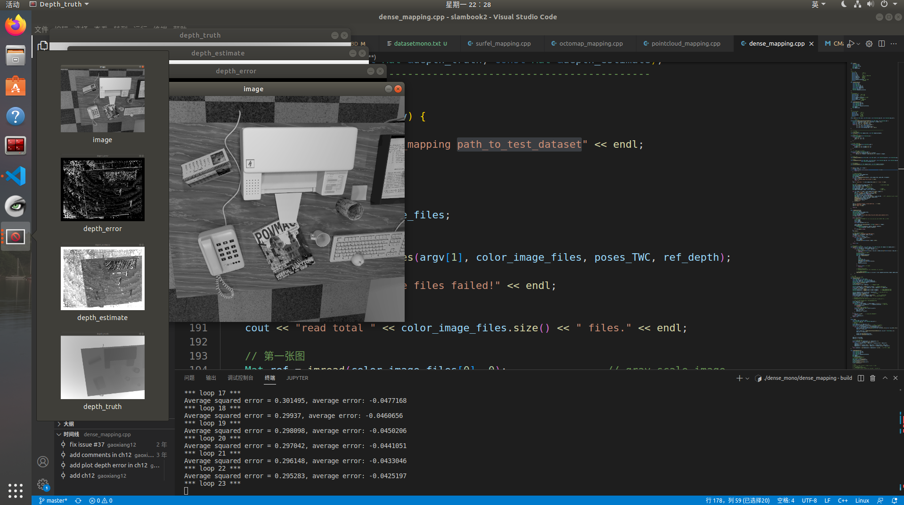

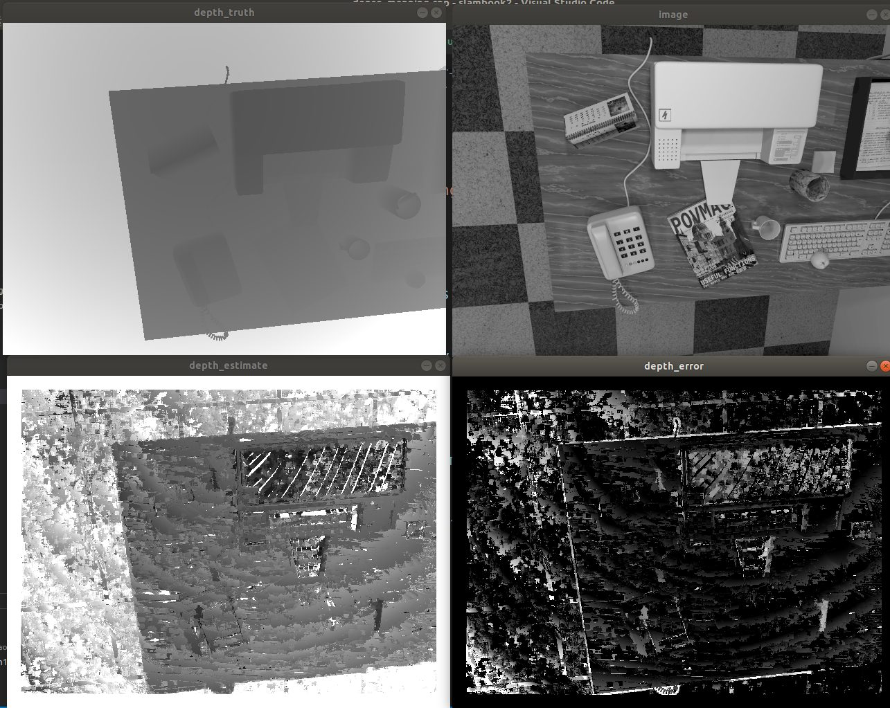

##### 12.4 RGB-D 稠密重建

###### 12.4.1 点云地图

运行程序：
../build/dense_RGBD/pointcloud_mapping

运行结果：
正在将图像转换为点云...
转换图像中: 1
转换图像中: 2
转换图像中: 3
转换图像中: 4
转换图像中: 5
点云共有1309800个点.
滤波之后，点云共有31876个点.

pcl-viewer查看：
pcl_viewer -i map.pcd

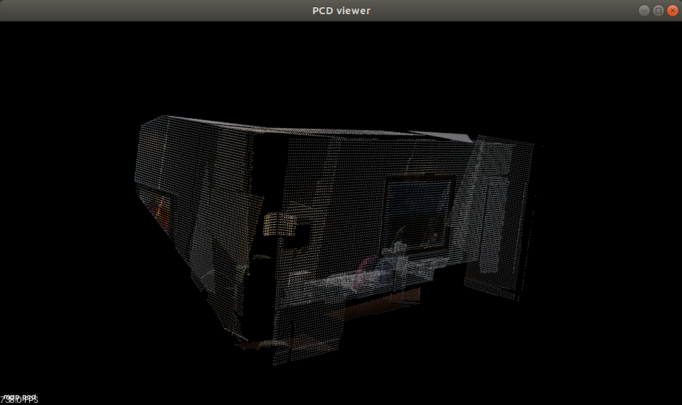

###### 12.4.2 点云重建网格

重建的算法是 Moving Least Square 和 Greedy Projection
//TODO 参考文献
> 参考文献: [130] [131]

运行程序：
../build/dense_RGBD/surfel_mapping map.pcd

运行结果：
point cloud loaded, points: 31876
computing normals ...
computing mesh ...
display mesh ...

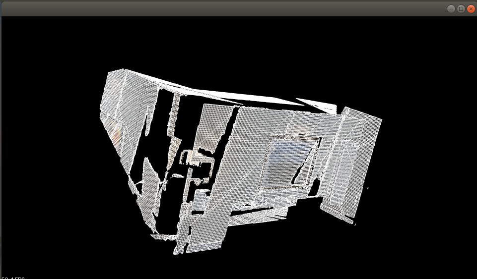

###### 12.4.3 八叉树地图

不同分辨率的条件下
深度为1：

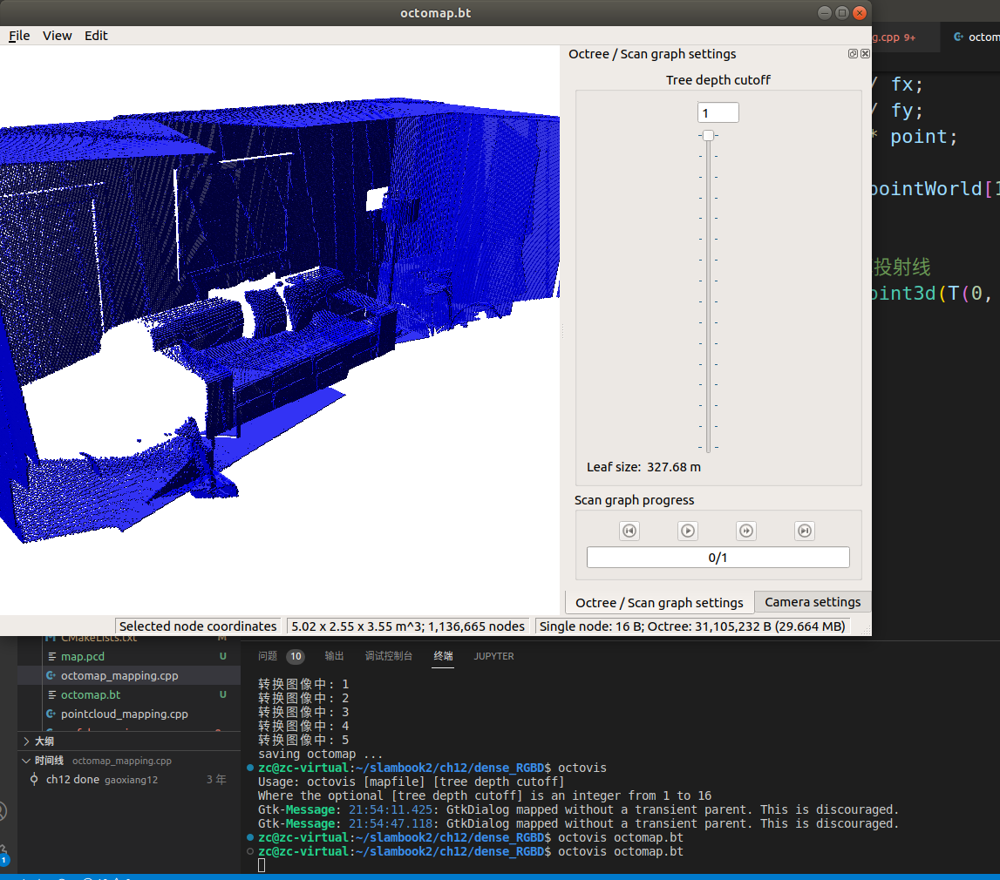

深度为5：
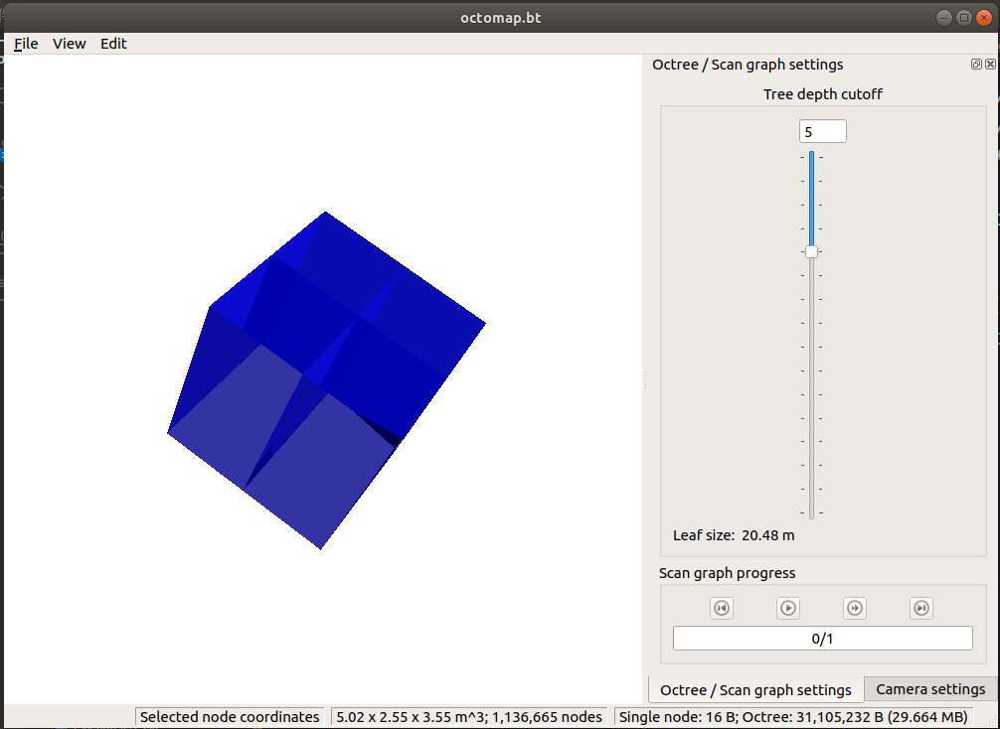

深度为16：
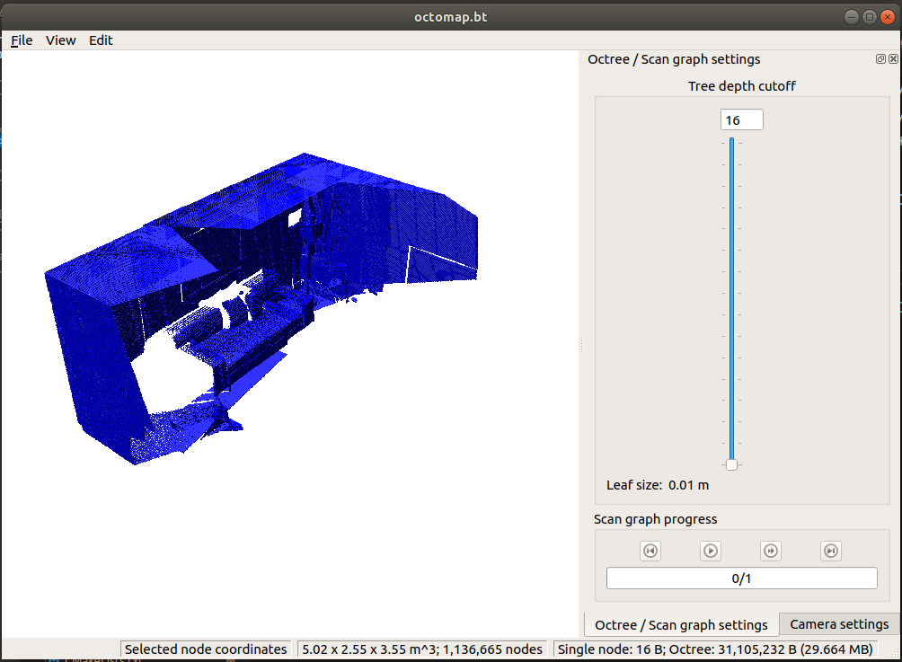

##### 实时三维重建

TSDF地图和Fusion系列

TSDF 是 Truncated Signed Distance Function 的缩写
截断符合距离函数

TSDF地图也是网格式地图，存储于显存中，对深度图依赖更深

#### 第十三章实践 - 设计SLAM系统

关于配置环境
> <https://blog.csdn.net/jiachang98/article/details/121700288>

//TODO
完成6个设计模式的Demo

单例模式

### 存在的问题

rostopic发布时存在卡顿的情况，暂时还未解决
