### 首先12月的主要目标是

> 发现还是得先看不熟悉的代码，去做，这样比看完整本slam十四讲进步快的多

1.c++学习；
2.orbslam算法修改；
3.建模需求对接；
4.空三算法分析；

#### 分解在学习上：

1. cmake、23中设计模式、uml、git
2. 输出带地理坐标的点云和位姿；
3. 输出地面点精度；

#### 分解在工作上：

##### 三维建模分析

建模效果分析，跟进和对接copre建模需求。

1. 三维建模软件学习，数据分析
2. 对接copre建模需求
列了需求和问题表，但是自己的不足之处在于做的表格不够清晰

##### 空三算法分析

1.前期测试数据补充；
2.pos影响精度，论证；（方法、数据）


### 具体工作情况

为了添加上R t 需要做的首先是熟悉单目+IMU构建的具体

经过讨论发现，在最开始的时候由于没有GNSS位置，就需要使用R t找到第一帧的相机中心在投影坐标系下的坐标，由此可以推算出所有地图点的投影坐标。
但是 加入R t进行优化还需要研究


#### 编译VINSFusion

首先安装ceres最新版编译报错：Parameter……
随后发现还是11月学习笔记中说到的ceres2.1.0与opencv3.3.90冲突（十四讲的安装最新版就不会报错）

遂改成Eigen3.3.7，
先卸载：https://blog.csdn.net/qq_45401419/article/details/118358687
再下载、编译：https://blog.csdn.net/reasonyuanrobot/article/details/114372363

Ceres1.14.0编译,记得先按照官方教程装一些依赖库
https://blog.csdn.net/qq_41586768/article/details/107541917

最后编译VINFusion
catkin_make

成功

用到了11月的学习笔记中的第八章opencv共存的问题
改成OpenCV 3.0.0之后成功的
```CMake
find_package(OpenCV 4 REQUIRED)
#find_package(OpenCV 3.0.0 REQUIRED)# 2个opencv的使用办法
```

随后编译成功

编译成功后采用2种方案提供bag包跑vins+GPS
1. 使用907设备采集的2Hz图像和BLH提高频率，始终无法让vins+GPS跑通

2. 用410采集IMU和Image，907采集BLH，组合成bag包，能够跑通，但是不流畅

目前还在努力工作，让bag包更完善

最后流畅正确的跑通后再进行绝对精度的评定

### 类与类之间的关系5种

#### 1泛化

表示类与类之间的继承关系，接口与接口之间的继承关系，或类对接口的实现关系。一般化的关系是从子类指向父类的，与继承或实现的方法相反。
[使用方式]
在类图中使用带三角箭头的实线<|--或虚线<|..表示，箭头从子类指向父类。
[具体表现]
父类 父类实例＝new 子类()

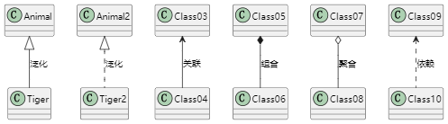

#### 2依赖

对于两个相对独立的对象，当一个对象负责构造另一个对象的实例，或者依赖另一个对象的服务时，这两个对象之间主要体现为依赖关系。
[使用方式]
在类图使用带箭头的虚线<..表示，箭头从使用类指向被依赖的类
[具体表现]
依赖关系表现在局部变量，方法的参数，以及对静态方法的调用
[现实例子]
比如说你要去拧螺丝，你是不是要借助(也就是依赖)螺丝刀(Screwdriver)来帮助你完成拧螺丝(screw)的工作

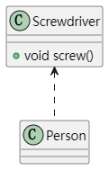

#### 3关联

对于两个相对独立的对象，当一个对象的实例与另一个对象的一些特定实例存在固定的对应关系时，这两个对象之间为关联关系。
[表示方式]
在类图使用带箭头的实线--表示，箭头从使用类指向被关联的类。可以是单向和双向
[具体表现]
关联关系是使用实例变量来实现
[现实例子]
比如客户和订单，每个订单对应特定的客户，每个客户对应一些特定的订单；再例如公司和员工，每个公司对应一些特定的员工，每个员工对应一特定的公司

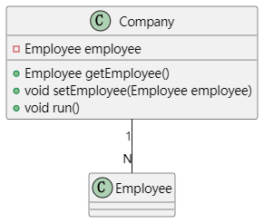

#### 4聚合

当对象A被加入到对象B中，成为对象B的组成部分时，对象B和对象A之间为聚集关系。聚合是关联关系的一种，是较强的关联关系，强调的是整体与部分之间的关系。
[表示方式]
在类图使用空心的菱形o--表示，菱形从局部指向整体。
[具体表现]
与关联关系一样，聚合关系也是通过实例变量来实现这样关系的。关联关系和聚合关系来语法上是没办法区分的，从语义上才能更好的区分两者的区别。
[关联与聚合的区别]
(1)关联关系所涉及的两个对象是处在同一个层次上的。比如人和自行车就是一种关联关系，而不是聚合关系，因为人不是由自行车组成的。
聚合关系涉及的两个对象处于不平等的层次上，一个代表整体，一个代表部分。比如电脑和它的显示器、键盘、主板以及内存就是聚集关系，因为主板是电脑的组成部分。
(2)对于具有聚集关系（尤其是强聚集关系）的两个对象，整体对象会制约它的组成对象的生命周期。部分类的对象不能单独存在，它的生命周期依赖于整体类的对象的生命周期，当整体消失，部分也就随之消失。比如张三的电脑被偷了，那么电脑的所有组件也不存在了，除非张三事先把一些电脑的组件（比如硬盘和内存）拆了下来。

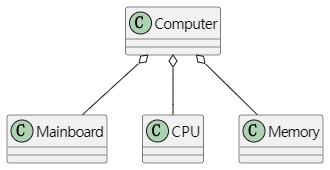

#### 5组合

代表整体的对象负责代表部分对象的生命周期。部分不能脱离整体存在
[表示方式]
在类图使用实心的菱形*--表示，菱形从局部指向整体

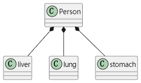

### UML图7种

> 参考：https://plantuml.com/zh/guide

#### 1用例图

用例
用例用圆括号括起来（两个圆括号看起来就像椭圆）。
也可以用关键字 usecase 来定义用例。还可以用关键字 as 定义一个别名，这个别名可以在以后定义关
系的时候使用。

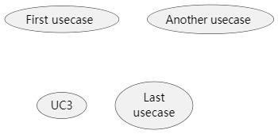

角色用两个冒号包裹起来。
也可以用 actor 关键字来定义角色。还可以用关键字 as 来定义一个别名，这个别名可以在以后定义关
系的时候使用。

火柴人 默认

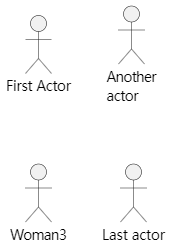

用户头像

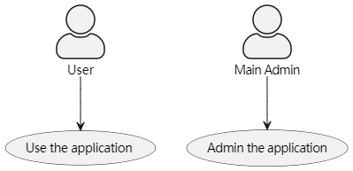

用箭头--> 连接角色和用例。
横杠-越多，箭头越长。通过在箭头定义的后面加一个冒号及文字的方式来添加标签。

#### 2类图

见 类关系.md

#### 3对象图
(感觉和类图很像)
使用关键字 object 定义实例。

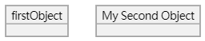

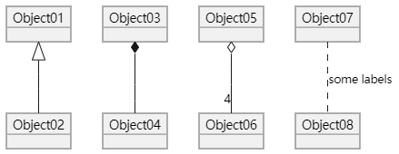

用冒号加属性名的形式声明属性。
也可以用大括号批量声明属性

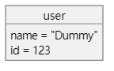


#### 4时序图
plantUML的例子
https://plantuml.com/zh/sequence-diagram

有一个在线的网站看可以在线画时序图
https://www.websequencediagrams.com/
例子

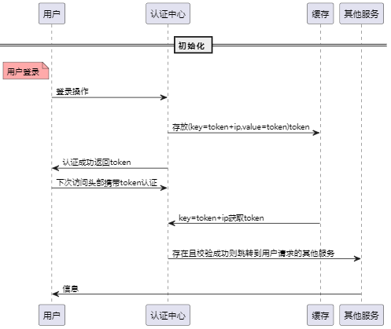

关键字 activate 和 deactivate 用来表示参与者的生命活动。
一旦参与者被激活，它的生命线就会显示出来。

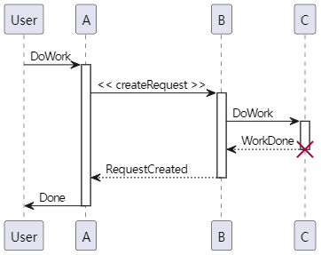

也可以使用自动激活关键字（autoactivate），这需要与 return 关键字配合：

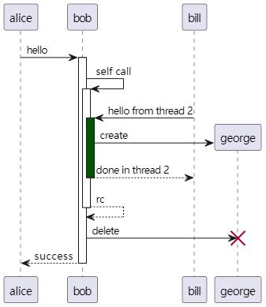

包裹参与者
可以使用 box 和 end box 画一个盒子将参与者包裹起来。
还可以在 box 关键字之后添加标题或者背景颜色。

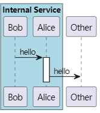

#### 5活动图

使用 (*) 作为活动图的开始点和结束点。
有时，可能想用 (*top) 强制开始点位于图示的顶端。
使用--> 绘制箭头。

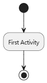

可以使用-> 定义水平方向箭头，还可以使用下列语法强制指定箭头的方向：
• -down-> (default arrow)
• -right-> or ->
• -left->
• -up->

可以使用关键字 if/then/else 创建分支。

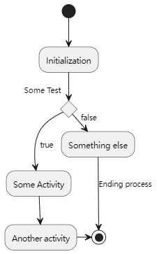

用关键字 partition 定义分区，还可以设置背景色 (用颜色名或者颜色值)。
定义活动的时候，它自动被放置到最新的分区中。
用} 结束分区的定义。

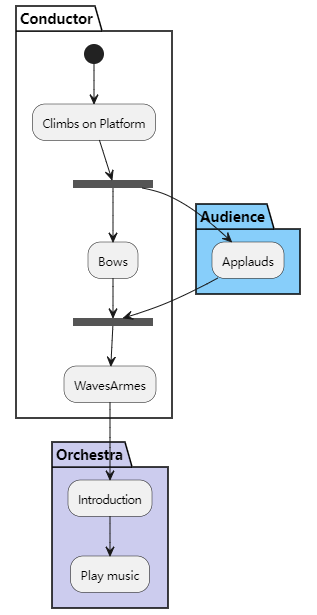

#### 6状态图

使用 ([*]) 开始和结束状态图。
使用--> 添加箭头。

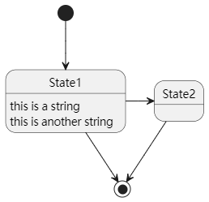

#### 7部署图

声明元素

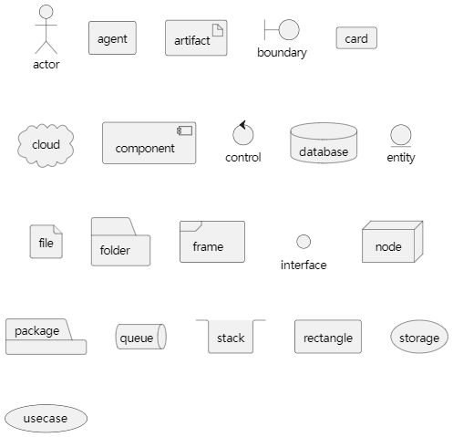

可以在元素之间创建简单链接

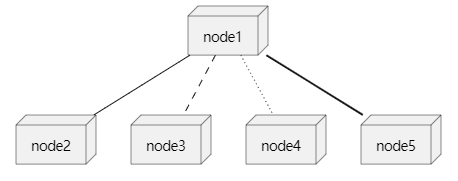

### 创建型模式5

#### 1单例模式

https://blog.csdn.net/weixin_45712636/article/details/124328504

创建型模式 :  通常和对象的创建有关，涉及到对象实例化的方式。（共5种模式)
结构型模式： 描述的是如何组合类和对象以获得更大的结构。(共7种模式)
行为型模式： 用来对类或对象怎样交互和怎样分配职责进行描述。(共11种模式)

设计模式基本原则
开放封闭原则、单一职责原则、依赖倒置原则、接口隔离原则、里氏替换原则、优先使用组合而不是继承原则、迪米特法则

单例模式（Singleton Pattern）是保证一个类仅有一个实例，并提供一个访问它的全局访问点。

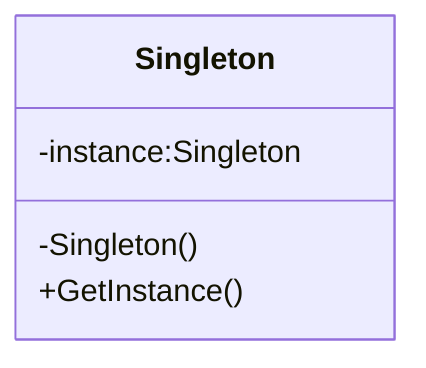

单例的好处/原因：

- 在多个线程之间，比如初始化一次socket资源

- 在整个程序空间使用全局变量，共享资源

- 大规模系统中，为了性能的考虑，需要节省对象的创建时间等等

实现单例步骤：

- 构造函数 私有
- 提供一个全局的静态方法
- 在类中定义一个静态指针，指向本类的变量的静态变量指针

//TODO
把变量和函数名规范化

懒汉式

```C++
#include <iostream>
using namespace std;

class Singleton
{
private:
    Singleton(){
        m_singer =NULL;
        m_count = 0;
        cout << "Construct Singleton done"<< endl;
    }
public:
    static Singleton *getInstance(){
        if(m_singer == NULL){ //懒汉式：1 每次获取实例都要判断 2 多线程会有问题
            m_singer = new Singleton;
        }
        return m_singer;
    }
    static void printT(){
        cout << "m_count:"<<m_count <<endl;
    }
private:
    static Singleton *m_singer;
    static int m_count;
};

Singleton *Singleton:: m_singer = NULL;//懒汉，没有创建单例对象
int Singleton:: m_count = 0;

int main(){
    cout << "perform lazyguy" << endl;
    Singleton *p1 = Singleton::getInstance(); //只有在使用的时候，才去创建对象。
    Singleton *p2 = Singleton::getInstance();
    if (p1 != p2)
	{
		cout << "not the same instance" << endl;
	}
    else
	{
		cout << "same instance" << endl;
	}
    p1->printT();
	p2->printT();
    system("pause");
	return 0;
}
```

使用DevC++编译后结果:
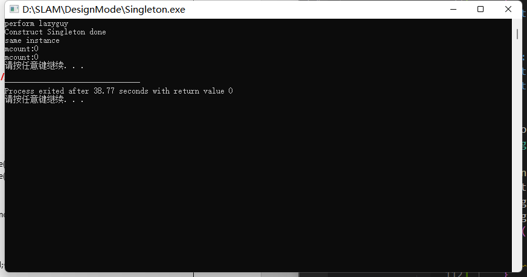

饿汉式

```C++
class  Singelton2
{
private:
	Singelton2()
	{
		m_singer = NULL;
		m_count = 0;
		cout << "Construct Singelton2 done" << endl;
	}
	
public:
	static Singelton2 *getInstance()
	{
// 		if (msinger == NULL )
// 		{
// 			msinger = new Singelton2;
// 		}
		return msinger;
	}
	static void freeInstance()//提供释放资源的函数
	{
		if (msinger != NULL)
		{
			delete msinger;
			msinger = NULL;
			mcount = 0;
		}
	}
	static void printT()
	{
		cout << "mcount: " << mcount << endl;
	}
private:
	static Singelton2 *msinger;
	static int mcount;
};

Singelton2 *Singelton2::msinger = new Singelton2; //不管你创建不创建实例，均把实例new出来
int Singelton2::mcount = 0;
```

使用DevC++编译后结果:
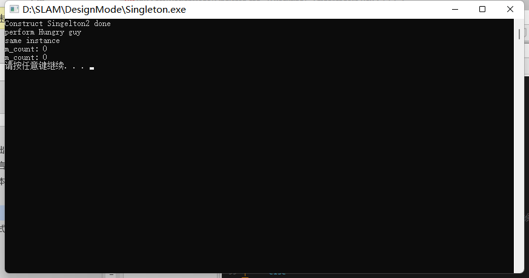

关于懒汉模式在多线程的优化：

- NULL == m_instance，使程序相对开销增大
- 多线程中会导致多个实例的产生，从而导致运行代码不正确以及内存的泄露
    C++中的构造函数简单来说分两步：
        第一步：内存分配
        第二步：初始化成员变量
        由于多线程的关系，可能当我们在分配内存好了以后，还没来得急初始化成员变量，就进行线程切换，另外一个线程拿到所有权后，由于内存已经分配了，但是变量初始化还没进行，因此打印成员变量的相关值会发生不一致现象。

```c++
//#include "stdafx.h"
#include "windows.h"
#include "winbase.h"
#include <process.h>
#include "iostream"

using namespace std;
class Singelton
{
private:
	Singelton()
	{
		count ++;
		cout<<"Singelton Construct begin\n"<<endl;
		Sleep(1000);
		cout<<"Singelton Construct end\n"<<endl;
		
	}
private:
	//防止拷贝构造和赋值操作
	Singelton(const Singelton &obj) { ;}
	Singelton& operator=(const Singelton &obj)	{ ;}
public:
	static Singelton *getSingelton()
	{
		//1"懒汉"模式虽然有优点，但是每次调用GetInstance()静态方法时，必须判断
		//	NULL == mInstance，使程序相对开销增大。
		//2多线程中会导致多个实例的产生，从而导致运行代码不正确以及内存的泄露。
		//3提供释放资源的函数
		return single;
	}

	static Singelton *releaseSingelton()
	{
		if (single != NULL) //需要判断
		{
			cout<<"release resources\n"<<endl;
			delete single;
			single = NULL;
		}
		return single;
	}
	void pirntS() //测试函数
	{
		printf("Singelton printS test count:%d \n", count);
	}

private:
	static Singelton *single;
	static int count;
};

//note 静态变量类外初始化
Singelton *Singelton::single = new Singelton();
int Singelton::count = 0;

int test01(int argc, char* argv[])
{
	Singelton *s1 = Singelton::getSingelton();
	Singelton *s2 = Singelton::getSingelton();
	if (s1 == s2)
	{
		cout<<"ok....equal"<<endl;
	}
	else
	{
		cout<<"not.equal"<<endl;
	}
	s1->pirntS();
	Singelton::releaseSingelton();
	cout <<"hello...."<<endl;
	system("pause");
	return 0;
}

unsigned int threadfunc2(void *myIpAdd)
{
	int id = GetCurrentThreadId();
	printf("\n threadfunc%d \n", id);
	return 1;
}

void threadfunc(void *myIpAdd)
{
	int id = GetCurrentThreadId();
	printf("\n threadfunc%d \n", id);
	 Singelton::getSingelton()->pirntS();
	return ;
}

 int main(int argc, char* argv[])
{
	int i = 0; 
	DWORD dwThreadId[201], dwThrdParam = 1;
	HANDLE hThread[201]; 
	int threadNum = 3;

	for (i=0; i<threadNum; i++)
	{
		//hThread[i] = (HANDLE)_beginthreadex( NULL, 0, &threadfunc, NULL, 0,&dwThreadId[i] );
		hThread[i] = (HANDLE)_beginthread(&threadfunc, 0 , 0 );
		if (hThread[i] == NULL)
		{
			printf("begin thread %d error!!!\n", i);
			break;
		}		
	}
    //等待所有的子线程都运行完毕后,才执行 这个代码
	for (i=0; i<threadNum; i++)
	{
		WaitForSingleObject( hThread[i], INFINITE );	  
	}
	printf("Watting for all thread end\n");
	for (i=0; i<threadNum; i++)
	{
		//CloseHandle( hThread[i] );
	}
	Singelton::releaseSingelton();
	cout <<"hello...."<<endl;
	system("pause");
	return 0;
}
```

使用DevC++编译后结果:
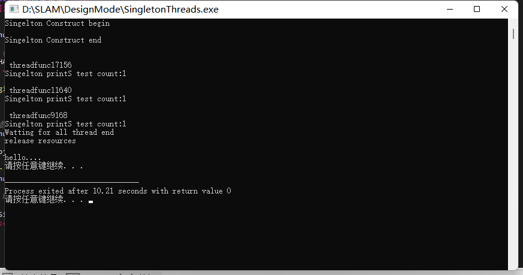

#### 2工厂模式

意义在于定义的是一个创建对象的接口，将实际的创建对象推迟到子类中 

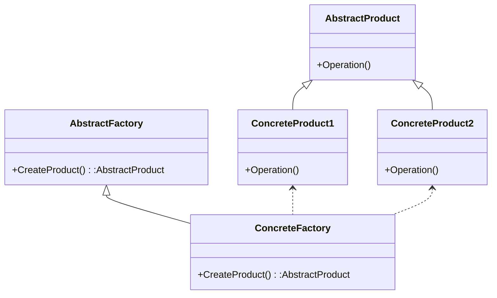

通过添加代码方式处理新建的ConcreteProduct

但是Factory 模式仅仅局限于一类类（就是说
Product 是一类，有一个共同的基类），如果我们要为不同类的类提供一个对象创建的接口，那就要用 AbstractFactory了

```c++
#include "iostream"
using namespace std;

class Fruit
{
public:
	virtual void sayname()
	{
		cout<<"fruit\n";
	}
};

class FruitFactory
{
public:
	virtual Fruit* getFruit()
	{
		return new Fruit();
	}
};


//香蕉
class Banana : public Fruit
{
public:
	virtual void sayname()
	{
		cout<<"Banana \n"<<endl;
	}
};

//香蕉工厂
class BananaFactory : public  FruitFactory
{
public:
	virtual Fruit* getFruit()
	{
		return new Banana;
	}
};


//苹果
class Apple : public Fruit
{
public:
	virtual void sayname()
	{
		cout<<"Apple \n"<<endl;
	}
};

//苹果工厂
class AppleFactory : public  FruitFactory
{
public:
	virtual Fruit* getFruit()
	{
		return new Apple;
	}
};

int main()
{
	FruitFactory * ff  = NULL;
	Fruit *fruit = NULL;

	//1
	ff = new BananaFactory();
	fruit = ff->getFruit();
	fruit->sayname();

	delete fruit;
	delete ff;

	//2苹果
	ff = new AppleFactory();
	fruit = ff->getFruit();
	fruit->sayname();

	delete fruit;
	delete ff;

	cout<<"hello....\n";
	system("pause");
	return 0;
}

```

运行结果如图：
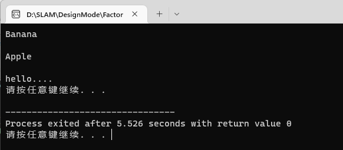

#### 3抽象工厂

我搜到的资料我个人觉得还是说的很清楚的，抽象工厂可以向客户端提供一个接口是的客户端不必指定产品的具体类型，就能创建多个产品族的产品对象。

解释:具体工厂在开闭原则下,		能生产香蕉/苹果/梨子;  (产品等级结构)
	抽象工厂:在开闭原则下,		能生产：南方香蕉/苹果/梨子 (产品族)

1. 抽象工厂(AbstractFactory)
任何工厂类都必须实现这个接口

2. 具体工厂
具体工厂类是抽象工厂的一个实现，负责实例化某个产品族中的产品对象。

3. 抽象产品
抽象模式所创建的所有对象的父类，它负责描述所有实例所共有的公共接口。

4. 具体产品
抽象模式所创建的具体实例对象

```c++

#include<iostream>
using namespace std;
class Fruit
{
public:
	virtual void sayname()
	{
		cout<<"fruit\n";
	}
};

class FruitFactory
{
public:
	virtual Fruit* getApple()
	{
		return new Fruit();
	}
	virtual Fruit* getBanana()
	{
		return new Fruit();
	}
};

//南方香蕉
class SouthBanana : public Fruit
{
public:
	virtual void sayname()
	{
		cout<<"South Banana \n"<<endl;
	}
};


//南方苹果
class SouthApple : public Fruit
{
public:
	virtual void sayname()
	{
		cout<<"South Apple \n"<<endl;
	}
};


//北方香蕉
class NorthBanana : public Fruit
{
public:
	virtual void sayname()
	{
		cout<<"North Banana \n"<<endl;
	}
};


//北方苹果
class NorthApple : public Fruit
{
public:
	virtual void sayname()
	{
		cout<<"North Apple \n"<<endl;
	}
};

class SourthFruitFactory : public FruitFactory
{
public:
	virtual Fruit* getApple()
	{
		return new SouthApple();
	}
	virtual Fruit* getBanana()
	{
		return new SouthBanana();
	}
};

class NorthFruitFactory : public FruitFactory
{
public:
	virtual Fruit* getApple()
	{
		return new NorthApple();
	}
	virtual Fruit* getBanana()
	{
		return new NorthBanana();
	}
};

int main()
{	
	FruitFactory * ff  = NULL;
	Fruit *fruit = NULL;

	ff = new SourthFruitFactory();
	fruit = ff->getApple();
	fruit->sayname();
	fruit = ff->getBanana();
	fruit->sayname();

	delete fruit;
	delete ff;

	ff = new NorthFruitFactory();
	fruit = ff->getApple();
	fruit->sayname();
	fruit = ff->getBanana();
	fruit->sayname();

	delete fruit;
	delete ff;

	cout<<"hello....\n";
	system("pause");
	return 0;
}

```
运行结果如下图
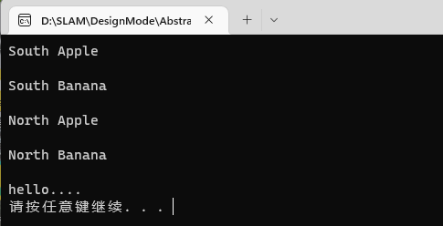

#### 4建造者模式


1. Builder：为创建产品各个部分，统一抽象接口。
2. ConcreteBuilder：具体的创建产品的各个部分，部分A， 部分B，部分C。
3. Director：构造一个使用Builder接口的对象。
4. Product：表示被构造的复杂对象。

ConcreteBuilder创建该产品的内部表示并定义它的装配过程，包含定义组成部件的类，包括将这些部件装配成最终产品的接口。

适用情况：
一个对象的构建比较复杂，将一个对象的构建和对象的表示进行分离。

Builder模式不是很常用。模式本身就是一种思想。知道了就可以了。

```c++

#include <iostream>
using namespace std;
#include "string"
class House
{
public:
	void setFloor(string floor)
	{
		this->m_floor = floor;
	}
	void setWall(string wall)
	{
		this->m_wall = wall;
	}
	void setDoor(string door)
	{
		this->m_door = door;
	}

	//
	string getFloor()
	{
		return m_floor;
	}
	string setWall()
	{
		return  m_wall;
	}
	string setDoor()
	{
		return m_door;
	}

protected:
private:
	string	m_floor;
	string	m_wall;
	string	m_door;
};

class Builder
{
public:
	virtual void makeFloor() = 0;
	virtual void makeWall() =  0;
	virtual void makeDoor() = 0;
	virtual House *GetHouse() = 0;
};

//公寓
class FlatBuild : public Builder
{
public:
	FlatBuild()
	{
		pHouse = new House;
	}
	virtual void makeFloor()
	{
		pHouse->setFloor("flat Door");
	}
	virtual void makeWall()
	{
		pHouse->setWall("flat Wall");
	}
	virtual void makeDoor()
	{
		pHouse->setDoor("flat Door");
	}
	virtual House *GetHouse()
	{
		return pHouse;
	}

private:
	House *pHouse;
};

//别墅
class VillaBuild : public Builder
{
public:
	VillaBuild()
	{
		pHouse = new House;
	}
	virtual void makeFloor()
	{
		pHouse->setFloor("villa floor");
	}
	virtual void makeWall()
	{
		pHouse->setWall("villa Wall");
	}
	virtual void makeDoor()
	{
		pHouse->setDoor("villa Door");
	}
	virtual House *GetHouse()
	{
		return pHouse;
	}
private:
	House *pHouse;
};

class Director
{
public:
	void Construct(Builder *builder)
	{
		builder->makeFloor();
		builder->makeWall();
		builder->makeDoor();
	}
protected:
private:
};


void test01()
{
	//客户直接造房子
	House *pHose = new House;
	pHose->setDoor("wbm门");
	pHose->setFloor("wbmFloor");
	pHose->setWall("wbmWall");
	delete pHose;

	
	/* //工程队直接造房子 
	Builder *builder = new FlatBuild;
	builder->makeFloor();
	builder->makeWall();
	builder->makeDoor();
	*/

	//指挥者（设计师）指挥 工程队 和 建房子
	Director *director = new Director;

	//建公寓
	Builder *builder = new FlatBuild;
	director->Construct(builder); //设计师 指挥 工程队干活
	House *house = builder->GetHouse();
	cout << house->getFloor() << endl;
	delete house;
	delete builder;

	//建别墅
	builder = new VillaBuild;
	director->Construct(builder); //设计师 指挥 工程队干活
	house = builder->GetHouse();
	cout << house->getFloor() << endl;
	delete house;
	delete builder;
	
	delete director;
	
	system("pause");
	return ;
}

int main(){
	test01();
	return 0;
	
}


```
运行结果如下图
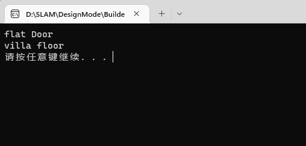

#### 5原型模式

适用情况：
一个复杂对象，具有自我复制功能，统一一套接口。

```c++
#include <iostream>
using namespace std;
#include "string"
class Person
{
public:
	virtual Person *Clone() = 0;
	virtual void printT() = 0;

};

class JavaProgrammer : public Person
{
public:
	JavaProgrammer()
	{
		this->m_name = "";
		this->m_age = 0;
		m_resume = NULL;
	}
	JavaProgrammer(string name, int age)
	{
		this->m_name = name;
		this->m_age = age;
		m_resume = NULL;
	}

	~JavaProgrammer()
	{
		if (m_resume!= NULL)
		{
			free(m_resume);
			m_resume = NULL;
		}
	}
	virtual Person *Clone()
	{
		JavaProgrammer *p = new JavaProgrammer;
		*p = *this;
		return p;
	}

	void setResume(char *resume)
	{
		m_resume = new char[strlen(resume) + 1];
		strcpy(m_resume, resume);
	}

	virtual void printT()
	{
		cout << "m_name:" << m_name << "\t" << "m_age:" << m_age << endl;
		if (m_resume != NULL)
		{
			cout << m_resume << endl;
		}
	}
protected:
private:
	string	m_name;
	int		m_age;
	char	*m_resume;
};

int main()
{
	JavaProgrammer javaperson1("张三", 30);
	javaperson1.setResume("我是java程序员");
	Person *p2 = javaperson1.Clone();  //对象具有自我复制功能 注意深拷贝和浅拷贝问题
	p2->printT();

	delete p2;
	
	cout<<"hello..."<<endl;
	system("pause");
	return 0;
}
```
运行结果如下
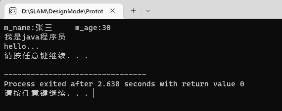

### 结构形模式7

#### 6代理模式

它可以为其他对象提供一种代理（Proxy）以控制对这个对象的访问。
指具有与代理元（被代理的对象）具有相同的接口的类，客户端必须通过代理与被代理的目标类交互，而代理一般在交互的过程中（交互前后），进行某些特别的处理。

举例：租房中介

1、和适配器模式的区别：适配器模式主要改变所考虑对象的接口，而代理模式不能改变所代理类的接口。
2、和装饰器模式的区别：装饰器模式为了增强功能，而代理模式是为了加以控制。

```c++

#include <string>
#include <iostream>
using namespace std;
//定义接口
class Interface
{
public:
	virtual void Request()=0;
};
//真实类
class RealClass : public Interface
{
public:
	virtual void Request()
	{
		cout<<"真实的请求"<<endl;
	}
};
//代理类
class ProxyClass : public Interface
{
private:
	RealClass* m_realClass;
public:
	virtual void Request()
	{
	    m_realClass= new RealClass();
		m_realClass->Request();
		delete m_realClass;
	}
};

//客户端：
int main()
{
	ProxyClass* test=new ProxyClass();
	test->Request();
	return 0;
}
```
运行结果如下
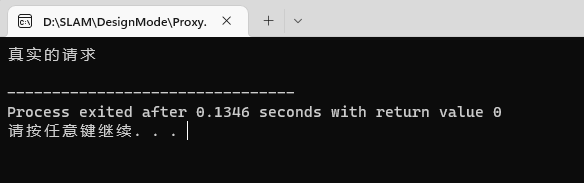

#### 7装饰模式

装饰（ Decorator ）模式又叫做包装模式。通过一种对客户端透明的方式来扩展对象的功能，是继承关系的一个替换方案。

装饰（ Decorator ）模式又叫做包装模式。通过一种对客户端透明的方式来扩展对象的功能，是继承关系的一个替换方案。

装饰者模式（Decorator Pattern）动态的给一个对象添加一些额外的职责。就增加功能来说，此模式比生成子类更为灵活

Component（被装饰对象的基类）
定义一个对象接口，可以给这些对象动态地添加职责。

ConcreteComponent（具体被装饰对象）
定义一个对象，可以给这个对象添加一些职责。

Decorator（装饰者抽象类）
维持一个指向Component实例的引用，并定义一个与Component接口一致的接口。

ConcreteDecorator（具体装饰者）
具体的装饰对象，给内部持有的具体被装饰对象，增加具体的职责。

```c++
#include <iostream>
using namespace std;

class Car
{
public:
	virtual void show() = 0;
protected:
private:
};

class RunCar : public Car
{
public:
	void run()
	{
		cout << "可以跑" << endl;
	}
	virtual void show()
	{
		run();
	}
protected:
private:
};

class SwimCarDirector : public Car
{
public:
	SwimCarDirector(Car *p)
	{
		m_p = p;
	}

	void swim()
	{
		cout << "可以游" << endl;
	}

	virtual void show()
	{
		m_p->show();
		swim();
	}
private:
	Car *m_p;
};

class FlyCarDirector : public Car
{
public:
	FlyCarDirector(Car *p)
	{
		m_p = p;
	}

	void fly()
	{
		cout << "可以飞" << endl;
	}
	virtual void show()
	{
		m_p->show();
		fly();
	}
private:
	Car *m_p;
};

int main()
{
	Car *runcar = NULL;
	runcar = new RunCar;
	runcar->show();

	cout <<"车开始装饰swim"<<endl;
	SwimCarDirector *swimCar = new SwimCarDirector(runcar);
	swimCar->show();

	cout <<"车开始装饰fly"<<endl;
	FlyCarDirector *flyCar = new FlyCarDirector(swimCar);
	flyCar->show();

	delete flyCar;
	delete swimCar;
	delete runcar;
	
	return 0;
}

```
运行结果如下
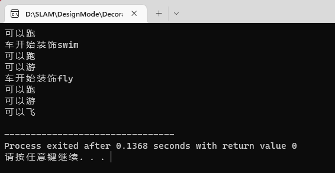

#### 8适配器模式

```c++
#include <iostream>
using namespace std;

class Current18v
{
public:
	void use18vCurrent()
	{
		cout << "使用18v的交流电" << endl;
	}
protected:
private:
};


class Current220v
{
public:
	void use220vCurrent()
	{
		cout << "使用220v的交流电" << endl;
	}
protected:
private:
};


class Adapter : public Current18v
{
public:
	Adapter(Current220v *p220v)
	{
		m_p220v = p220v;
	}
	void use18vCurrent()
	{
		cout << "adapter中使用电流" << endl;
		m_p220v->use220vCurrent();
	}
protected:
private:
	Current220v *m_p220v;
};

int main()
{
	Current220v *p220v = new Current220v;
	Adapter *padapter = new Adapter(p220v);
	padapter->use18vCurrent();

	delete p220v;
	delete padapter;
	system("pause");
	return 0;
}
```
运行结果如下
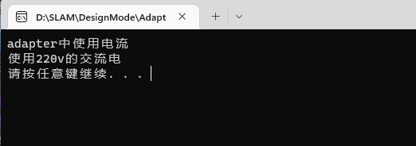

#### 9组合模式

通过递归手段来构造树形的对象结构，并可以通过一个对象来访问整个对象树

适用于：
单个对象和组合对象的使用具有一致性。将对象组合成树形结构以表示“部分--整体”

```c++

#include <iostream>
#include <list>
#include <string>
using namespace std;
//
class IFile
{
public:
	virtual void display() = 0;
	virtual int add(IFile *ifile) = 0;
	virtual int remove(IFile *ifile) = 0;
	virtual list<IFile *>* getChild() = 0;
protected:
private:
};

class File : public IFile
{
public:
	File(string name)
	{
		m_list = NULL;
		m_name = "";
		m_name = name;
	}
	~File()
	{
		if (m_list != NULL)
		{
			delete m_list;
		}
	}
	virtual void display()
	{
		cout << m_name << endl;
	}
	virtual int add(IFile *ifile)
	{
		return -1;
	}
	virtual int remove(IFile *ifile)
	{
		return -1;
	}
	virtual list<IFile *>* getChild() 
	{
		return NULL;
	}

private:
	list<IFile *> *	m_list;
	string		m_name;

};

class Folder : public IFile
{
public:
	Folder(string name)
	{
		m_name = name;
		m_list = new list<IFile *>;
	}
	~Folder()
	{
		if (m_list == NULL)
		{
			delete m_list;
		}
	}
	virtual void display()
	{
		cout << m_name << endl;
	}
	virtual int add(IFile *ifile)
	{
		m_list->push_back(ifile);
		return 0;
	}
	virtual int remove(IFile *ifile)
	{
		m_list->remove(ifile);
		return 0;
	}
	virtual list<IFile *>* getChild() 
	{
		return m_list;
	}

private:
	list<IFile *> *	m_list;
	string			m_name;

};

void showTree(IFile *ifile, int level)
{
	list<IFile *> *l = NULL;
	int i = 0;
	for (i=0; i<level; i++)
	{
		printf("\t");
	}
	ifile->display();

	l = ifile->getChild();
	if (l != NULL)
	{
		for (list<IFile *>::iterator it=l->begin(); it!=l->end(); it++)
		{
			if ( (*it)->getChild() == NULL)
			{
				for (i=0; i<=level; i++) //注意 <= 
				{
					printf("\t");
				}
				(*it)->display();
			}
			else
			{
				showTree((*it), level + 1);
			}

		}
	}
}

int main()
{
	Folder *root = new Folder("C:");

	Folder *dir1 = new Folder("111dir");
	File *txt1 = new File("aaa.txt");

	Folder *dir12 = new Folder("222dir");
	//dir12->display();
	File *txt12 = new File("222.txt");
	//txt12->display();

	
	root->display();
	root->add(dir1);
	root->add(txt1);

	dir1->add(dir12);
	dir1->add(txt12);

	/*
	list<IFile *> *l = dir1->getChild();
	for (list<IFile *>::iterator it=l->begin(); it!=l->end(); it++)
	{
		(*it)->display();
	}
	*/
	//开发一个递归函数 现在根结点下的所有子结点
	cout << "测试递归函数" << endl;

	showTree(root, 0);

	delete txt12;
	delete dir12;
	delete dir1;
	delete txt1;
	delete root;
	cout<<"hello..."<<endl;
	system("pause");
	return 0;
}
```
运行结果如下
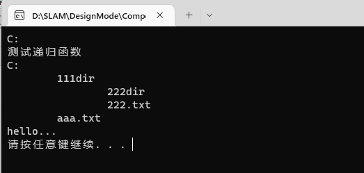

#### 10桥接模式

1. 它的主要特点是把抽象（abstraction）与行为实现（implementation）分离开来，从而可以保持各部分的独立性以及应对它们的功能扩展。
2. 基于类的最小设计原则,通过使用封装，聚合以及继承等行为来让不同的类承担不同的责任

适用于：
桥接模式（Bridge Pattern）是将抽象部分与实现部分分离（解耦合），使它们都可以独立的变化。

```c++

#include <iostream>
using namespace std;

class MyCar1
{
public:
	virtual void installEngine() = 0;
};

class BMW5 : public MyCar1
{
public:
	virtual void installEngine()
	{
		cout << "BMW5 3500CC" << endl;
	}
};

class BMW6 : public MyCar1
{
public:
	virtual void installEngine()
	{
		cout << "BMW6 4000CC" << endl;
	}
};


class Jeep11 : public MyCar1
{
public:
	virtual void installEngine()
	{
		cout << "Jeep11 1100CC" << endl;
	}
};


class Jeep12 : public MyCar1
{
public:
	virtual void installEngine()
	{
		cout << "Jeep12 1200CC" << endl;
	}
};

//不同的车型，不同型号，安装不同类型的发动机，会引起子类的泛滥
//问题引出
void test01()
{
	Jeep12 *j12 = new Jeep12;
	j12->installEngine();
	delete j12;
	return ;
}

class MyCar2
{

public:
	virtual void installEngine3500() = 0;
	virtual void installEngine4000() = 0;
	virtual void installEngine1100() = 0;
	virtual void installEngine1200() = 0;
};

class BMW : public MyCar2
{
public:
	virtual void installEngine3500()
	{
		cout << "3500CC" << endl;
	}
	virtual void installEngine4000()
	{
		cout << "4000CC" << endl;
	}
	virtual void installEngine1100() 
	{
		cout << "1100CC" << endl;
	}
	virtual void installEngine1200()
	{
		cout << "1200CC" << endl;
	}
};

//这样的设计 不符合开闭原则
void test02()
{
	BMW *bmw5 = new BMW;
	bmw5->installEngine3500();
}

//需要把“安装发动机”这个事，做很好的分解；把抽象 和 行为实现 分开
//发动机是一个名次，专门抽象成一个类；类中含有一个成员函数，安装发动机

class Engine
{
public:
	virtual void installEngine() = 0;
};

class Engine4000 : public Engine
{
public:
	virtual void installEngine()
	{
		cout << "安装发动机 Engine4000" << endl;
	}
};

class Engine3500 : public Engine
{
public:
	virtual void installEngine()
	{
		cout << "安装发动机 Engine 3500" << endl;
	}
};

class Car
{
public:
	Car(Engine *pengine)
	{
		m_engine = pengine;
	}
	virtual void installEngine() = 0;

protected:
	Engine *m_engine;
};

class BMW7 :public Car
{
public:
	BMW7(Engine *p) : Car(p)
	{

	}

	//注意车的安装  和 发动机的安装 不同之处
	virtual void installEngine()
	{
		cout << "BMW7 " ; 
		m_engine->installEngine();
	}
protected:
private:
};

void test03()
{
	Engine4000 *e4000 = new Engine4000;
	BMW7 *bmw7 = new BMW7(e4000);
	bmw7->installEngine();

	delete bmw7;
	delete e4000;
}
int main()
{
	test01();
	test02();
	test03();
	system("pause");
	return 0;
}
```
运行结果如下
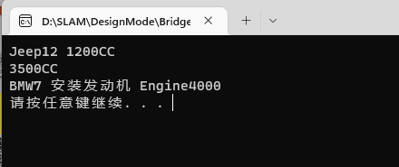

#### 11外观模式

acade模式为一组具有类似功能的类群，比如类库，子系统等等，提供一个一致的简单的界面。这个一致的简单的界面被称作facade

适用于：
为子系统中统一一套接口，让子系统更加容易使用。

```c++
#include <iostream>
using namespace std;

class SystemA
{
public:
	void doThing()
	{
		cout << "systemA do...." << endl;
	}
};

class SystemB
{
public:
	void doThing()
	{
		cout << "systemB do...." << endl;
	}
};

class SystemC
{
public:
	void doThing()
	{
		cout << "systemC do...." << endl;
	}
};

class Facade
{
public:
	Facade()
	{
		a = new SystemA;
		b = new SystemB;
		c = new SystemC;
	}
	~Facade()
	{
		delete a;
		delete b;
		delete c;
	}

	void doThing()
	{
		a->doThing();
		b->doThing();
		c->doThing();
	}

protected:
private:
	SystemA *a;
	SystemB *b;
	SystemC *c;
};


int main()
{
	/*
	SystemA *a = new SystemA;
	SystemB *b = new SystemB;
	SystemC *c = new SystemC;

	a->doThing();
	b->doThing();
	c->doThing();

	delete a;
	delete b;
	delete c;
	*/

	Facade *f = new Facade;
	f->doThing();
	delete f;
	cout<<"hello..."<<endl;
	system("pause");
	return 0;
}
```
运行结果如下
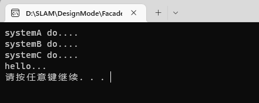

#### 12享元模式

它通过与其他类似对象共享数据来减小内存占用

使用场景：
是以共享的方式，高效的支持大量的细粒度的对象

```c++
//Flyweight.h
#ifndef FLYWEIGHT_H 
#define FLYWEIGHT_H 
#include <string> 
#include <list> 
typedef std::string STATE; 
class Flyweight 
{ 
public: 
 virtual ~Flyweight(){} 
 STATE GetIntrinsicState(); 
 virtual void Operation(STATE& ExtrinsicState) = 0; 
protected: 
 Flyweight(const STATE& state) 
 :m_State(state) 
 { 
 } 
private: 
 STATE m_State; 
}; 
class FlyweightFactory 
{ 
public: 
 FlyweightFactory(){} 
 ~FlyweightFactory(); 
 Flyweight* GetFlyweight(const STATE& key); 
private: 
 std::list<Flyweight*> m_listFlyweight; 
}; 
class ConcreateFlyweight 
 : public Flyweight 
{ 
public: 
 ConcreateFlyweight(const STATE& state) 
 : Flyweight(state) 
 { 
 } 
 virtual ~ConcreateFlyweight(){} 
 virtual void Operation(STATE& ExtrinsicState); 
}; 
#endif

//Flyweight.cpp
//#include "FlyWeight.h" 
#include <iostream> 
inline STATE Flyweight::GetIntrinsicState() 
{ 
 return m_State; 
} 
FlyweightFactory::~FlyweightFactory() 
{ 
 std::list<Flyweight*>::iterator iter1, iter2, temp; 
 for (iter1 = m_listFlyweight.begin(), iter2 = m_listFlyweight.end(); 
 iter1 != iter2; 
 ) 
 { 
 temp = iter1; 
 ++iter1; 
 delete (*temp); 
 } 
 m_listFlyweight.clear(); 
} 
Flyweight* FlyweightFactory::GetFlyweight(const STATE& key) 
{ 
 std::list<Flyweight*>::iterator iter1, iter2; 
 for (iter1 = m_listFlyweight.begin(), iter2 = m_listFlyweight.end(); 
 iter1 != iter2; 
 ++iter1) 
 { 
 if ((*iter1)->GetIntrinsicState() == key) 
 { 
 std::cout << "The Flyweight:" << key << " already exits"<< std::endl; 
 return (*iter1); 
 } 
 } 
 std::cout << "Creating a new Flyweight:" << key << std::endl; 
 Flyweight* flyweight = new ConcreateFlyweight(key); 
 m_listFlyweight.push_back(flyweight); 
} 
void ConcreateFlyweight::Operation(STATE& ExtrinsicState) 
{ 
}

//#include "FlyWeight.h" 
int main() 
{ 
 FlyweightFactory flyweightfactory; 
 flyweightfactory.GetFlyweight("hello"); 
 flyweightfactory.GetFlyweight("world"); 
 flyweightfactory.GetFlyweight("hello"); 
 system("pause"); 
 return 0; 
}
```
运行结果如下
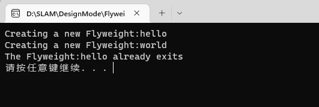

### 行为模式 11

####  13模板模式template

它把具有特定步骤算法中的某些必要的处理委让给抽象方法，通过子类继承对抽象方法的不同实现改变整个算法的行为

在抽象类中统一操作步骤，并规定好接口；让子类实现接口。这样可以把各个具体的子类和操作步骤接耦合

- 具有统一的操作步骤或操作过程
- 具有不同的操作细节
- 存在多个具有同样操作步骤的应用场景，但某些具体的操作细节却各不相同

```c++
#include <iostream>
using namespace std;

class MakeCar
{
public:
	virtual void makeHead() = 0;
	virtual void makeBody() = 0;
	virtual void makeTail() = 0;

public:   //把一组行为 变成 一个模板
	void make()
	{
		makeHead();
		makeBody();
		makeTail();
	}
	
protected:
private:
};

class MakeBus : public MakeCar
{
public:
	virtual void makeHead()
	{
		cout << "bus 组装 车头" << endl;
	}
	virtual void makeBody()
	{
		cout << "bus 组装 车身" << endl;
	}
	virtual void makeTail()
	{
		cout << "bus 组装 车尾" << endl;
	}
protected:
private:
};

class MakeJeep : public MakeCar
{
public:
	virtual void makeHead()
	{
		cout << "Jeep 组装 车头" << endl;
	}
	virtual void makeBody()
	{
		cout << "Jeep 组装 车身" << endl;
	}
	virtual void makeTail()
	{
		cout << "Jeep 组装 车尾" << endl;
	}
protected:
private:
};

int main()
{
	MakeCar *bus = new MakeBus;
	
	//bus->makeHead();
	//bus->makeBody();
	//bus->makeTail();
	bus->make();

	MakeCar *jeep = new MakeJeep;
	//jeep->makeHead();
	//jeep->makeBody();
	//jeep->makeTail();
	jeep->make();

	delete bus;
	delete jeep;

	cout<<"hello..."<<endl;
	system("pause");
	return 0;
}
```
运行结果如下
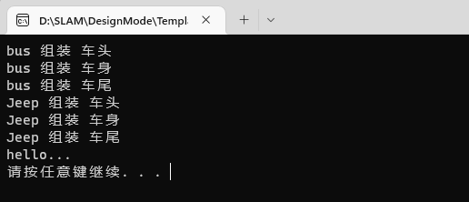

#### 14命令模式command

Command模式通过被称为Command的类封装了对目标对象的调用行为以及调用参数
整个调用过程比较繁杂，或者存在多处这种调用。这时，使用Command类对该调用加以封装，便于功能的再利用。-
调用前后需要对调用参数进行某些处理。调用前后需要进行某些额外处理，比如日志，缓存，记录历史操作等。

Command
Command命令的抽象类。
ConcreteCommand
    	Command的具体实现类。
Receiver
    	需要被调用的目标对象。
Invorker
    	通过Invorker执行Command对象。
适用于：
	是将一个请求封装为一个对象，从而使你可用不同的请求对客户端进行参数化；对请求排队或记录请求日志，以及支持可撤销的操作。 


```c++
#include <iostream>
using namespace std;
#include "list"

class Vendor
{
public:
	void sailbanana()
	{
		cout << "卖香蕉" << endl;
	}
	void sailapple()
	{
		cout << "卖苹果" << endl;
	}
};

class Command
{
public:
	virtual void sail() = 0;
};

class BananaCommand : public Command
{
public:
	BananaCommand(Vendor *v)
	{
		m_v = v;
	}
	Vendor *getV(Vendor *v)
	{
		return m_v;
	}

	void setV(Vendor *v)
	{
		m_v = v;
	}
	virtual void sail()
	{
		m_v->sailbanana();
	}
protected:
private:
	Vendor *m_v;
};

class AppleCommand : public Command
{
public:
	AppleCommand(Vendor *v)
	{
		m_v = v;
	}
	Vendor *getV(Vendor *v)
	{
		return m_v;
	}

	void setV(Vendor *v)
	{
		m_v = v;
	}
	virtual void sail()
	{
		m_v->sailapple();
	}
protected:
private:
	Vendor *m_v;
};

class Waiter
{
public:
	Command *getCommand()
	{
		return m_command;
	}
	void setCommand(Command *c)
	{
		m_command = c;
	}
	void sail()
	{
		m_command->sail();
	}
protected:
private:
	Command *m_command;
};

class AdvWaiter
{
public:
	AdvWaiter()
	{
		m_list = new list<Command *>;
		m_list->resize(0);
	}
	~AdvWaiter()
	{
		delete m_list;
	}
	void setCommands(Command *c)
	{
		m_list->push_back(c);
	}
	list<Command *> * getCommands()
	{
		return m_list;
	}
	void sail()
	{
		for (list<Command *>::iterator it=m_list->begin(); it!=m_list->end(); it++ )
		{
			(*it)->sail();
		}
	}
protected:
private:
	list<Command *> *m_list;
};

//小商贩 直接 卖 水果
void test01()
{
	Vendor *v = new Vendor;
	v->sailapple();
	v->sailbanana();

	delete v;
	return ;
}

//小商贩 通过命令 卖 水果
void test02()
{
	Vendor *v = new Vendor;
	AppleCommand *ac = new AppleCommand(v);
	ac->sail();

	BananaCommand *bc = new BananaCommand(v);
	bc->sail();

	delete bc;
	delete ac;
	delete v;
}

//小商贩 通过waiter 卖 水果
void test03()
{
	Vendor *v = new Vendor;
	AppleCommand *ac = new AppleCommand(v);
	BananaCommand *bc = new BananaCommand(v);

	Waiter *w = new Waiter;
	w->setCommand(ac);
	w->sail();

	w->setCommand(bc);
	w->sail();

	delete w;
	delete bc;
	delete ac;
	delete v;
}

//小商贩 通过advwaiter 批量下单 卖水果
void test04()
{
	Vendor *v = new Vendor;
	AppleCommand *ac = new AppleCommand(v);
	BananaCommand *bc = new BananaCommand(v);

	AdvWaiter *w = new AdvWaiter;
	w->setCommands(ac);
	w->setCommands(bc);
	w->sail();

	delete w;
	delete bc;
	delete ac;
	delete v;
}

int main()
{
	//test01();
	//test02();
	//test03();
	test04();
	system("pause");
	return 0;
}
```
运行结果如下
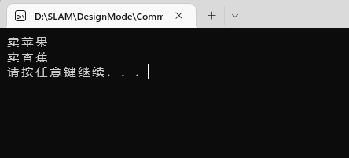

#### 15责任链模式Chain of Responsibility

该模式构造一系列分别担当不同的职责的类的对象来共同完成一个任务，这些类的对象之间像链条一样紧密相连，所以被称作职责链模式

优点：
1。责任的分担。每个类只需要处理自己该处理的工作（不该处理的传递给下一个对象完成），明确各类的责任范围，符合类的最小封装原则。
2。可以根据需要自由组合工作流程。如工作流程发生变化，可以通过重新分配对象链便可适应新的工作流程。
3。类与类之间可以以松耦合的形式加以组织。
缺点：
因为处理时以链的形式在对象间传递消息，根据实现方式不同，有可能会影响处理的速度。

适用于：
	链条式处理事情。工作流程化、消息处理流程化、事物流程化；

```c++
#include <iostream>
using namespace std;
class CarHandle
{
public:
	virtual void HandleCar() = 0;
	
public:
	CarHandle *setNextHandle(CarHandle *carhandle)
	{
		this->carhandle = carhandle;
		return this->carhandle;
	}
protected:
	CarHandle *carhandle;
};

class CarHandleHead : public CarHandle
{
public:
	virtual void HandleCar()
	{
		cout << "处理车头" << endl;
		if (this->carhandle != NULL)
		{
			carhandle->HandleCar();
		}
	}
};

class CarHandleBody : public CarHandle
{
public:
	virtual void HandleCar()
	{
		cout << "处理车身" << endl;
		if (this->carhandle != NULL)
		{
			carhandle->HandleCar();
		}
	}
};

class CarHandleTail : public CarHandle
{
public:
	virtual void HandleCar()
	{
		cout << "处理车尾" << endl;
		if (this->carhandle != NULL)
		{
			carhandle->HandleCar();
		}
	}
};

int main()
{
	CarHandleHead *head = new CarHandleHead;
	CarHandleBody *body = new CarHandleBody;
	CarHandleTail *tail = new CarHandleTail;

	head->setNextHandle(body);
	body->setNextHandle(tail);
	tail->setNextHandle(NULL);

	//处理
	head->HandleCar();
	delete head;
	delete body;
	delete tail;
	system("pause");
	return 0;
}
```
运行结果如下
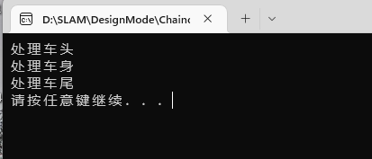

#### 16策略模式

它对一系列的算法加以封装，为所有算法定义一个抽象的算法接口，并通过继承该抽象算法接口对所有的算法加以封装和实现，具体的算法选择交由客户端决定（策略）。Strategy模式主要用来平滑地处理算法的切换

Strategy:
 	策略（算法）抽象。
ConcreteStrategy
    	各种策略（算法）的具体实现。
Context
    	策略的外部封装类，或者说策略的容器类。根据不同策略执行不同的行为。策略由外部环境决定。 

适用于：
	准备一组算法，并将每一个算法封装起来，使得它们可以互换。

策略模式优缺点
它的优点有：
1. 策略模式提供了管理相关的算法族的办法。策略类的等级结构定义了一个算法或行为族。恰当使用继承可以把公共的代码移到父类里面，从而避免重复的代码。
2. 策略模式提供了可以替换继承关系的办法。继承可以处理多种算法或行为。如果不是用策略模式，那么使用算法或行为的环境类就可能会有一些子类，每一个子类提供一个不同的算法或行为。但是，这样一来算法或行为的使用者就和算法或行为本身混在一起。决定使用哪一种算法或采取哪一种行为的逻辑就和算法或行为的逻辑混合在一起，从而不可能再独立演化。继承使得动态改变算法或行为变得不可能。
3. 使用策略模式可以避免使用多重条件转移语句。多重转移语句不易维护，它把采取哪一种算法或采取哪一种行为的逻辑与算法或行为的逻辑混合在一起，统统列在一个多重转移语句里面，比使用继承的办法还要原始和落后。

策略模式的缺点有：
1. 客户端必须知道所有的策略类，并自行决定使用哪一个策略类。这就意味着客户端必须理解这些算法的区别，以便适时选择恰当的算法类。换言之，策略模式只适用于客户端知道所有的算法或行为的情况。
2. 策略模式造成很多的策略类。有时候可以通过把依赖于环境的状态保存到客户端里面，而将策略类设计成可共享的，这样策略类实例可以被不同客户端使用。换言之，可以使用享元模式来减少对象的数量。

```c++
//Symmetric encryption
#include<iostream>
using namespace std;
class Strategy
{
public:
	virtual void SymEncrypt() = 0;
};

class Des : public Strategy
{
public:
	virtual void SymEncrypt()
	{
		cout << "Des 加密" << endl; 
	}
};

class AES : public Strategy
{
public:
	virtual void SymEncrypt()
	{
		cout << "AES 加密" << endl; 
	}
};


class Context
{
public:
	Context(Strategy *strategy)
	{
		p = strategy;
	}
	void Operator()
	{
		p->SymEncrypt();
	}
private:
	Strategy *p;
};


//算法的实现 和 客户端的使用 解耦合
//使得算法变化，不会影响客户端
int main()
{
	/* 不符合开闭原则
 	Strategy *strategy = NULL;
	strategy = new AES;
	strategy->SymEncrypt();
	delete strategy;

	strategy = new Des;
	strategy->SymEncrypt();
	delete strategy;
	*/
	Strategy *strategy = NULL;
	Context *ctx = NULL;

	strategy = new AES;
	ctx = new Context(strategy);
	ctx->Operator();
	delete strategy;
	delete ctx;

	cout<<"hello..."<<endl;
	system("pause");
	return 0;
}

```
运行结果如下
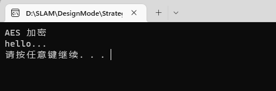

#### 17中介者模式mediator

类之间的交互行为被统一放在Mediator的对象中，对象通过Mediator对象同其他对象交互，Mediator对象起着控制器的作用

Mediator抽象中介者
    	中介者类的抽象父类。
concreteMediator
    	具体的中介者类。
Colleague
 关联类的抽象父类。
concreteColleague
	具体的关联类。
适用于：
	用一个中介对象，封装一些列对象（同事）的交换，中介者是各个对象不需要显示的相互作用，从而实现了耦合松散，而且可以独立的改变他们之间的交换。

优点：
1. 将系统按功能分割成更小的对象，符合类的最小设计原则
2. 对关联对象的集中控制
3. 减小类的耦合程度，明确类之间的相互关系：当类之间的关系过于复杂时，其中任何一个类的修改都会影响到其他类，不符合类的设计的开闭原则 ，而Mediator模式将原来相互依存的多对多的类之间的关系简化为Mediator控制类与其他关联类的一对多的关系，当其中一个类修改时，可以对其他关联类不产生影响（即使有修改，也集中在Mediator控制类）。
4. 有利于提高类的重用性

```c++
#include <iostream>
using namespace std;
#include "string"

class Person
{
public:
	Person(string name, int sex, int condit)
	{
		m_name = name;
		m_sex = sex;
		m_condition = condit;
	}
	string getName()
	{
		return m_name;
	}
	int getSex()
	{
		return m_sex;
	}
	int getCondit()
	{
		return m_condition;
	}
	virtual void getParter(Person *p) = 0;

protected:
	string	m_name;	//
	int		m_sex; //1男  2女
	int		m_condition; //123456789;
};

class Man : public Person
{
public: 
	Man(string name, int sex, int condit):Person(name, sex, condit)
	{
		;
	}
	virtual void getParter(Person *p)
	{
		if (this->getSex() == p->getSex())
		{
			cout << "No No No 我不是同性恋" << endl;
		}
		if (this->getCondit() == p->getCondit())
		{
			cout << this->getName() << " 和 " << p->getName() << "绝配" << endl;
		}
		else
		{
			cout << this->getName() << " 和 " << p->getName() << "不配" << endl;
		}
	}
protected:

};

class Woman : public Person
{
public: 
	Woman(string name, int sex, int condit):Person(name, sex, condit)
	{
		;
	}
	virtual void getParter(Person *p)
	{
		if (this->getSex() == p->getSex())
		{
			cout << "No No No 我不是同性恋" << endl;
		}
		if (this->getCondit() == p->getCondit())
		{
			cout << this->getName() << " 和 " << p->getName() << "绝配" << endl;
		}
		else
		{
			cout << this->getName() << " 和 " << p->getName() << "不配" << endl;
		}
	}
protected:

};

//以上  Woman  Man类的太紧密 需要解耦合
void test01()
{
	
	Woman *w1 = new Woman("小芳", 2, 4);
	Man *m1 = new Man("张三", 1, 3);
	Man *m2 = new Man("李四", 1, 4);

	w1->getParter(m1);
	w1->getParter(m2);

	delete w1;
	delete m1;
	delete m2;
	
	return ;
}

class Mediator ;
class Person2
{
public:
	Person2(string name, int sex, int condition, Mediator *m)
	{
		m_name = name;
		m_sex = sex;
		m_condition = condition;
		m_m = m;
	}
	string getName()
	{
		return m_name;
	}
	int getSex()
	{
		return m_sex;
	}
	int getCondit()
	{
		return m_condition;
	}
	
	Mediator *getMediator()
	{
		return m_m;
	}
public:
	virtual void getParter(Person2 *p) = 0;

protected:
	string	m_name;	//
	int		m_sex; //1男  2女
	int		m_condition; //123456789;
	Mediator *m_m;
};


class Mediator 
{
public:
	Mediator()
	{
		pMan = NULL;
		pWoman = NULL;
	}
	void setWoman(Person2 *p)
	{
		pWoman = p;
	}
	void setMan(Person2 *p)
	{
		pMan = p;
	}

	void getPartner()
	{
		if (pMan->getSex() == pWoman->getSex())
		{
			cout << "No No No 我不是同性恋" << endl;
		}
		if (pMan->getCondit() == pWoman->getCondit())
		{
			cout << pMan->getName() << " 和 " << pWoman->getName() << "绝配" << endl;
		}
		else
		{
			cout << pMan->getName() << " 和 " << pWoman->getName() << "不配" << endl;
		}
	}

protected:
private:
	Person2	*pMan;
	Person2	*pWoman;
};

class Woman2 : public Person2
{
public:
	Woman2(string name, int sex, int condition, Mediator *m) : Person2(name, sex, condition, m)
	{
		;
	}
	virtual void getParter(Person2 *p)
	{
		this->getMediator()->setWoman(this);
		this->getMediator()->setMan(p);
		this->getMediator()->getPartner();
	}
private:
};

class Man2 : public Person2
{
public:
	Man2(string name, int sex, int condition, Mediator *m) : Person2(name, sex, condition, m)
	{
		;
	}
	virtual void getParter(Person2 *p)
	{
		this->getMediator()->setMan(this);
		this->getMediator()->setWoman(p);
		this->getMediator()->getPartner();
	}
private:
};

void test02()
{
	Mediator *mediator = new Mediator;
	Woman2 *w1 = new Woman2("小芳", 2, 4, mediator);
	Man2 *m1 = new Man2("张三", 1, 3, mediator);
	Man2 *m2 = new Man2("李四", 1, 4, mediator);

	w1->getParter(m1);
	w1->getParter(m2);

	delete w1;
	delete m1;
	delete m2;
	delete mediator;
}
int main()
{
	//test01(); //问题的引出
	test02(); //用中介者模式 进行优化
	system("pause");
	return 0;
}

```
运行结果如下
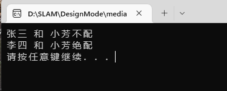

#### 18观察者模式observer

它的作用是当一个对象的状态发生变化时，能够自动通知其他关联对象，自动刷新对象状态
Observer模式提供给关联对象一种同步通信的手段，使某个对象与依赖它的其他对象之间保持状态同步

Subject（被观察者）
    	被观察的对象。当需要被观察的状态发生变化时，需要通知队列中所有观察者对象。Subject需要维持（添加，删除，通知）一个观察者对象的队列列表。
ConcreteSubject
    	被观察者的具体实现。包含一些基本的属性状态及其他操作。
Observer（观察者）
    	接口或抽象类。当Subject的状态发生变化时，Observer对象将通过一个callback函数得到通知。
ConcreteObserver
    	观察者的具体实现。得到通知后将完成一些具体的业务逻辑处理。

- 侦听事件驱动程序设计中的外部事件
- 侦听/监视某个对象的状态变化
- 发布者/订阅者(publisher/subscriber)模型中，当一个外部事件（新的产品，消息的出现等等）被触发时，通知邮件列表中的订阅者
适用于：
	定义对象间一种一对多的依赖关系，使得每一个对象改变状态，则所有依赖于他们的对象都会得到通知。

```c++
#include <iostream>
using namespace std;
#include "vector"
#include "string"

class Secretary;

//玩游戏的同事类（观察者）
class PlayserObserver
{
public:
	PlayserObserver(string name, Secretary *secretary)
	{
		m_name = name;
		m_secretary = secretary;
	}
	void update(string action)
	{
		cout << "观察者收到action:" << action << endl;
	}
private:
	string		m_name;
	Secretary	*m_secretary;
};

//秘书类（主题对象，通知者）
class Secretary
{
public:
	void addObserver(PlayserObserver *o)
	{
		v.push_back(o);
	}
	void Notify(string action)
	{
		for (vector<PlayserObserver *>::iterator it= v.begin(); it!=v.end(); it++ )
		{
			(*it)->update(action);
		}
	}
	void setAction(string action)
	{
		m_action = action;
		Notify(m_action);
	}
private:
	string m_action;
	vector<PlayserObserver *> v;
};

int main()
{
	//subject 被观察者
	Secretary *s1 = new Secretary;

	//具体的观察者 被通知对象
	PlayserObserver *po1 = new PlayserObserver("小张", s1);
	//PlayserObserver *po2 = new PlayserObserver("小李", s1);
	s1->addObserver(po1);
	//s1->addObserver(po2);
	s1->setAction("老板来了");
	s1->setAction("老板走了");
	cout<<"hello..."<<endl;
	system("pause");
	return 0;
}
```
运行结果如下
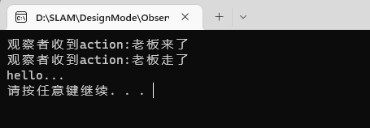

#### 19备忘录模式mememto

1. 一个类需要保存它的对象的状态（相当于Originator角色）
2. 设计一个类，该类只是用来保存上述对象的状态（相当于Memento角色）
3. 需要的时候，Caretaker角色要求Originator返回一个Memento并加以保存
4. undo或rollback操作时，通过Caretaker保存的Memento恢复Originator对象的状态

Originator（原生者）
    需要被保存状态以便恢复的那个对象。
Memento（备忘录）
    该对象由Originator创建，主要用来保存Originator的内部状态。
Caretaker（管理者）
    负责在适当的时间保存/恢复Originator对象的状态。
适用于：
在不破坏封装性的前提下，捕获一个对象的内部状态，并在该对象之外保存这个状态，这样就可以将以后的对象状态恢复到先前保存的状态。
适用于功能比较复杂的，但需要记录或维护属性历史的类；或者需要保存的属性只是众多属性中的一小部分时Originator可以根据保存的Memo还原到前一状态。

```c++

#include <iostream>
using namespace std;
#include "string"

class MememTo
{
public:
	MememTo(string name, int age)
	{
		this->m_name = name;
		this->m_age = age;
	}
	void setName(string name)
	{
		this->m_name = name;
	}
	string getName()
	{
		return m_name;
	}
	void setAge(int  age)
	{
		this->m_age = age;
	}
	int getAge()
	{
		return m_age;
	}
protected:
private:
	string	m_name;
	int		m_age;
};

class Person
{
public:
	Person(string name, int age)
	{
		this->m_name = name;
		this->m_age = age;
	}
	void setName(string name)
	{
		this->m_name = name;
	}
	string getName()
	{
		return m_name;
	}
	void setAge(int  age)
	{
		this->m_age = age;
	}
	int getAge()
	{
		return m_age;
	}
	void printT()
	{
		cout << "name: " << m_name << "age: " << m_age << endl;
	}

public:

	//创建备份
	MememTo *createMememTo()
	{
		return new MememTo(m_name, m_age);
	}

	//恢复备份
	void SetMememTo(MememTo *memto)
	{
		m_name = memto->getName();
		m_age = memto->getAge();
	}

protected:
private:
	string	m_name;
	int		m_age;

};

//管理者
class Caretaker
{
public:
	Caretaker(MememTo *mem)
	{
		this->m_memto = mem;
	}
	MememTo *getMememTo()
	{
		return m_memto;
	}
	void setMememTo(MememTo *mem)
	{
		this->m_memto = mem;
	}
protected:
private:
	MememTo *m_memto;
};

void test_01()
{
	Person *p = new Person("张三", 18);
	p->printT();

	//创建备份
	Caretaker *ct = new Caretaker(p->createMememTo());
	
	p->setAge(28);
	p->printT();

	//恢复信息
	p->SetMememTo(ct->getMememTo());
	p->printT();

	delete p;
	delete ct->getMememTo();

	return ;
}

void test_02()
{
	Person *p = new Person("张三", 18);
	p->printT();

	//创建备份
	MememTo * membak = p->createMememTo();
	p->setAge(28);
	p->printT();

	//恢复信息
	p->SetMememTo(membak);
	p->printT();

	delete p;
	delete membak;
}

int main()
{
	//test_01();
	test_02();
	system("pause");
	return 0;
}
```
运行结果如下
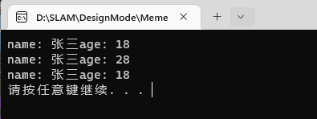

#### 20访问者模式visitor

使用Visitor模式，可以不修改已有类的情况下，增加新的操作角色和职责

抽象访问者（Visitor）角色：声明了一个或者多个访问操作，形成所有的具体元素角色必须实现的接口。
具体访问者（ConcreteVisitor）角色：实现抽象访问者角色所声明的接口，也就是抽象访问者所声明的各个访问操作。
抽象节点（Element）角色：声明一个接受操作，接受一个访问者对象作为一个参量。
具体节点（ConcreteElement）角色：实现了抽象元素所规定的接受操作。
结构对象（ObiectStructure）角色：有如下的一些责任，可以遍历结构中的所有元素；如果需要，提供一个高层次的接口让访问者对象可以访问每一个元素；如果需要，可以设计成一个复合对象或者一个聚集，如列（List）或集合（Set）。

适用于：
	把数据结构 和 作用于数据结构上的操作 进行解耦合;
适用于数据结构比较稳定的场合
访问者模式总结：
访问者模式优点是增加新的操作很容易，因为增加新的操作就意味着增加一个新的访问者。访问者模式将有关的行为集中到一个访问者对象中。
那访问者模式的缺点是是增加新的数据结构变得困难了

优点：
1. 访问者模式使得增加新的操作变得很容易。
2. 访问者模式将有关的行为集中到一个访问者对象中，而不是分散到一个个的节点类中。
3. 访问者模式可以跨过几个类的等级结构访问属于不同的等级结构的成员类。
4. 积累状态。

缺点：
1. 增加新的节点类变得很困难。
2. 破坏封装。

```c++
#include <iostream>
using namespace std;
#include "list"
#include "string"

class  ParkElement;
 
//不同的访问者 访问公园完成不同的动作 
class Visitor
{
public:
	virtual void visit(ParkElement *park) = 0;
};

class ParkElement //每一个
{
public:
	virtual void accept(Visitor *v) = 0;
};

class ParkA : public ParkElement
{
public:
	virtual void accept(Visitor *v)
	{
		v->visit(this);
	}
};

class ParkB : public ParkElement
{
public:
	virtual void accept(Visitor *v)
	{
		v->visit(this);
	}
};

class Park  : public ParkElement
{
public:
	Park()
	{
		m_list.clear();
	}
	void setPart(ParkElement *e)
	{
		m_list.push_back(e);
	}
public:
	void accept(Visitor *v)
	{
		for ( list<ParkElement *>::iterator it=m_list.begin(); it != m_list.end(); it++)
		{
			(*it)->accept(v);
		}
	}

private:
	list<ParkElement *> m_list;
};

class VisitorA : public Visitor
{
public:
	virtual void visit(ParkElement *park)
	{
		cout << "清洁工A访问公园A部分，打扫卫生完毕" << endl;
	}
};

class VisitorB : public Visitor
{
public:
	virtual void visit(ParkElement *park)
	{
		cout << "清洁工B 访问 公园B 部分，打扫卫生完毕" << endl;	
	}
};
class VisitorManager : public Visitor
{
public:
	virtual void visit(ParkElement *park)
	{
		cout << "管理员 检查整个公园卫生打扫情况" << endl;
	}
};

int main()
{
	VisitorA *visitorA = new VisitorA;
	VisitorB *visitorB = new VisitorB;
	
	ParkA *partA = new ParkA;
	ParkB *partB = new ParkB;

	//公园接受访问者a访问
	partA->accept(visitorA);
	partB->accept(visitorB);

	VisitorManager *visitorManager = new VisitorManager;
	Park * park = new Park;
	park->setPart(partA);
	park->setPart(partB);
	park->accept(visitorManager);

	cout<<"hello..."<<endl;
	system("pause");
	return 0;
}
```
运行结果如下
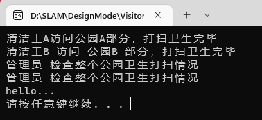

#### 21状态模式state

State模式允许通过改变对象的内部状态而改变对象的行为，这个对象表现得就好像修改了它的类一样

State模式允许通过改变对象的内部状态而改变对象的行为，这个对象表现得就好像修改了它的类一样

角色和职责
Context：用户对象
拥有一个State类型的成员，以标识对象的当前状态； 
State：接口或基类
封装与Context的特定状态相关的行为； 
ConcreteState：接口实现类或子类
实现了一个与Context某个状态相关的行为。 
适用于：
	对象的行为，依赖于它所处的当前状态。行为随状态改变而改变的场景。

```c++

#include <iostream>
using namespace std;

class Worker;

class State
{
public:
	virtual void doSomeThing(Worker *w) = 0;
};

class Worker
{
public:
	Worker();
	int getHour()
	{
		return m_hour;
	}
	void setHour(int hour)
	{
		m_hour = hour;
	}
	State* getCurrentState()
	{
		return m_currstate;
	}
	void setCurrentState(State* state)
	{
		m_currstate = state;
	}

	void doSomeThing() //
	{
		m_currstate->doSomeThing(this);
	}
private:
	int		m_hour;
	State	*m_currstate; //对象的当前状态
};

class State1 : public State
{
public:
	 void doSomeThing(Worker *w);
};

class State2  : public State
{
public:
	 void doSomeThing(Worker *w);
};

void State1::doSomeThing(Worker *w)
{
	if (w->getHour() == 7 || w->getHour()==8)
	{
		cout << "吃早饭" << endl; 
	}
	else
	{ 
		delete w->getCurrentState();  //状态1 不满足 要转到状态2
		w->setCurrentState(new State2 );
		w->getCurrentState()->doSomeThing(w); //
	}
}


void State2::doSomeThing(Worker *w)
{
	if (w->getHour() == 9 || w->getHour()==10)
	{
		cout << "工作" << endl; 
	}
	else 
	{
		delete w->getCurrentState(); //状态2 不满足 要转到状态3 后者恢复到初始化状态
		w->setCurrentState(new State1); //恢复到当初状态
		cout << "当前时间点：" << w->getHour() << "未知状态" << endl;
	}
}

Worker::Worker()
{
	m_currstate = new State1;
}

int main()
{
	Worker *w1 = new Worker;
	w1->setHour(7);
	w1->doSomeThing();

	w1->setHour(9);
	w1->doSomeThing();

	delete w1;
	cout<<"hello..."<<endl;
	system("pause");
	return 0;
}
```
运行结果如下
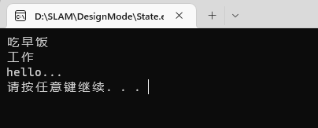

#### 22解释模式interpreter

一些应用提供了内建（Build-In)的脚本或者宏语言来让用户可以定义他们能够在系统中进行的操作。Intcerpreter模式的目的就是使用一个解释器为用户提供一个一门定义语言的语法表示的解释器，然后通过这个解释器来解释语言中的句子。

Context
解释器上下文环境类。用来存储解释器的上下文环境，比如需要解释的文法等。 AbstractExpression   
 解释器抽象类。
ConcreteExpression
解释器具体实现类。


```c++

#include <iostream>
using namespace std;
#include "string"

class Context
{
public:
	Context(int num)
	{
		m_num = num;
	}
public:
	void setNum(int num)
	{
		m_num = num;
	}
	int getNum()
	{
		return m_num;
	}
	void setRes(int res)
	{
		m_res = res;
	}
	int getRes()
	{
		return m_res;
	}

private:
	int m_num;
	int m_res;

};

class Expression
{
public:
	virtual void interpreter(Context *context) = 0;
};

class PlusExpression : public Expression
{
public:
	virtual void interpreter(Context *context)
	{
		int num = context->getNum();
		num ++ ;
		context->setNum(num);
		context->setRes(num);
	}
};

class MinusExpression : public Expression
{
public:
	virtual void interpreter(Context *context)
	{
		int num = context->getNum();
		num -- ;
		context->setNum(num);
		context->setRes(num);
	}
};

int main()
{
	Context *pcxt = new Context(10);
	Expression *e1 = new PlusExpression;
	e1->interpreter(pcxt);
	cout << "PlusExpression:" << pcxt->getRes() << endl;

	Expression *e2 = new MinusExpression;
	e2->interpreter(pcxt);
	cout << "MinusExpression:" << pcxt->getRes() << endl;

	delete e2;
	delete e1;
	system("pause");
	return 0;
}
```
运行结果如下
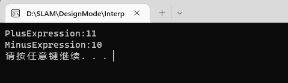

#### 23迭代器模式iterator

它把对容器中包含的内部对象的访问委让给外部类，使用Iterator（遍历）按顺序进行遍历访问的设计模式

Iterator模式就是为了有效地处理按顺序进行遍历访问的一种设计模式，简单地说，Iterator模式提供一种有效的方法，可以屏蔽聚集对象集合的容器类的实现细节，而能对容器内包含的对象元素按顺序进行有效的遍历访问。所以，Iterator模式的应用场景可以归纳为满足以下几个条件：
- 访问容器中包含的内部对象 
- 按顺序访问

Iterator（迭代器接口）：
该接口必须定义实现迭代功能的最小定义方法集
比如提供hasNext()和next()方法。
ConcreteIterator（迭代器实现类）：
迭代器接口Iterator的实现类。可以根据具体情况加以实现。

Aggregate（容器接口）：
定义基本功能以及提供类似Iterator iterator()的方法。

concreteAggregate（容器实现类）：
容器接口的实现类。必须实现Iterator iterator()方法。

```c++

#include <iostream>
using namespace std;

typedef int Object ;
#define SIZE 5 

//注意类的顺序 
class MyIterator
{
public:
	virtual void First() = 0;
	virtual void Next() = 0;
	virtual bool IsDone() = 0;
	virtual Object CurrentItem() = 0;
};

class Aggregate
{
public:
	virtual Object getItem(int index) = 0;
	virtual MyIterator *CreateIterator() = 0;
	virtual int getSize() = 0;
};

class ContreteIterator : public MyIterator
{
public:
	ContreteIterator(Aggregate *ag) 
	{
		_ag = ag;
		_idx = 0;
	}
	~ContreteIterator()
	{
		_ag = NULL;
		_idx = 0;
	}

	virtual void First()
	{
		_idx = 0;
	}
	virtual void Next()
	{
		if (_idx <	_ag->getSize())
		{
			_idx ++;
		}
	}
	virtual bool IsDone()
	{
		return (_idx == _ag->getSize());
	}
	virtual Object CurrentItem()
	{
		return _ag->getItem(_idx);
	}

protected:
private:
	int			_idx;
	Aggregate	*_ag;
};

class ConcreteAggregate : public Aggregate
{
public:
	ConcreteAggregate()
	{
		for (int i=0; i<SIZE; i++)
		{
			object[i] = i+1;
		}
	}
	virtual ~ConcreteAggregate()
	{

	}
	virtual Object getItem(int index)
	{
		return object[index];
	}
	virtual MyIterator *CreateIterator()
	{
		return new ContreteIterator(this);
	}
	virtual int getSize()
	{
		return SIZE;
	}
protected:
private:
	Object object[SIZE];
};

void test01()
{
	// 创建一个集合
	Aggregate *ag = new ConcreteAggregate();
	// 创建一个遍历这个集合的 迭代器
	MyIterator *it = ag->CreateIterator();
	

	//通过迭代器 遍历 集合
	for (; !(it->IsDone()); it->Next() )
	{
		cout << it->CurrentItem() << " ";
	}
	
	//清理相关资源 
	delete it;
	delete ag;
}

int main()
{
	test01();
	system("pause");
	return 0;
}
```
运行结果如下
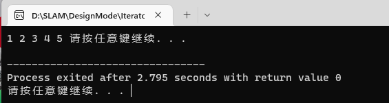

### 关于cmake的学习

首先在Windows下有一个名叫vcpkg的包可以统一管理当前windows上的包
它可以极大地简化三方库的获取、安装、使用和部署流程。

可以对库进行编译，使得各种库的版本同一，不会出现在调用各种第三方库时出现版本不统一问题，同时在出现版本问题时可以使用 vcpkg list 查看已安装的库版本，然后直接进行对应的更新操作，十分简便。

安装/更新
使用git克隆即可，git pull 然后下次再用的时候会自动编译新版的vcpkg.exe

集成使用
与Visual Studio链接：.\vcpkg.exe integrate install

C\C++库的安装
.\vcpkg install [packages to install] 

C\C++库的卸载(彻底卸载需要加上 --recurse)
.\vcpkg remove [packages to remove]
.\vcpkg.exe remove opencv:x64-windows --recurse

集成到全局：vcpkg integrate install
移除全局：vcpkg integrate remove
集成到工程：vcpkg integrate project（在“\scripts\buildsystems”目录下，生成nuget配置文件）
查看库目录：vcpkg search
查看支持的架构：vcpkg help triplet
指定编译某种架构的程序库：vcpkg install xxxx:x64-windows（x86-windows）
卸载已安装库：vcpkg remove xxxx
指定卸载平台：vcpkg remove xxxx:x64-windows
移除所有旧版本库：vcpkg remove --outdated
查看已经安装的库：vcpkg list
更新已经安装的库：vcpkg update xxx
导出已经安装的库：vcpkg export xxxx --7zip（–7zip –raw –nuget –ifw –zip）

目前我的目录下安装了boost pangolin fmt opencv3 opencv4 cmake

使用它的另一个好处就是他会提示你怎么去用

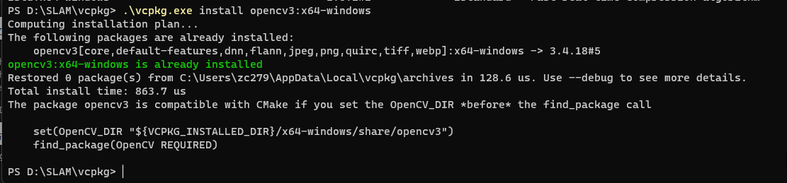

首先安装了库之后，需要使用msys2
https://blog.csdn.net/maoye/article/details/128254445

想要编译成linux下的makefile而非msvc的sln解决方案时需要使用如下命令
```cmake .. -G "Unix Makefiles" ```编译时会出现问题
CMake Error: CMake was unable to find a build program corresponding to "Unix Makefiles".  CMAKE_MAKE_PROGRAM is not set.  You probably need to select a different build tool.

解决方法就是找到mingw安装目录下mingw32-make.exe拷贝一份并重命名为make.exe

例子testmylib文件夹下的内容所示