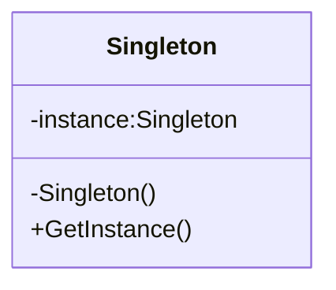

### 首先12月的主要目标是

> 发现还是得先看不熟悉的代码，去做，这样比看完整本slam十四讲进步快的多

1.c++学习；
2.orbslam算法修改；
3.建模需求对接；
4.空三算法分析；

#### 分解在学习上：

1. cmake、23中设计模式、uml、git
2. 输出带地理坐标的点云和位姿；
3. 输出地面点精度；

#### 分解在工作上：

##### 三维建模分析

建模效果分析，跟进和对接copre建模需求。

1. 三维建模软件学习，数据分析
2. 对接copre建模需求
列了需求和问题表，但是自己的不足之处在于做的表格不够清晰

##### 空三算法分析

1.前期测试数据补充；
2.pos影响精度，论证；（方法、数据）


### 具体工作情况

为了添加上R t 需要做的首先是熟悉单目+IMU构建的具体

经过讨论发现，在最开始的时候由于没有GNSS位置，就需要使用R t找到第一帧的相机中心在投影坐标系下的坐标，由此可以推算出所有地图点的投影坐标。
但是 加入R t进行优化还需要研究

#### 学习设计模式第一课 - 单例模式

创建型模式 :  通常和对象的创建有关，涉及到对象实例化的方式。（共5种模式)
结构型模式： 描述的是如何组合类和对象以获得更大的结构。(共7种模式)
行为型模式： 用来对类或对象怎样交互和怎样分配职责进行描述。(共11种模式)

设计模式基本原则
开放封闭原则、单一职责原则、依赖倒置原则、接口隔离原则、里氏替换原则、优先使用组合而不是继承原则、迪米特法则

单例模式（Singleton Pattern）是保证一个类仅有一个实例，并提供一个访问它的全局访问点。



单例的好处/原因：

- 在多个线程之间，比如初始化一次socket资源

- 在整个程序空间使用全局变量，共享资源

- 大规模系统中，为了性能的考虑，需要节省对象的创建时间等等

实现单例步骤：

- 构造函数 私有
- 提供一个全局的静态方法
- 在类中定义一个静态指针，指向本类的变量的静态变量指针

//TODO
把变量和函数名规范化

懒汉式

```C++
#include <iostream>
using namespace std;

class Singleton
{
private:
    Singleton(){
        m_singer =NULL;
        m_count = 0;
        cout << "Construct Singleton done"<< endl;
    }
public:
    static Singleton *getInstance(){
        if(m_singer == NULL){ //懒汉式：1 每次获取实例都要判断 2 多线程会有问题
            m_singer = new Singleton;
        }
        return m_singer;
    }
    static void printT(){
        cout << "m_count:"<<m_count <<endl;
    }
private:
    static Singleton *m_singer;
    static int m_count;
};

Singleton *Singleton:: m_singer = NULL;//懒汉，没有创建单例对象
int Singleton:: m_count = 0;

int main(){
    cout << "perform lazyguy" << endl;
    Singleton *p1 = Singleton::getInstance(); //只有在使用的时候，才去创建对象。
    Singleton *p2 = Singleton::getInstance();
    if (p1 != p2)
	{
		cout << "not the same instance" << endl;
	}
    else
	{
		cout << "same instance" << endl;
	}
    p1->printT();
	p2->printT();
    system("pause");
	return 0;
}
```

使用DevC++编译后结果:


饿汉式

```C++
class  Singelton2
{
private:
	Singelton2()
	{
		m_singer = NULL;
		m_count = 0;
		cout << "Construct Singelton2 done" << endl;
	}
	
public:
	static Singelton2 *getInstance()
	{
// 		if (m_singer == NULL )
// 		{
// 			m_singer = new Singelton2;
// 		}
		return m_singer;
	}
	static void freeInstance()//提供释放资源的函数
	{
		if (m_singer != NULL)
		{
			delete m_singer;
			m_singer = NULL;
			m_count = 0;
		}
	}
	static void printT()
	{
		cout << "m_count: " << m_count << endl;
	}
private:
	static Singelton2 *m_singer;
	static int m_count;
};

Singelton2 *Singelton2::m_singer = new Singelton2; //不管你创建不创建实例，均把实例new出来
int Singelton2::m_count = 0;
```

使用DevC++编译后结果:


关于懒汉模式在多线程的优化：

- NULL == m_instance，使程序相对开销增大
- 多线程中会导致多个实例的产生，从而导致运行代码不正确以及内存的泄露
    C++中的构造函数简单来说分两步：
        第一步：内存分配
        第二步：初始化成员变量
        由于多线程的关系，可能当我们在分配内存好了以后，还没来得急初始化成员变量，就进行线程切换，另外一个线程拿到所有权后，由于内存已经分配了，但是变量初始化还没进行，因此打印成员变量的相关值会发生不一致现象。

```c++
//#include "stdafx.h"
#include "windows.h"
#include "winbase.h"
#include <process.h>
#include "iostream"

using namespace std;
class Singelton
{
private:
	Singelton()
	{
		count ++;
		cout<<"Singelton Construct begin\n"<<endl;
		Sleep(1000);
		cout<<"Singelton Construct end\n"<<endl;
		
	}
private:
	//防止拷贝构造和赋值操作
	Singelton(const Singelton &obj) { ;}
	Singelton& operator=(const Singelton &obj)	{ ;}
public:
	static Singelton *getSingelton()
	{
		//1"懒汉"模式虽然有优点，但是每次调用GetInstance()静态方法时，必须判断
		//	NULL == m_instance，使程序相对开销增大。
		//2多线程中会导致多个实例的产生，从而导致运行代码不正确以及内存的泄露。
		//3提供释放资源的函数
		return single;
	}

	static Singelton *releaseSingelton()
	{
		if (single != NULL) //需要判断
		{
			cout<<"release resources\n"<<endl;
			delete single;
			single = NULL;
		}
		return single;
	}
	void pirntS() //测试函数
	{
		printf("Singelton printS test count:%d \n", count);
	}

private:
	static Singelton *single;
	static int count;
};

//note 静态变量类外初始化
Singelton *Singelton::single = new Singelton();
int Singelton::count = 0;

int _tmainTTT(int argc, char* argv[])
{
	Singelton *s1 = Singelton::getSingelton();
	Singelton *s2 = Singelton::getSingelton();
	if (s1 == s2)
	{
		cout<<"ok....equal"<<endl;
	}
	else
	{
		cout<<"not.equal"<<endl;
	}
	s1->pirntS();
	Singelton::releaseSingelton();
	cout <<"hello...."<<endl;
	system("pause");
	return 0;
}

unsigned int threadfunc2(void *myIpAdd)
{
	int id = GetCurrentThreadId();
	printf("\n threadfunc%d \n", id);
	return 1;
}

void threadfunc(void *myIpAdd)
{
	int id = GetCurrentThreadId();
	printf("\n threadfunc%d \n", id);
	 Singelton::getSingelton()->pirntS();
	return ;
}

 int main(int argc, char* argv[])
{
	int i = 0; 
	DWORD dwThreadId[201], dwThrdParam = 1;
	HANDLE hThread[201]; 
	int threadNum = 3;

	for (i=0; i<threadNum; i++)
	{
		//hThread[i] = (HANDLE)_beginthreadex( NULL, 0, &threadfunc, NULL, 0,&dwThreadId[i] );
		hThread[i] = (HANDLE)_beginthread(&threadfunc, 0 , 0 );
		if (hThread[i] == NULL)
		{
			printf("begin thread %d error!!!\n", i);
			break;
		}		
	}
    //等待所有的子线程都运行完毕后,才执行 这个代码
	for (i=0; i<threadNum; i++)
	{
		WaitForSingleObject( hThread[i], INFINITE );	  
	}
	printf("Watting for all thread end\n");
	for (i=0; i<threadNum; i++)
	{
		//CloseHandle( hThread[i] );
	}
	Singelton::releaseSingelton();
	cout <<"hello...."<<endl;
	system("pause");
	return 0;
}
```

使用DevC++编译后结果:
