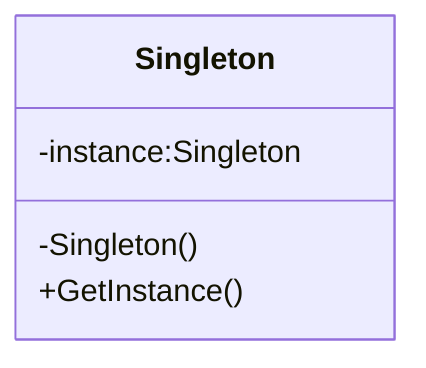
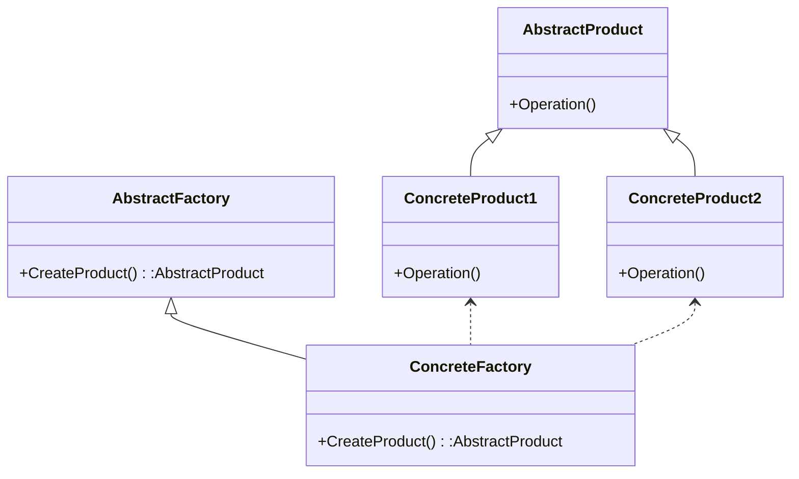

### 首先12月的主要目标是

> 发现还是得先看不熟悉的代码，去做，这样比看完整本slam十四讲进步快的多

1.c++学习；
2.orbslam算法修改；
3.建模需求对接；
4.空三算法分析；

#### 分解在学习上：

1. cmake、23中设计模式、uml、git
2. 输出带地理坐标的点云和位姿；
3. 输出地面点精度；

#### 分解在工作上：

##### 三维建模分析

建模效果分析，跟进和对接copre建模需求。

1. 三维建模软件学习，数据分析
2. 对接copre建模需求
列了需求和问题表，但是自己的不足之处在于做的表格不够清晰

##### 空三算法分析

1.前期测试数据补充；
2.pos影响精度，论证；（方法、数据）


### 具体工作情况

为了添加上R t 需要做的首先是熟悉单目+IMU构建的具体

经过讨论发现，在最开始的时候由于没有GNSS位置，就需要使用R t找到第一帧的相机中心在投影坐标系下的坐标，由此可以推算出所有地图点的投影坐标。
但是 加入R t进行优化还需要研究


#### 编译VINSFusion

首先安装ceres最新版编译报错：Parameter……
随后发现还是11月学习笔记中说到的ceres2.1.0与opencv3.3.90冲突（十四讲的安装最新版就不会报错）

遂改成Eigen3.3.7，
先卸载：https://blog.csdn.net/qq_45401419/article/details/118358687
再下载、编译：https://blog.csdn.net/reasonyuanrobot/article/details/114372363

Ceres1.14.0编译,记得先按照官方教程装一些依赖库
https://blog.csdn.net/qq_41586768/article/details/107541917

最后编译VINFusion
catkin_make

成功

用到了11月的学习笔记中的第八章opencv共存的问题
改成OpenCV 3.0.0之后成功的
```CMake
find_package(OpenCV 4 REQUIRED)
#find_package(OpenCV 3.0.0 REQUIRED)# 2个opencv的使用办法
```

随后编译成功


### 类与类之间的关系5种

#### 1泛化

#### 2依赖

#### 3关联

#### 4聚合

#### 5组合

### UML图10种

#### 1用例图

#### 2类图

#### 3对象图

#### *4时序图*

#### 5活动图

#### 6状态图

#### 7协作图

#### 8和9 包图和组件图

#### 10部署图

### 创建型模式5

#### 学习设计模式第1课 - 单例模式

https://blog.csdn.net/weixin_45712636/article/details/124328504

创建型模式 :  通常和对象的创建有关，涉及到对象实例化的方式。（共5种模式)
结构型模式： 描述的是如何组合类和对象以获得更大的结构。(共7种模式)
行为型模式： 用来对类或对象怎样交互和怎样分配职责进行描述。(共11种模式)

设计模式基本原则
开放封闭原则、单一职责原则、依赖倒置原则、接口隔离原则、里氏替换原则、优先使用组合而不是继承原则、迪米特法则

单例模式（Singleton Pattern）是保证一个类仅有一个实例，并提供一个访问它的全局访问点。



单例的好处/原因：

- 在多个线程之间，比如初始化一次socket资源

- 在整个程序空间使用全局变量，共享资源

- 大规模系统中，为了性能的考虑，需要节省对象的创建时间等等

实现单例步骤：

- 构造函数 私有
- 提供一个全局的静态方法
- 在类中定义一个静态指针，指向本类的变量的静态变量指针

//TODO
把变量和函数名规范化

懒汉式

```C++
#include <iostream>
using namespace std;

class Singleton
{
private:
    Singleton(){
        m_singer =NULL;
        m_count = 0;
        cout << "Construct Singleton done"<< endl;
    }
public:
    static Singleton *getInstance(){
        if(m_singer == NULL){ //懒汉式：1 每次获取实例都要判断 2 多线程会有问题
            m_singer = new Singleton;
        }
        return m_singer;
    }
    static void printT(){
        cout << "m_count:"<<m_count <<endl;
    }
private:
    static Singleton *m_singer;
    static int m_count;
};

Singleton *Singleton:: m_singer = NULL;//懒汉，没有创建单例对象
int Singleton:: m_count = 0;

int main(){
    cout << "perform lazyguy" << endl;
    Singleton *p1 = Singleton::getInstance(); //只有在使用的时候，才去创建对象。
    Singleton *p2 = Singleton::getInstance();
    if (p1 != p2)
	{
		cout << "not the same instance" << endl;
	}
    else
	{
		cout << "same instance" << endl;
	}
    p1->printT();
	p2->printT();
    system("pause");
	return 0;
}
```

使用DevC++编译后结果:


饿汉式

```C++
class  Singelton2
{
private:
	Singelton2()
	{
		m_singer = NULL;
		m_count = 0;
		cout << "Construct Singelton2 done" << endl;
	}
	
public:
	static Singelton2 *getInstance()
	{
// 		if (m_singer == NULL )
// 		{
// 			m_singer = new Singelton2;
// 		}
		return m_singer;
	}
	static void freeInstance()//提供释放资源的函数
	{
		if (m_singer != NULL)
		{
			delete m_singer;
			m_singer = NULL;
			m_count = 0;
		}
	}
	static void printT()
	{
		cout << "m_count: " << m_count << endl;
	}
private:
	static Singelton2 *m_singer;
	static int m_count;
};

Singelton2 *Singelton2::m_singer = new Singelton2; //不管你创建不创建实例，均把实例new出来
int Singelton2::m_count = 0;
```

使用DevC++编译后结果:


关于懒汉模式在多线程的优化：

- NULL == m_instance，使程序相对开销增大
- 多线程中会导致多个实例的产生，从而导致运行代码不正确以及内存的泄露
    C++中的构造函数简单来说分两步：
        第一步：内存分配
        第二步：初始化成员变量
        由于多线程的关系，可能当我们在分配内存好了以后，还没来得急初始化成员变量，就进行线程切换，另外一个线程拿到所有权后，由于内存已经分配了，但是变量初始化还没进行，因此打印成员变量的相关值会发生不一致现象。

```c++
//#include "stdafx.h"
#include "windows.h"
#include "winbase.h"
#include <process.h>
#include "iostream"

using namespace std;
class Singelton
{
private:
	Singelton()
	{
		count ++;
		cout<<"Singelton Construct begin\n"<<endl;
		Sleep(1000);
		cout<<"Singelton Construct end\n"<<endl;
		
	}
private:
	//防止拷贝构造和赋值操作
	Singelton(const Singelton &obj) { ;}
	Singelton& operator=(const Singelton &obj)	{ ;}
public:
	static Singelton *getSingelton()
	{
		//1"懒汉"模式虽然有优点，但是每次调用GetInstance()静态方法时，必须判断
		//	NULL == m_instance，使程序相对开销增大。
		//2多线程中会导致多个实例的产生，从而导致运行代码不正确以及内存的泄露。
		//3提供释放资源的函数
		return single;
	}

	static Singelton *releaseSingelton()
	{
		if (single != NULL) //需要判断
		{
			cout<<"release resources\n"<<endl;
			delete single;
			single = NULL;
		}
		return single;
	}
	void pirntS() //测试函数
	{
		printf("Singelton printS test count:%d \n", count);
	}

private:
	static Singelton *single;
	static int count;
};

//note 静态变量类外初始化
Singelton *Singelton::single = new Singelton();
int Singelton::count = 0;

int _tmainTTT(int argc, char* argv[])
{
	Singelton *s1 = Singelton::getSingelton();
	Singelton *s2 = Singelton::getSingelton();
	if (s1 == s2)
	{
		cout<<"ok....equal"<<endl;
	}
	else
	{
		cout<<"not.equal"<<endl;
	}
	s1->pirntS();
	Singelton::releaseSingelton();
	cout <<"hello...."<<endl;
	system("pause");
	return 0;
}

unsigned int threadfunc2(void *myIpAdd)
{
	int id = GetCurrentThreadId();
	printf("\n threadfunc%d \n", id);
	return 1;
}

void threadfunc(void *myIpAdd)
{
	int id = GetCurrentThreadId();
	printf("\n threadfunc%d \n", id);
	 Singelton::getSingelton()->pirntS();
	return ;
}

 int main(int argc, char* argv[])
{
	int i = 0; 
	DWORD dwThreadId[201], dwThrdParam = 1;
	HANDLE hThread[201]; 
	int threadNum = 3;

	for (i=0; i<threadNum; i++)
	{
		//hThread[i] = (HANDLE)_beginthreadex( NULL, 0, &threadfunc, NULL, 0,&dwThreadId[i] );
		hThread[i] = (HANDLE)_beginthread(&threadfunc, 0 , 0 );
		if (hThread[i] == NULL)
		{
			printf("begin thread %d error!!!\n", i);
			break;
		}		
	}
    //等待所有的子线程都运行完毕后,才执行 这个代码
	for (i=0; i<threadNum; i++)
	{
		WaitForSingleObject( hThread[i], INFINITE );	  
	}
	printf("Watting for all thread end\n");
	for (i=0; i<threadNum; i++)
	{
		//CloseHandle( hThread[i] );
	}
	Singelton::releaseSingelton();
	cout <<"hello...."<<endl;
	system("pause");
	return 0;
}
```

使用DevC++编译后结果:


#### 学习设计模式第2课 - 工厂模式

意义在于定义的是一个创建对象的接口，将实际的创建对象推迟到子类中 



通过添加代码方式处理新建的ConcreteProduct

但是Factory 模式仅仅局限于一类类（就是说
Product 是一类，有一个共同的基类），如果我们要为不同类的类提供一个对象创建的接口，那就要用 AbstractFactory了

```c++
#include "iostream"
using namespace std;

class Fruit
{
public:
	virtual void sayname()
	{
		cout<<"fruit\n";
	}
};

class FruitFactory
{
public:
	virtual Fruit* getFruit()
	{
		return new Fruit();
	}
};


//香蕉
class Banana : public Fruit
{
public:
	virtual void sayname()
	{
		cout<<"Banana \n"<<endl;
	}
};

//香蕉工厂
class BananaFactory : public  FruitFactory
{
public:
	virtual Fruit* getFruit()
	{
		return new Banana;
	}
};


//苹果
class Apple : public Fruit
{
public:
	virtual void sayname()
	{
		cout<<"Apple \n"<<endl;
	}
};

//苹果工厂
class AppleFactory : public  FruitFactory
{
public:
	virtual Fruit* getFruit()
	{
		return new Apple;
	}
};

int main()
{
	FruitFactory * ff  = NULL;
	Fruit *fruit = NULL;

	//1
	ff = new BananaFactory();
	fruit = ff->getFruit();
	fruit->sayname();

	delete fruit;
	delete ff;

	//2苹果
	ff = new AppleFactory();
	fruit = ff->getFruit();
	fruit->sayname();

	delete fruit;
	delete ff;

	cout<<"hello....\n";
	system("pause");
	return 0;
}

```

#### 学习设计模式第3课 - 抽象工厂

我搜到的资料我个人觉得还是说的很清楚的，抽象工厂可以向客户端提供一个接口是的客户端不必指定产品的具体类型，就能创建多个产品族的产品对象。

解释:具体工厂在开闭原则下,		能生产香蕉/苹果/梨子;  (产品等级结构)
	抽象工厂:在开闭原则下,		能生产：南方香蕉/苹果/梨子 (产品族)

1. 抽象工厂(AbstractFactory)
任何工厂类都必须实现这个接口

2. 具体工厂
具体工厂类是抽象工厂的一个实现，负责实例化某个产品族中的产品对象。

3. 抽象产品
抽象模式所创建的所有对象的父类，它负责描述所有实例所共有的公共接口。

4. 具体产品
抽象模式所创建的具体实例对象

```c++

#include<iostream>
using namespace std;
class Fruit
{
public:
	virtual void sayname()
	{
		cout<<"fruit\n";
	}
};

class FruitFactory
{
public:
	virtual Fruit* getApple()
	{
		return new Fruit();
	}
	virtual Fruit* getBanana()
	{
		return new Fruit();
	}
};

//南方香蕉
class SouthBanana : public Fruit
{
public:
	virtual void sayname()
	{
		cout<<"South Banana \n"<<endl;
	}
};


//南方苹果
class SouthApple : public Fruit
{
public:
	virtual void sayname()
	{
		cout<<"South Apple \n"<<endl;
	}
};


//北方香蕉
class NorthBanana : public Fruit
{
public:
	virtual void sayname()
	{
		cout<<"North Banana \n"<<endl;
	}
};


//北方苹果
class NorthApple : public Fruit
{
public:
	virtual void sayname()
	{
		cout<<"North Apple \n"<<endl;
	}
};

class SourthFruitFactory : public FruitFactory
{
public:
	virtual Fruit* getApple()
	{
		return new SouthApple();
	}
	virtual Fruit* getBanana()
	{
		return new SouthBanana();
	}
};

class NorthFruitFactory : public FruitFactory
{
public:
	virtual Fruit* getApple()
	{
		return new NorthApple();
	}
	virtual Fruit* getBanana()
	{
		return new NorthBanana();
	}
};

int main()
{	
	FruitFactory * ff  = NULL;
	Fruit *fruit = NULL;

	ff = new SourthFruitFactory();
	fruit = ff->getApple();
	fruit->sayname();
	fruit = ff->getBanana();
	fruit->sayname();

	delete fruit;
	delete ff;

	ff = new NorthFruitFactory();
	fruit = ff->getApple();
	fruit->sayname();
	fruit = ff->getBanana();
	fruit->sayname();

	delete fruit;
	delete ff;

	cout<<"hello....\n";
	system("pause");
	return 0;
}

```

#### 学习设计模式第4课 - 建造者模式


1. Builder：为创建产品各个部分，统一抽象接口。
2. ConcreteBuilder：具体的创建产品的各个部分，部分A， 部分B，部分C。
3. Director：构造一个使用Builder接口的对象。
4. Product：表示被构造的复杂对象。

ConcreteBuilder创建该产品的内部表示并定义它的装配过程，包含定义组成部件的类，包括将这些部件装配成最终产品的接口。

适用情况：
一个对象的构建比较复杂，将一个对象的构建和对象的表示进行分离。

Builder模式不是很常用。模式本身就是一种思想。知道了就可以了。

```c++


#include <iostream>
using namespace std;
#include "string"
class House
{
public:
	void setFloor(string floor)
	{
		this->m_floor = floor;
	}
	void setWall(string wall)
	{
		this->m_wall = wall;
	}
	void setDoor(string door)
	{
		this->m_door = door;
	}

	//
	string getFloor()
	{
		return m_floor;
	}
	string setWall()
	{
		return  m_wall;
	}
	string setDoor()
	{
		return m_door;
	}

protected:
private:
	string	m_floor;
	string	m_wall;
	string	m_door;
};

class Builder
{
public:
	virtual void makeFloor() = 0;
	virtual void makeWall() =  0;
	virtual void makeDoor() = 0;
	virtual House *GetHouse() = 0;
};

//公寓
class FlatBuild : public Builder
{
public:
	FlatBuild()
	{
		pHouse = new House;
	}
	virtual void makeFloor()
	{
		pHouse->setFloor("flat Door");
	}
	virtual void makeWall()
	{
		pHouse->setWall("flat Wall");
	}
	virtual void makeDoor()
	{
		pHouse->setDoor("flat Door");
	}
	virtual House *GetHouse()
	{
		return pHouse;
	}

private:
	House *pHouse;
};

//别墅
class VillaBuild : public Builder
{
public:
	VillaBuild()
	{
		pHouse = new House;
	}
	virtual void makeFloor()
	{
		pHouse->setFloor("villa floor");
	}
	virtual void makeWall()
	{
		pHouse->setWall("villa Wall");
	}
	virtual void makeDoor()
	{
		pHouse->setDoor("villa Door");
	}
	virtual House *GetHouse()
	{
		return pHouse;
	}
private:
	House *pHouse;
};

class Director
{
public:
	void Construct(Builder *builder)
	{
		builder->makeFloor();
		builder->makeWall();
		builder->makeDoor();
	}
protected:
private:
};


void main01()
{
	//客户直接造房子
	House *pHose = new House;
	pHose->setDoor("wbm门");
	pHose->setFloor("wbmFloor");
	pHose->setWall("wbmWall");
	delete pHose;

	
	/* //工程队直接造房子 
	Builder *builder = new FlatBuild;
	builder->makeFloor();
	builder->makeWall();
	builder->makeDoor();
	*/

	//指挥者（设计师）指挥 工程队 和 建房子
	Director *director = new Director;

	//建公寓
	Builder *builder = new FlatBuild;
	director->Construct(builder); //设计师 指挥 工程队干活
	House *house = builder->GetHouse();
	cout << house->getFloor() << endl;
	delete house;
	delete builder;

	//建别墅
	builder = new VillaBuild;
	director->Construct(builder); //设计师 指挥 工程队干活
	house = builder->GetHouse();
	cout << house->getFloor() << endl;
	delete house;
	delete builder;
	
	delete director;
	
	system("pause");
	return ;
}

int main(){
	main01();
	return 0;
	
}

```

#### 学习设计模式第5课 - 原型模式

适用情况：
一个复杂对象，具有自我复制功能，统一一套接口。

```c++


#include <iostream>
using namespace std;
#include "string"
class Person
{
public:
	virtual Person *Clone() = 0;
	virtual void printT() = 0;

};

class JavaProgrammer : public Person
{
public:
	JavaProgrammer()
	{
		this->m_name = "";
		this->m_age = 0;
		m_resume = NULL;
	}
	JavaProgrammer(string name, int age)
	{
		this->m_name = name;
		this->m_age = age;
		m_resume = NULL;
	}

	~JavaProgrammer()
	{
		if (m_resume!= NULL)
		{
			free(m_resume);
			m_resume = NULL;
		}
	}
	virtual Person *Clone()
	{
		JavaProgrammer *p = new JavaProgrammer;
		*p = *this;
		return p;
	}

	void setResume(char *resume)
	{
		m_resume = new char[strlen(resume) + 1];
		strcpy(m_resume, resume);
	}

	virtual void printT()
	{
		cout << "m_name:" << m_name << "\t" << "m_age:" << m_age << endl;
		if (m_resume != NULL)
		{
			cout << m_resume << endl;
		}
	}
protected:
private:
	string	m_name;
	int		m_age;
	char	*m_resume;
};

int main()
{
	JavaProgrammer javaperson1("张三", 30);
	javaperson1.setResume("我是java程序员");
	Person *p2 = javaperson1.Clone();  //对象具有自我复制功能 注意深拷贝和浅拷贝问题
	p2->printT();

	delete p2;
	
	cout<<"hello..."<<endl;
	system("pause");
	return 0;
}
```

### 结构形模式7

#### 学习设计模式第6课 - 代理模式

它可以为其他对象提供一种代理（Proxy）以控制对这个对象的访问。
指具有与代理元（被代理的对象）具有相同的接口的类，客户端必须通过代理与被代理的目标类交互，而代理一般在交互的过程中（交互前后），进行某些特别的处理。

举例：租房中介

1、和适配器模式的区别：适配器模式主要改变所考虑对象的接口，而代理模式不能改变所代理类的接口。
2、和装饰器模式的区别：装饰器模式为了增强功能，而代理模式是为了加以控制。

```c++

#include <string>
#include <iostream>
using namespace std;
//定义接口
class Interface
{
public:
	virtual void Request()=0;
};
//真实类
class RealClass : public Interface
{
public:
	virtual void Request()
	{
		cout<<"真实的请求"<<endl;
	}
};
//代理类
class ProxyClass : public Interface
{
private:
	RealClass* m_realClass;
public:
	virtual void Request()
	{
	    m_realClass= new RealClass();
		m_realClass->Request();
		delete m_realClass;
	}
};

//客户端：
int main()
{
	ProxyClass* test=new ProxyClass();
	test->Request();
	return 0;
}
```

#### 学习设计模式第7课 - 装饰模式

装饰（ Decorator ）模式又叫做包装模式。通过一种对客户端透明的方式来扩展对象的功能，是继承关系的一个替换方案。

装饰（ Decorator ）模式又叫做包装模式。通过一种对客户端透明的方式来扩展对象的功能，是继承关系的一个替换方案。

装饰者模式（Decorator Pattern）动态的给一个对象添加一些额外的职责。就增加功能来说，此模式比生成子类更为灵活

Component（被装饰对象的基类）
定义一个对象接口，可以给这些对象动态地添加职责。

ConcreteComponent（具体被装饰对象）
定义一个对象，可以给这个对象添加一些职责。

Decorator（装饰者抽象类）
维持一个指向Component实例的引用，并定义一个与Component接口一致的接口。

ConcreteDecorator（具体装饰者）
具体的装饰对象，给内部持有的具体被装饰对象，增加具体的职责。

```c++
#include <iostream>
using namespace std;

class Car
{
public:
	virtual void show() = 0;
protected:
private:
};

class RunCar : public Car
{
public:
	void run()
	{
		cout << "可以跑" << endl;
	}
	virtual void show()
	{
		run();
	}
protected:
private:
};

class SwimCarDirector : public Car
{
public:
	SwimCarDirector(Car *p)
	{
		m_p = p;
	}

	void swim()
	{
		cout << "可以游" << endl;
	}

	virtual void show()
	{
		m_p->show();
		swim();
	}
private:
	Car *m_p;
};

class FlyCarDirector : public Car
{
public:
	FlyCarDirector(Car *p)
	{
		m_p = p;
	}

	void fly()
	{
		cout << "可以飞" << endl;
	}
	virtual void show()
	{
		m_p->show();
		fly();
	}
private:
	Car *m_p;
};

int main()
{
	Car *runcar = NULL;
	runcar = new RunCar;
	runcar->show();

	cout <<"车开始装饰swim"<<endl;
	SwimCarDirector *swimCar = new SwimCarDirector(runcar);
	swimCar->show();

	cout <<"车开始装饰fly"<<endl;
	FlyCarDirector *flyCar = new FlyCarDirector(swimCar);
	flyCar->show();

	delete flyCar;
	delete swimCar;
	delete runcar;
	
	return 0;
}

```

#### 学习设计模式第8课 - 适配器模式

```c++
#include <iostream>
using namespace std;

class Current18v
{
public:
	void use18vCurrent()
	{
		cout << "使用18v的交流电" << endl;
	}
protected:
private:
};


class Current220v
{
public:
	void use220vCurrent()
	{
		cout << "使用220v的交流电" << endl;
	}
protected:
private:
};


class Adapter : public Current18v
{
public:
	Adapter(Current220v *p220v)
	{
		m_p220v = p220v;
	}
	void use18vCurrent()
	{
		cout << "adapter中使用电流" << endl;
		m_p220v->use220vCurrent();
	}
protected:
private:
	Current220v *m_p220v;
};

int main()
{
	Current220v *p220v = new Current220v;
	Adapter *padapter = new Adapter(p220v);
	padapter->use18vCurrent();

	delete p220v;
	delete padapter;
	system("pause");
	return 0;
}
```

#### 学习设计模式第9课 - 组合模式


#### 学习设计模式第10课 - 桥接模式


#### 学习设计模式第11课 - 外观模式


#### 学习设计模式第12课 - 享元模式


### 行为模式 11

#### 模板模式template


#### 命令模式command


#### 责任链模式Chain of Responsibility

#### 策略模式

#### 中介者模式mediator

#### 观察者模式observer

#### 备忘录模式mememto

#### 访问者模式visitor

#### 状态模式state

#### 解释模式interpreter

#### 迭代器模式iterator