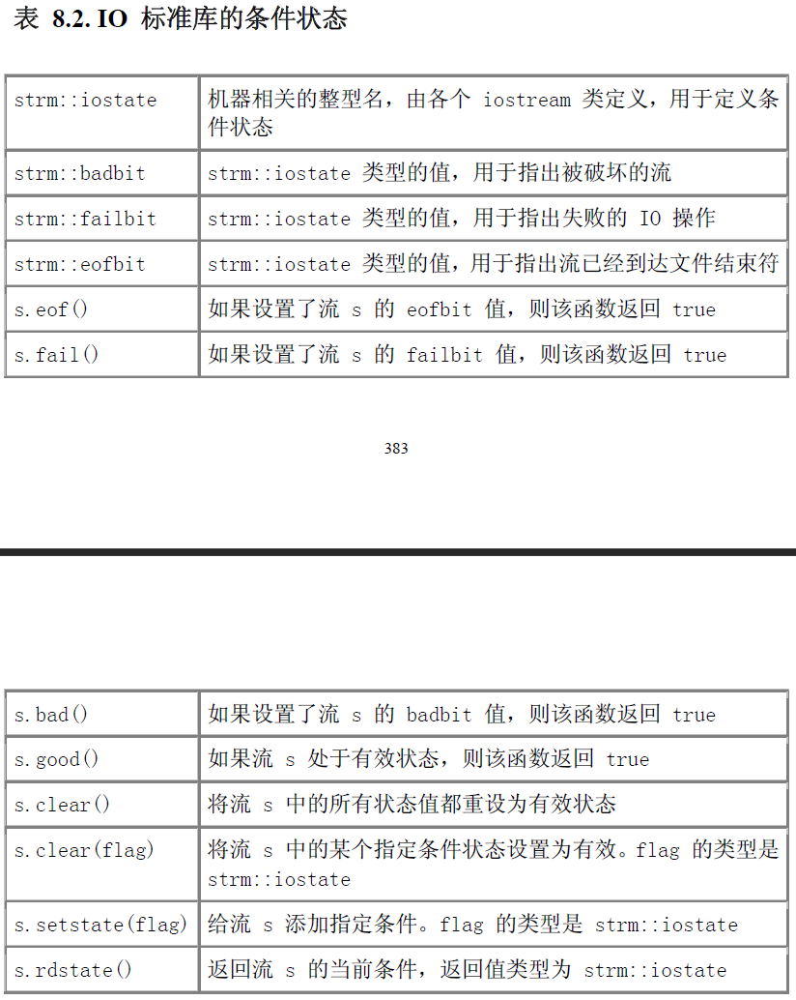
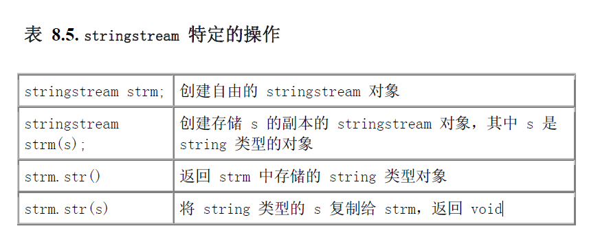
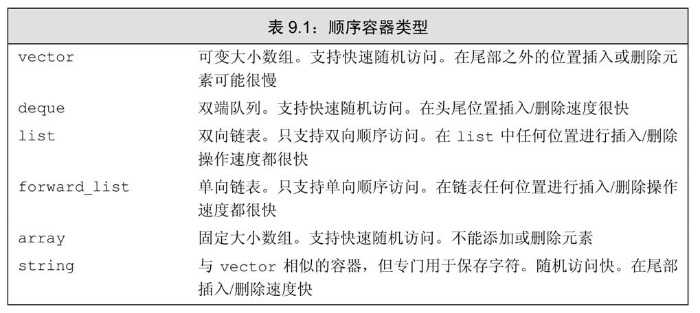
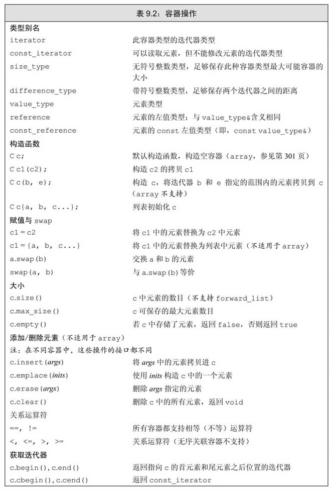
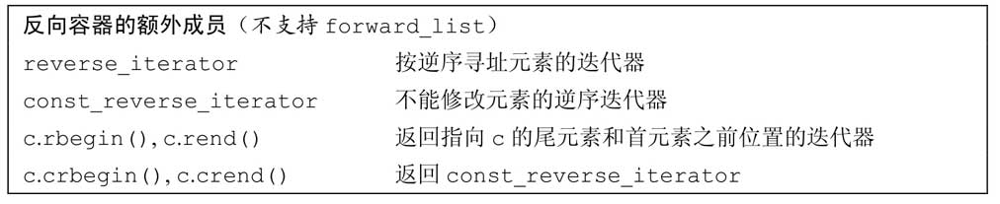
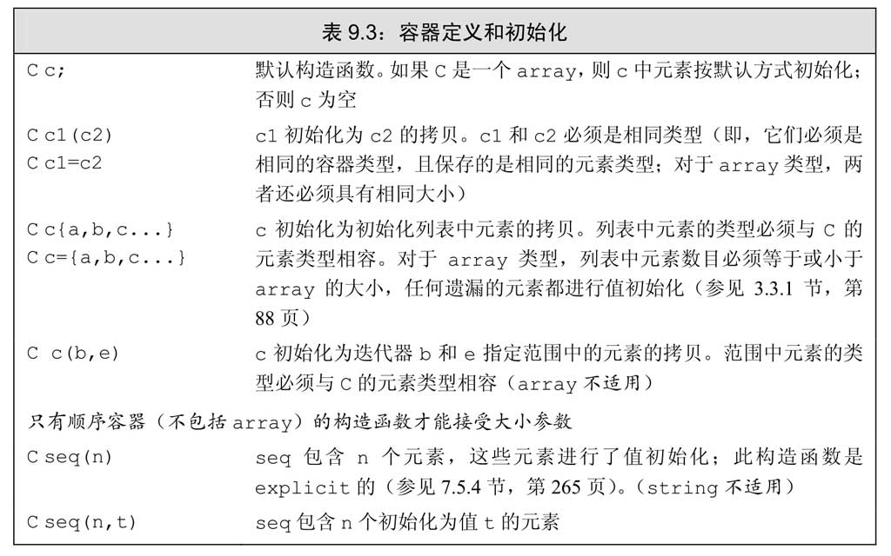
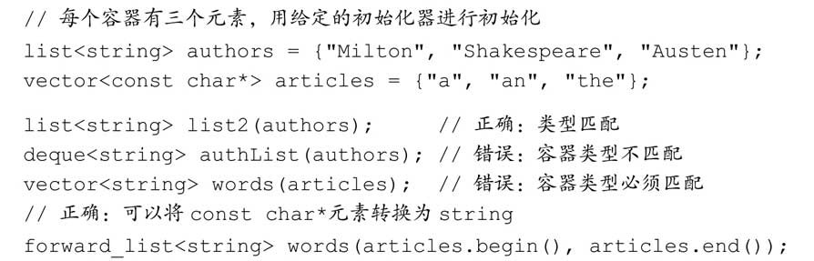
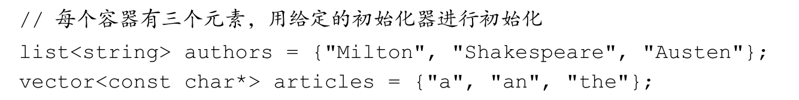
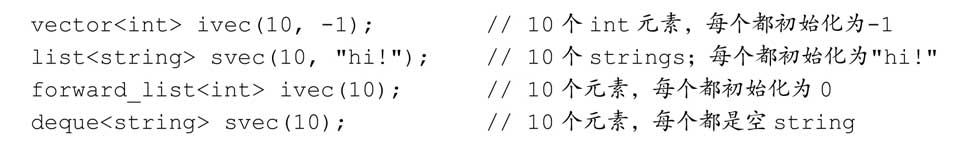

# C++ Primer

> 简要介绍自己不熟的地方，方便以后查看

## 第一章 快速入门

std::cin
std::cout

## 第二章 变量和基本类型

## 第三章 标准库类型

## 第四章 数组和指针

## 第五章 表达式

## 第六章 语句

## 第七章 函数

## 第八章 标准IO库

### 8.1. 面向对象的标准IO库

iostream:istream ostream iostream
fstream:ifstream ofstream
sstream:istringstream ostringstream stringstream

**IO对象不可以复制或复制**

1. 只有支持复制的元素类型可以存储在 vector 或其他容器类型里
2. 形参或返回类型也不能为流类型。如果需要传递或返回 IO 对象，则必须传递或返回指向该对象的指针或引用

### 8.2. IO标准库的条件状态

### 8.3. 输出缓冲区管理

每个 IO 对象管理一个缓冲区，用于存储程序读写的数据
比如ostream os ;
os << "111";

系统将字符串字面值存储在与流 os 关联的缓冲区中。
下面几种情况将导致
缓冲区的内容被刷新，即写入到真实的输出设备或者文件：

1. 程序正常结束。作为 main 返回工作的一部分，将清空所有输出缓冲区。
2. 在一些不确定的时候，缓冲区可能已经满了，在这种情况下，缓冲区将会
在写下一个值之前刷新。
3. 用操纵符（第 1.2.2 节）显式地刷新缓冲区，例如行结束符 endl。
4. 在每次输出操作执行完后，用 unitbuf 操作符设置流的内部状态，从而
清空缓冲区。
5. 可将输出流与输入流关联（tie）起来。在这种情况下，在读输入流时将
刷新其关联的输出缓冲区。

**程序崩溃**不会刷新缓冲区
如果因为缓冲区没有刷新导致的问题，花了很多时间查找问题就不值得了。所以多用endl，少用'\n'

将输入和输出绑在一起
当输入流与输出流绑在一起时，任何读输入流的尝试都将首先刷新其输出流关联的缓冲区
标准库将 cout 与 cin 绑在一起

tie 函数可由 istream 或 ostream 对象调用，使用一个指向 ostream 对象的指针形参。

### 8.4. 文件的输入和输出

fstream 头文件定义了三种支持文件 IO 的类型：

1. ifstream，由 istream 派生而来，提供读文件的功能。
2. ofstream，由 ostream 派生而来，提供写文件的功能。
3. fstream，由 iostream 派生而来，提供读写同一个文件的功能。
8.4.1. 文件流对象的使用
由于历史原因，IO 标准库使用 C 风格字符串（第 4.3 节）
假设要使用的文件名保存在 string 对象中，则可调用 c_str 成员（第4.3.2 节）获取 C 风格字符串。
ifstream infile(ifile.c_str());
ofstream outfile(ofile.c_str());

调用 open 成员函数将已存在的 fstream 对象与特定文件绑定
ifstream infile; // unbound input file stream
ofstream outfile; // unbound output file stream
infile.open("in"); // open file named "in" in the current directory
outfile.open("out"); // open file named "out" in the current directory

**检查文件打开是否成功**
if (!infile) {
cerr << "error: unable to open input file: "
<< ifile << endl;
return -1;
}

### 8.5. 字符串流

只要将流与存储在程序内存中的string 对象捆绑起来即可。

标准库定义了三种类型的字符串流：
• istringstream，由 istream 派生而来，提供读 string 的功能。
• ostringstream，由 ostream 派生而来，提供写 string 的功能。
• stringstream，由 iostream 派生而来，提供读写 string 的功能。
要使用上述类，必须包含 sstream 头文件

前面已经见过以每次一个单词或每次一行的方式处理输入的程序。第一种程序用 string 输入操作符，而第二种则使getline 函数

然而，有些程序需要同时使用这两种方式：有些处理基于每行实现，而其他处理则要操纵每行中每个单词。可用stringstreams 对象实现：

C++使用标准库类来处理面向流的输入和输出：
· iostream处理控制台IO
· fstream处理命名文件IO
· stringstream完成内存string的IO

## 第九章 顺序容器

### 9.1 顺序容器概述

表9.1列出了标准库中的顺序容器，所有顺序容器都提供了快速顺序访问元素的能力。但是，这些容器在以下方面都有不同的性能折中：· 向容器添加或从容器中删除元素的代价· 非顺序访问容器中元素的代价

> 新标准库的容器比旧版本快得多，原因我们将在13.6节（第470页）解释

### 9.2　容器库概览

· 某些操作是所有容器类型都提供的（参见表9.2，第295页）。
· 另外一些操作仅针对顺序容器（参见表9.3，第299页）、关联容器（参见表11.7，第388页）或无序容器（参见表11.8，第395页）。
· 还有一些操作只适用于一小部分容器。

#### 9.2.1　迭代器

如果一个迭代器提供某个操作，那么所有提供相同操作的迭代器对这个操作的实现方式都是相同的

1. 标准容器类型上的所有迭代器都允许我们访问容器中的元素，而所有迭代器都是通过解引用运算符来实现这个操作的

2. 标准库容器的所有迭代器都定义了递增运算符，从当前元素移动到下一个元素

表3.6（第96页）列出了容器迭代器支持的所有操作，其中有一个例外不符合公共接口特点——forward_list迭代器不支持递减运算符（--）。表3.7（第99页）列出了迭代器支持的算术运算，这些运算只能应用于string、vector、deque和array的迭代器。我们不能将它们用于其他任何容器类型的迭代器。

**迭代器范围**
一个迭代器范围（iterator range）由一对迭代器表示，两个迭代器分别指向同一个容器中的元素或者是尾元素之后的位置（one past the last element）

这种元素范围被称为左闭合区间（left-inclusive interval）

**使用左闭合范围蕴含的编程假定**
标准库使用左闭合范围是因为这种范围有三种方便的性质。假定begin和end构成一个合法的迭代器范围，则
· 如果begin与end相等，则范围为空
· 如果begin与end不等，则范围至少包含一个元素，且begin指向该范围中的第一个元素
· 我们可以对begin递增若干次，使得begin==end

begin != end 是安全的
begin < end 是不安全的 

原因：比如list容器的迭代器不支持关系操作符，可改为 iter1 != iter2 

#### 9.2.2　容器类型成员

我们已经使用过其中三种：size_type（参见3.2.2节，第79页）、iterator和const_iterator（参见3.4.1节，第97页）。

除了已经使用过的迭代器类型，大多数容器还提供反向迭代器。简单地说，反向迭代器就是一种反向遍历容器的迭代器，与正向迭代器相比，各种操作的含义也都发生了颠倒。例如，对一个反向迭代器执行++操作，会得到上一个元素。我们将在10.4.3节（第363页）介绍更多关于反向迭代器的内容。

#### 9.2.3　begin和end成员

不以c开头的函数都是被重载过的
以c开头的版本是C++新标准引入的，用以支持auto（参见2.5.2节，第61页）与begin和end函数结合使用

#### 9.2.4　容器定义和初始化

每个容器类型都定义了一个默认构造函数（参见7.1.4节，第236页）。除array之外，其他容器的默认构造函数都会创建一个指定类型的空容器，且都可以接受指定容器大小和元素初始值的参数。

**将一个容器初始化为另一个容器的拷贝**
将一个新容器创建为另一个容器的拷贝的方法有两种：可以直接拷贝整个容器，或者（array除外）拷贝由一个迭代器对指定的元素范围。

为了创建一个容器为另一个容器的拷贝，两个容器的类型及其元素类型必须匹配。不过，当传递迭代器参数来拷贝一个范围时，就不要求容器类型是相同的了。而且，新容器和原容器中的元素类型也可以不同，只要能将要拷贝的元素转换（参见4.11节，第141页）为要初始化的容器的元素类型即可。

**列表初始化**
在新标准中，我们可以对一个容器进行列表初始化

**与顺序容器大小相关的构造函数**
除了与关联容器相同的构造函数外，顺序容器（array除外）还提供另一个构造函数，它接受一个容器大小和一个（可选的）元素初始值。

如果元素类型是内置类型或者是具有默认构造函数（参见9.2节，第294页）的类类型，可以只为构造函数提供一个容器大小参数。如果元素类型没有默认构造函数，除了大小参数外，还必须指定一个显式的元素初始值。
## 第十章 关联容器

## 第十一章 泛型算法

## 第十二章 类

## 第十三章 复制控制

## 第十四章 重载操作符与转换

## 第十五章 面向对象编程

## 第十六章 模板和泛型编程

## 第十七章 用于大型程序的工具-异常

## 第十八章 特殊工具与技术-内存优化