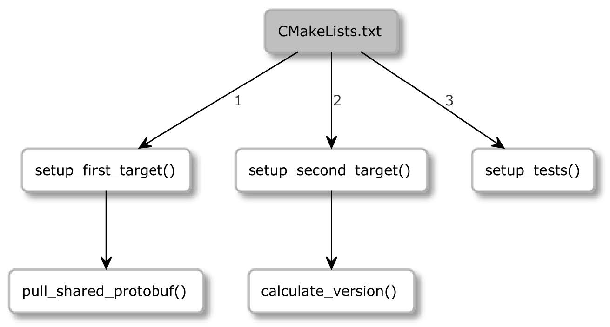

## 第一部分：基础知识

选择 Debug, Release, MinSizeRel 或 RelWithDebInfo，并进行指定:cmake —build <dir> —config <cfg>

当需要查看内部情况时，可以让 CMake 的信息更加详细:cmake —build <dir> —verbosecmake —build <dir> -v

同样的效果可以通过设置 CMAKE_VERBOSE_MAKEFILE 缓存变量来实现

# 安装模式的语法cmake —install <dir> [<options>]与其他操作模式一样，CMake 需要一个到生成构建树的路径:cmake —install <dir>

多配置生成器的选项就像在构建阶段一样，可以指定希望安装使用哪种构建类型 (有关更多细节，请参阅构建项目部分)。可用的类型包括 Debug、Release、MinSizeRel 和 RelWithDebInfo:cmake —install <dir> —config <cfg>

组件的选项

安装单个组件时，可以使用以下方式:cmake —install <dir> —component <comp>

安装目录的选项可以在项目配置中指定的安装路径前面，加上已经选择的前缀 (当我们对某些目录有限制的写访问权限时)。以“homeuser”为前缀的“usrlocal”路径变成“homeuserusrlocal”: cmake —install <dir> —prefix <prefix>

CMake 可以像这样运行脚本:# 脚本模式的语法cmake [{-D <var>=<value>}…] -P <cmake-script-file> [— <unparsed-options>…]

有两种方法可以将值传递给这个脚本

• 通过使用-D 选项定义的变量。• 通过可在—后传递的参数。CMake 将为传递给脚本的所有参数 (包括—) 创建CMake_ARGV<n>变量。

运行命令行工具

CMake 提供了一种模式，可以跨平台以相同的方式执行一些常见的方法:

# 命令行工具模式的语法cmake -E < command> [<options>]

由于这种特定模式的使用是相当有限的，不会对其深入讨论。若对细节感兴趣，建议使用 cmake-E 列出所有可用的命令。为了简单地了解一下所提供的功能，CMake 3.20 支持以下命令:

1.4.2 CTest

为了产生和维护高质量的代码，自动化测试非常重要。这就是为什么花了一整个章节来讨论这个主题 (请参考第 8 章)

1.4.3 CPack

构建并测试了软件之后，我们就可以与世界进行分享。高级用户完全可以接受源代码，这就是他们想要的。然而，由于方便和节省时间，世界上绝大多数人都在使用预编译的二进制文件

1.4.4 CMake 用户界面

1.4.5 CCMake

ccmake 可执行文件是 CMake 面向类 Unix 平台的接口 (它不适用于 Windows)。它不是 CMake包的一部分，所以用户必须单独安装

1.5. 项目文件

即使文件包含 CMake 语言命令，也不能确定它是为开发人员编辑而设计的

1.5.1 源码树

1.5.2 构建树

1.5.3 文件列表

1.5.4 CMakeLists.txt

1.5.5 CMakeCache.txt

当配置阶段第一次运行时，缓存变量将从列表文件中生成并存储在 CMakeCache.txt 中。该文件
位于构建树的根目录中:

#### 1.5.6 包配置文件

从注释中观察到的，EXTERNAL 部分中的缓存项是供用户修改的，而 INTERNAL 部分是由CMake 管理的

1.5.6 包配置文件

描述包的 CMake 文件命名为 <PackageName>-config.cmake 和<PackageName>Config.cmake

1.5.7 cmake_install.cmake，CTestTestfile.cmake 和 CPackConfig.cmake 这些文件是由生成阶段的 cmake 可执行文件在构建树中生成的，不应该通过手动编辑。

1.5.8 CMakePresets.json 和 CMakeUserPresets.json

当需要明确缓存变量、所选择的生成器、构建树的路径等时，项目的配置可能会成为一项相对繁忙的任务——特别是当有多种构建项目的方法时。这就处于预设的用武之地了。用户可以通过 GUI 选择预置，也可以使用命令行—listpresets，并使用—preset= 选项为构建系统选择预置。

CMakePresets.json: 项目作者提供的预设
CMakeUserPresets.json: 根据自己的偏好定制项目配置用户准备的 (可以将其添加到 VCS 的忽略文件中)

1.5.9 设置 Git 忽略文件

1.6. 脚本和模块

1.6.1 脚本

由于在脚本中没有源代码/构建树的概念，通常持有这些路径引用的变量将包含当 前工作目录:CMAKE_BINARY_DIR, CMAKE_SOURCE_DIR,CMAKE_CURRENT_BINARY_DIR 和CMAKE_CURRENT_SOURCE_DIR。

1.6.2 实用工具模块

CMake 项目可以使用外部模块来增强它们的功能。模块是用 CMake 语言编写的，包含宏定义、变量和执行各种功能的命令。范围从相当复杂的脚本 (CPack 和 CTest 也提供模块!) 到相当简单的脚本，如 AddFileDependencies或 TestBigEndian。

CMake 发行版包含了近 90 个不同的实用程序模块，还可以通过浏览列表从网上下载更多，比如在https://github.com/onqtam/awesome-cmake上找到的列表，或者自己编写一个模块。
要使用实用程序模块，需要使用 include(<MODULE>) 指令。下面是一个简单的项目:
我们将了解哪些模块是可用的，因为其与当前的主题相关。若对其他模块感兴趣，可以在https://cmake.org/cmake/help/latest/manual/cmake-modules.7.html找到一个完整的绑定模块列表。

1.6.3 查找模块

CMake 提供了 150 多个模块，这些模块能够定位系统中不同的包，另一种选择是编写自己的模块

2.2.1 注释

2.2.2 执行指令

指令名不区分大小写，但在 CMake 社区中有一个约定，即在指令名中使用 snake_case(即小写单词与下划线连接)。
可以定义自己的指令，会在“控制结构” 一节中介绍这些指令

为了使事情更简单，将在介绍不同示例时介绍相关指令，可以分为三类:
• 脚本指令: 脚本指令可用，会改变指令处理器、访问变量的状态，并影响其他指令和环境。
• 项目指令: 这些指令在项目中可用，操纵项目状态并构建目标
• CTest 指令: 这些指令在 CTest 脚本中可用，管理测试。

2.2.3 指令参数

2.3. 变量

变量名区分大小写，可以包含任何字符。
变量都在内部作为字符串存储，有些智力可以解释为其他数据类型的值 (甚至是列表!)
基本的变量操作指令是 set() 和 unset()，但还有其他指令可以影响变量，如 string() 和 list()

2.3.1 引用变量

引用，需要使用 ${} 语法:message(${MyString1})。这样的插值是由内而外的方式执行的:

${} 用于引用普通变量或缓存变量
$ENV{} 用于引用环境变量

可以通过命令行在—标记之后将参数传递给脚本。值将存储在 CMAKE_ARGV<n> 变量中，传递的参数的计数将存储在 CMAKE_ARGC 变量中。

2.3.2 环境变量

2.3.3 缓存变量

2.3.4 如何正确使用变量作用域

CMake 有两个作用域:
函数作用域: 用于执行用 function() 定义的自定义函数
目录作用域: 当从 add_subdirectory() 指令执行嵌套目录中的 CMakeLists.txt 文件时

首先，需要知道变量作用域的概念如何实现。当创建嵌套作用域时，CMake 只需用来自当前作用域的所有变量的副本填充。后续命令将影响这些副本。但若完成了嵌套作用域的执行，所有的副本都会删除，而原始的父作用域将恢复。
若真的需要更改调用 (父) 作用域中的变量，该怎么办呢
CMake 有一个 PARENT_SCOPE 标志，可以在 set() 和 unset() 指令的末尾添加:set(MyVariable “New Value” PARENT_SCOPE)unset(MyVariable PARENT_SCOPE)
这种解决方法有一定的局限性，因为其不允许访问超过一个级别的变量
使用 PARENT_SCOPE 不会改变当前作用域中的变量

2.4. 列表

要存储列表，CMake 会将所有元素连接成一个字符串，使用分号 (;) 分隔:a;list;of;5;elements

要创建一个列表，可以使用 set() 指令:set(myList 一个包含五个元素的列表)。由于列表的存储方式不同，下面的命令将具有完全相同的效果:

CMake 会自动解包未加引号的参数中的列表。通过传递一个不加引号的 myList 引用，可以有效地向指令传递更多的参数:

message(“the list is:” ${myList})

2.5. 控制结构

2.5.1 条件块

2.5.2 条件指令的语法

只有当字符串等于以下任何一个常量时 (这些比较不区分大小写)，才认为是布尔值 true:
• ON, Y, YES 或 TRUE
• 一个非零的数

这里还有另一个问题——若条件的参数没有加引号，且变量的名称包含一个值
set(FOO BAR)
if(FOO)
根据我们到目前为止所说的，它将是 false，因为 BAR 字符串不满足计算布尔值 true 值的标准。
但情况并非如此，因为 CMake 在涉及到未加引号的变量引用时会出现例外。与带引号的参数不同，
CMake 只会在 if(FOO)为false 时计算它是以下任何一个常量 (这些比较不区分大小写):
• OFF, NO, FALSE, N, IGNORE, NOTFOUND
• 以-NOTFOUND 结尾的字符串
• 一个空字符串
• 零
因此，未定义的变量将赋值为 false:
但先定义一个变量会改变这种情况，并且计算为 true:
若认为不加引号的参数的行为令人困惑，请将变量引用包装在加引号的参数中:if (”${FOO}”)。这将导致在提供的参数传递到 if() 指令之前进行参数求值，并且行为将与字符串的求值一致。CMake 假设用户正在询问是否定义了变量 (并且不显式为 false)。可以显式检查这个事实
if(DEFINED <name>)

**比较**

以下操作符支持比较操作:
EQUAL，LESS，LESS_EQUAL，GREATER 和 GREATER_EQUA

**简单的检查**

• 若值在列表中:<variable|string> in _LIST <variable>
• 若指令可用:command <command-name>
• 若 CMake 策略存在:POLICY <policy-id>(这将在第 3 章中介绍)
• 若使用 add_test() 添加 CTest 测试:test <test-name>
• 若定义了构建目标:target <target-name>

**文件系统检查**

• EXISTS <path-to-file-or-directory>: 检查文件或目录是否存在
这将解析符号链接 (若符号链接的目标存在，则返回 true)。

• <file1> IS_NEWER_THAN <file2>: 检查哪个文件更新
如果 file1 比 (或等于)file2 更新，或者两个文件中有一个不存在，则返回 true。
• IS_DIRECTORY path-to-directory: 检查路径是否为目录
• IS_SYMLINK filename: 检查路径是否为符号链接
• IS_ABSOLUTE path: 检查路径是否为绝对路径

2.5.3 循环

CMake 中的循环相当简单——可以使用 while() 或 foreach() 重复执行同一组命令。这两个命令都支持循环控制机制:
break() 循环停止剩余块的执行，并从封闭循环中断开。
continue() 循环停止当前迭代的执行，并开启下一个迭代。

while循环块用 while() 指令创建，用 endwhile() 关闭。只要 while() 中提供的 <condition> 表达式为true，其后续的指令都会执行

foreach块有几个变体，它有打开和关闭指令:foreach() 和 endforeach()。

foreach(<loop_var> RANGE <max>)
<commands>
endforeach()

CMake 将从 0 迭代到 <max>(包括)。若需要更多的控制，可以使用第二个变量，提供 <min>、<max> 和 <step>(可选)，所有参数必须是非负整数，<min> 必须小于 <max>

foreach(<loop_var> RANGE <min> <max> [<step>]) 
foreach(<loop_variable> IN [LISTS <lists>] [ITEMS <items>])

CMake 将从所有提供的 <lists> 列表变量中获取元素，然后是所有显式声明的 <items> 值，并将它们存储在 <loop_variable> 中，对每个项逐个执行 <commands>。

从3.17版本开始，foreach() 已经学会了如何压缩列表 (ZIP_LISTS):

foreach(<loop_var>… IN ZIP_LISTS <lists>)

压缩列表可以遍历多个列表并处理具有相同索引的各自项:

set(L1 “one;two;three;four”)
foreach(num IN ZIP_LISTS L1 L2)

2.5.4 定义指令

有两种方法可以定义自己的命令: 可以使用 macro() 或 function()。要解释这两个指令间的区别，
最简单的方法是将它们与 C 风格的宏和实际的 C++ 函数进行比较:

• macro() 的工作方式更像是查找和替换指令，而不是像 function() 这样的实际子例程调用。

• function() 为本地变量创建一个单独的作用域，这与 macro() 命令不同，后者在调用者的变量作用域中工作

CMake 允许通过以下引用访问命令调用中传递的参数

• ${ARGC}: 参数的数量
• ${ARGV}: 所有参数的列表
• ${ARG0}, ${ARG1}, ${ARG2}: 特定索引处的实参值
• ${ARGN}: 最后一个预期参数之后，由调用者传递的匿名参数列表

使用 ARGC 边界外的索引访问数值参数会产生未定义行为。

macro(<name> [<argument> … ])
<commands>
endmacro()

此声明之后，可以通过调用宏的名称来执行宏 (函数调用不区分大小写)。

# chapter02/08-definitions/macro.cmake
macro(MyMacro myVar)
set(myVar "new value")
message("argument: ${myVar}") endmacro()
set(myVar "first value") message("myVar is now: ${myVar}") MyMacro("called value") message("myVar is now: ${myVar}")

下面是这个脚本的输出:
$ cmake -P chapter02/08-definitions/macro.cmake
myVar is now: first value
argument: called value
myVar is now: new value

发生了什么事? 尽管显式地将 myVar 设置为新值，但并不影响 message(”argument:${myVar}”)!

这是因为传递给宏的参数没有视为真正的变量，而是作为常量查找并替换指令。

另一方面，全局作用域中的 myVar 变量从第一个值更改为新值。这种行为称为副作用，是一种糟糕的实践，因为在不了解宏的情况下，很难判断哪些变量可能会受到这种宏的影响。
建议尽可能使用函数，可以避免许多令人头疼的事情。

function(<name> [<argument> … ])
<commands>
endfunction()

若函数调用传递的参数多于声明的参数，多余的参数将解释为匿名参数并存储在 ARGN 变量中。

• CMAKE_CURRENT_FUNCTION
• CMAKE_CURRENT_FUNCTION_LIST_DIR
• CMAKE_CURRENT_FUNCTION_LIST_FILE
• CMAKE_CURRENT_FUNCTION_LIST_LINE
函数的一般语法和概念非常类似于宏，但这一次是有效的。

**CMake 中的过程范式**

CMake 中，用这种过程风格编写代码有点麻烦——需要提前提供计划使用的命令定义:
cmake_minimum_required(…)
project(Procedural)
function(pull_shared_protobuf)
function(setup_first_target)
function(calculate_version)
function(setup_second_target)
function(setup_tests)
setup_first_target()
setup_second_target()
setup_tests()
真是恶梦一场! 这段代码非常难以阅读，因为最微小的细节都在文件的顶部

对于这个问题有一些解决方案: 将命令定义移动到其他文件和跨目录分区作用域 (作用域目录将在第 3 章中详细解释)。但也有一个简单而优雅的解决方案: 在文件的顶部声明一个入口点宏，并在文件的最后调用它:

通过这种方法，代码的编写范围逐渐缩小，因为直到最后我们才真正调用 main() 宏，CMake 不会抱怨未定义命令的执行!

为什么在推荐的函数上使用宏? 可以无限制地访问全局变量，因为没有向 main() 传递参数，所以通常不需要担心这里的警告。

2.6. 实用指令

2.6.1 message() 指令

通过提供 MODE 参数，可以自定义输出的样式，并且在出现错误的情况下，可以停止代码:message(<mode> ”text”) 的执行。
• FATAL_ERROR: 将停止处理和生成。
• SEND_ERROR: 将继续处理，但跳过生成。
• WARNING: 继续处理。
• AUTHOR_WARNING: CMake 警告。继续处理。
• DEPRECATION:
若启用了CMAKE_ERROR_DEPRECATED或CMAKE_WARN_DEPRECATED 变量，将做出相应处理。
• NOTICE 或省略模式 (默认): 将向 stderr 输出一条消息，以吸引用户的注意。
• STATUS: 将继续处理，建议用于用户的主要消息。
• VERBOSE: 将继续处理，用于通常不是很有必要的更详细的信息
• DEBUG: 将继续处理，并包含在项目出现问题时可能有用的详细信息
• TRACE: 将继续处理，并建议在项目开发期间打印消息。通常，在发布项目之前，将这些类型的消息删除

我们已经了解了调试的三个重要部分: 列表、作用域和函数。

当启用命令行标志cmake—log-context时，消息将装饰为点分隔的上下文，并存储在CMAKE_MESSAGE_CONTEXT列表中。

message()的另一个很酷的技巧是在CMAKE_MESSAGE_INDENT列表中添加缩进(与CMAKE_MESSAGE_CONTEXT的方法完全相同):
list(APPEND CMAKE_MESSAGE_INDENT " ")

由于 CMake 没有提供带有断点或其他工具的真正调试器，当事情没有完全按计划进行时，干净的日志就非常重要了。

可以将 CMake 代码划分到单独的文件中，以保持内容的有序和独立性。然后，可以通过 include()
从父列表文件引用:include(< file|module> [OPTIONAL] [RESULT_VARIABLE <var>]) 若提供文件名 (一个扩展名为.cmake)，CMake 将尝试打开并执行它。

这里不会创建嵌套的、单独的作用域，因此对该文件中变量的修改会影响调用作用域。

若需要知道 include()是否成功，可以提供一个带有变量名的 RESULT_VARIABLE 关键字。若成功，则用包含的文件的完整路径填充，失败则用未找到 (NOTFOUND) 填充。

2.6.3 include_guard() 指令

包含有副作用的文件时，可能想要限制它们，以便它们只包含一次。这就是
include_guard([DIRECTORY|GLOBAL])的作用。

将include_guard()放在包含的文件的顶部。当CMake第一次遇到它时，将在当前作用域中进行
记录。若文件再次包含(可能是因为没有控制项目中的所有文件)，将不会处理。

GLOBAL参数。顾名思义，DIRECTORY关键字将在当前目录及其以下应用保护，而GLOBAL关
键字将对整个构建应用保护。

2.6.4 file() 指令

file(READ <filename> <out-var> […])

file({WRITE | APPEND} <filename> <content>…) 

file(DOWNLOAD <url> [< file>] […]) 

file() 指令会以一种与系统无关的方式读取、写入和传输文件，并使用文件系统、文
件锁、路径和存档

2.6.5 execute_process() 指令

有时需要使用系统中可用的工具 (毕竟，CMake 主要是一个构建系统生成器)

execute_process() 可以用来运行其他进程，并收集它们的输出。这个命令非常适合脚本，也可以在配置阶段的项目中使用。

execute_process(COMMAND <cmd1> [<arguments>] … [OPTIONS]) 

CMake 将使用操作系统的 API 来创建子进程 (因此，诸如 &&、|| 和 > 等 shell 操作符将不起作用)

可以通过不止一次地提供 COMMAND <cmd> <arguments> 参数来连接命令，并将一个命令的输出传递给另一个命令。

若进程没有在要求的限制内完成任务，可以选择使用 TIMEOUT <seconds> 参数来终止进程，并且可以根据需要设置 WORKING_DIRECTORY <directory>。

通过 RESULTS_VARIABLE <variable> 参数，可以在列表中收集所有任务的退出代码

若只对最后执行命令的结果感兴趣，请使用单数形式:RESULT_VARIABLE <variable>。

为了收集输出，CMake 提供了两个参数:OUTPUT_VARIABLE 和 ERROR_VARIABLE(以类似的方式使用)。若想合并 stdout 和 stderr，请对两个参数使用相同的变量。

记住，在为其他用户编写项目时，应该确保命令在相应的平台上可用。

第 3 章 CMake 项目

本章中，我们将讨论以下主题:

• 指令和命令
• 划分项目
• 项目结构
• 环境范围
• 配置工具链
• 禁用内构建

3.1. 相关准备

可以在 GitHub 上找到本章中出现的代码 https://github.com/PacktPublishing/Modern-CMake-for-Cpp/tree/main/examples/chapter03。

3.2.1 指定最低的 CMake 版本——cmake_minimum_required()

cmake_minimum_required() 将检查系统是否有正确的 cmake 版本，还将隐式调用另一个指令 cmake_policy(version)，告诉 cmake该项目使用什么正确的策略。这些策略是什么?

为了保持语法的干净和简单，CMake 的团队决定引入一些策略来反映这些变化。每当引入一个向后不兼容的更改时，都会附带一个启用新行为的策略。

当 CMake 使用新策略进行升级时，因为新策略不会启用，所以不需要担心破坏项目

3.2.2 定义语言和元数据–project()

CMake 不需要 project()，包含 CMakeLists.txt 文件的目录都将在项目模式下进行解析。

CMake 隐式地将该指令添加到文件的顶部。但我们需要从指定最低版本开始，所以最好不要忘记使用 project()。

调用此指令将隐式设置以下变量:
• PROJECT_NAME
• CMAKE_PROJECT_NAME (只有在顶层 CMakeLists.txt 中)
• PROJECT_SOURCE_DIR, <PROJECT-NAME>_SOURCE_DIR
• PROJECT_BINARY_DIR, <PROJECT-NAME>_BINARY_DIR

CMake 默认启用 C 和 C++，因此可能希望为 C++ 项目显式地仅指定 CXX。为什么?project() 将为所选语言检测和测试可用的编译器，因此选择正确的编译器，可以在配置阶段跳过对未使用语言的任何检查，从而节省时间。

CMake 还可以使用 enable_language(<lang>) 来修改所使用的语言，这将不会创建元数据。

3.3. 划分项目

随着解决方案的行数和文件数的增长，慢慢地不可避免的事情即将到来: 要么开始对项目进行区分，要么淹没在代码行和大量文件中。

可以通过两种方式解决这个问题: 分配 CMake 代码和将源文件移动到子目录中。

但这个解决方案有一些缺陷:

• 来自嵌套目录的变量会污染顶层作用域 (反之亦然):

• 所有的目录将共享相同的配置:

随着项目多年来的成熟，这个问题会更加的明显。若没有粒度度的存在，必须将每个翻译单元视为相同的，并且不能指定不同的编译标志，不能为代码的某些部分选择较新的语言版本，也不能在选定的代码区域设置静默警告。所有内容都是全局的，需要同时对所有源文件进行更改。

• 有一些共享编译触发器:
• 所有的路径都相对于顶层:

另一种方法是使用 add_subdirectory() 指令，引入了一个变量范围等。

3.3.1 作用域的子目录

这个概念，CMake 提供了以下指令:add_subdirectory(source_dir [binary_dir]
                                                [EXCLUDE_FROM_ALL])

这将向构建添加一个源目录，也可以提供一个写入构建文件的路径(binary_dir)。

EXCLUDE_FROM_ALL 关键字将禁用在子目录中定义的目标的默认构建 (将在下一章讨论目标)

• 变量更改与嵌套作用域隔离。
• 可以随心所欲地配置嵌套工件。
• 更改嵌套的 CMakeLists.txt 文件中不需要构建和不相关的目标。
• 路径是目录的本地路径，若需要，可以添加到父 include 路径。

使用 add_library() 生成了全局可见的目标 cars，并使用 target_include_ directories() 将 cars 目录
添加到其公共包括目录中。这允许 main.cpp 包含 cars.h 文件而不提供相对路径:
#include “car.h”

为我们使用了 OBJECT 关键字，这表示只对生成目标文件感兴趣

3.3.2 嵌套项目

