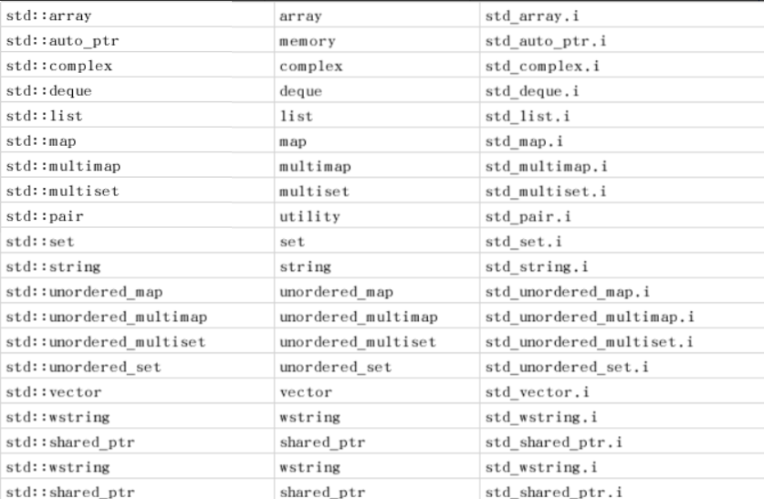
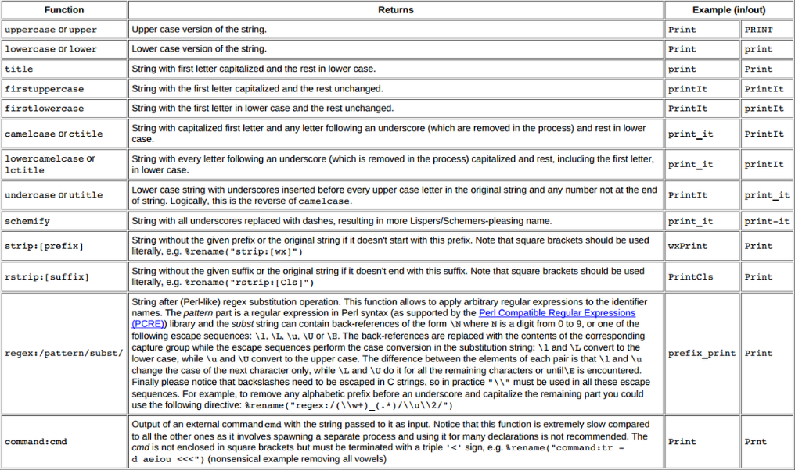

# Swig脚本文件说明

## 常用字段说明
不同语言之间转换最主要的就是不同语言之间语法的封装，swig就是用来干这些事情的。而这些字段正是指导swig来完成这些操作的指令

```c++
/* File : example.i */
%module(directors="1") example

%include "std_string.i"

%header %{
#include "director.h"
%}

%feature("director") FooBarAbstract;
%include "director.h"

%{
/* Put headers and other declarations here */
extern double My_variable;
extern int fact(int);
extern int my_mod(int n, int m);
%}
extern double My_variable;
extern int fact(int);
extern int my_mod(int n, int m);
```

- module:指定swig会创建的模块
- module后面的directors="1"说明swig允许类之间继承，使能这个之后哪个类需要开启代理同样需要使用feature进行指定，说明这个类开启代理模式，在实际运行中根据实际的继承来决定调用哪个
> SWIG provides support for cross language polymorphism using directors feature. The directors feature is disabled by default. In order to enable it, the %module preprocessor directive should be modified to include the directors flag. After enabling the directors extension, the feature should be applied to AsyncUidProvider class using the %feature preprocessor directive. 

```c++
%module mymodule
%{
// 这里是源代码中需要的
#include "myheader.h"
%}
// 这里是转换之后目标代码中需要的
// Now list ISO C/C++ declarations
int foo;
int bar(int x);
...
```

### %{....%}

- 所有在%{....%}之间的内容会被一字不差的放置到被swig创建的封装的文件中。这个区域通常用来放置一些swig不会生成的定义或者声明，对应C/C++的封装通常用来引入头文件

### %+指令

- 大多数的swig指令都是这种以%开头的指令，目的就是为了能和C能够很好的区分开来
- 默认情况下，swig是不会对include进来的头文件中的#include进行展开的，除非你指定-includeall

```c++
%{
/* Include in the generated wrapper file */
typedef unsigned int size_t;
%}
/* Tell SWIG about it */
typedef unsigned int size_t;
```

Or

```c++
%inline %{
typedef unsigned int size_t;
%}
```

- 像C语言一样，swig中也能使用swig进行类型重定义

### %include 引入头文件

- 使用%include指令来引入swig定义的头文件

### %import引入头文件

- 如果只是想引入文件使用文件中的宏定义和类型可以使用import

```c++
%import "foo.i"
```

### 预定义变量

为了区分不同语言以及在部分指导文件中能够区别进行，siwg中提前预定义了一些变量

```c++
SWIG Always defined when SWIG is processing a file
SWIGIMPORTED Defined when SWIG is importing a file with %import
SWIG_VERSION Hexadecimal (binary-coded decimal) number containing SWIG version,
such as 0x010311 (corresponding to SWIG-1.3.11).
SWIGCSHARP Defined when using C#
SWIGD Defined when using D
SWIGGO Defined when using Go
SWIGGUILE Defined when using Guile
SWIGJAVA Defined when using Java
SWIGJAVASCRIPT Defined when using Javascript
SWIG_JAVASCRIPT_JSC Defined when using Javascript with -jsc
SWIG_JAVASCRIPT_V8 Defined when using Javascript with -v8 or -node
SWIGLUA Defined when using Lua
SWIGMZSCHEME Defined when using Mzscheme
SWIGOCAML Defined when using OCaml
SWIGOCTAVE Defined when using Octave
SWIGPERL Defined when using Perl
SWIGPHP Defined when using PHP (any version)
SWIGPHP7 Defined when using PHP7
SWIGPYTHON Defined when using Python
SWIGR Defined when using R
SWIGRUBY Defined when using Ruby
SWIGSCILAB Defined when using Scilab
SWIGTCL Defined when using Tcl
SWIGXML Defined when using XML

__LINE__ Current line number
__FILE__ Current file name
__STDC__ Defined to indicate ISO C
__cplusplus Defined when -c++ option used

SWIG_D_VERSION Unsigned integer target version when using D
SWIGGO_CGO Defined when using Go for cgo
SWIGGO_GCCGO Defined when using Go for gccgo
SWIGGO_INTGO_SIZE Size of the Go type int when using Go (32 or 64)
SWIGPYTHON_PY3 Defined when using Python with -py3
SWIGPYTHON_BUILTIN Defined when using Python with -builtin
SWIG_RUBY_AUTORENAME Defined when using Ruby with -autorename
```

### 增强型的宏定义
为了更好的实现对源码的封装，swig提供了一种增强型的宏定义指令， %define 和 %enddef

```c++
%define ARRAYHELPER(type, name)
%inline %{
type *new_ ## name (int nitems) {
return (type *) malloc(sizeof(type)*nitems);
}
void delete_ ## name(type *t) {
free(t);
}
type name ## _get(type *t, int index) {
return t[index];
}
void name ## _set(type *t, int index, type val) {
t[index] = val;
}
%}
%enddef
ARRAYHELPER(int, IntArray)
ARRAYHELPER(double, DoubleArray)
```

### 指令透传

正常情况下，在需要封装的函数中，swig会将#define进行处理，如果想让对应的宏定义不进行预处理可以在#前面添加%来实现

```c
%extend Foo {
void bar() {
    %#ifdef DEBUG
    printf("I'm in bar\n");
    %#endif
}
}
```

### 指针处理(cpointer.i)
在一些函数中需要传入指针，但是在其他函数中可能没有指针这个概念，因此swig特意为指针提供了封装方式%pointer_functions(int, intp);的含义就是，提供一个函数封装，这个函数封装可以创建指针执行的内容，这里的含义就是申请一块int大小的内存并返回

```c
%include "cpointer.i"
/* Create some functions for working with "int *" */
%pointer_functions(int, intp);
/* A function that uses an "int *" */
void add(int x, int y, int *result);
```

如果想处理复杂的或者自定义的class可以使用%pointer_class(int, intp);来进行处理，相比之下使用pointer_class将申请的内容当成一个对象来管理更加的便捷和方便垃圾回收

```c
%module example
%include "cpointer.i"
/* Wrap a class interface around an "int *" */
%pointer_class(int, intp);
/* A function that uses an "int *" */
void add(int x, int y, int *result);
```

**类型转换**
当一些类型需要转换是可以使用类型转换指令pointer_cast，第一个参数是当前类型，第二个参数是转换之后的参数，第三个是封装的函数名字

```c
%include "cpointer.i"
%pointer_cast(int *, unsigned int *, int_to_uint);
```

### 数组(carrays.i)

使用前先引入头文件，指令方式

```c
%array_functions(type, name)
%include "carrays.i"
%array_functions(double, doubleArray);
void print_array(double x[10]);
```

同样，这里可以使用array_class来封装自定义类型的数组

```c
%module example
%include "carrays.i"
%array_class(double, doubleArray);
void print_array(double x[10]);
```

### 内存管理(cmalloc.i)

swig提供了内存管理的模块，使用这些指令可以对malloc，calloc,realloc和free进行封装，具体的指令形式如下

```c
%malloc(type [, name=type])
%calloc(type [, name=type])
%realloc(type [, name=type])
%free(type [, name=type])
%sizeof(type [, name=type])
%allocators(type [, name=type])
```

```c
// SWIG interface
%include "cmalloc.i"
%malloc(int);
%free(int);
%malloc(int *, intp);
%free(int *, intp);
%allocators(double);
```

### C类型数据封装(cdata.i)

引入cdata.i模块后，会在封装代码中提供Cdata*, memmove()等函数的封装用于申请和释放C类型数据。
如果类型已知可以使用以下方式
%include "carrays.i"
%include "cdata.i"
%array_class(int, intArray);
如果类型是未知类型，就需要借助cdata指令了%cdata(type [, name=type])

### 内存释放

当一个C中的函数申请一块内存，并返回一个char *类型时，swig可能会判断不出对应的内容是否需要释放，新版本的swig已经能够对简单的源码进行自行判断，如果源码中是申请了一块内存但是没有释放，在目标代码中swig会默认封装上释放的函数，比如go中没有char * 类型的数据，在进行封装时swig会创建一个string类型数据，并将原有的char *内容赋值到string对象中，然后根据判断自动释放对象，但是函数复杂时就需要进行人为指定了，这时需要用到指令%newobject来进行指定

```c
%newobject foo;
char *foo() {
    char *result = (char *) malloc(sizeof(char));
    return result;
}
```

### STL的支持

对于STL的支持是一个循序渐进的过程，目前已经支持的STL如下所示

使用STL时需要注意异常的抛出，通常在使用时需要对可能发生的异常进行适当的封装

```c
%module example
%include "std_vector.i"
%typemap(throws) std::out_of_range {
// custom exception handler
}
%template(VectInt) std::vector<int>;
```

更加通用的方法是对所有异常进行封装

```c
%include "exception.i"
%exception {
    try {
        $action
    } catch (const std::exception& e) {
        SWIG_exception(SWIG_RuntimeError, e.what());
    }
}
```

SWIG_exception(int code, const char *message)用于在封装的目标函数代码中抛出异常，常见的错误类型如下

- SWIG_MemoryError
- SWIG_IOError
- SWIG_RuntimeError
- SWIG_IndexError
- SWIG_TypeError
- SWIG_DivisionByZero
- SWIG_OverflowError
- SWIG_SyntaxError
- SWIG_ValueError
- SWIG_SystemError

### 参数类型(typemaps.i)

假如有以下函数，如果不对result进行声明，那么swig只会对按照指针的形式处理result参数，如果你直接传入一个空的result底层会在赋值时直接崩溃
void add(double a, double b, double *result) {
    *result = a + b;
}
因此需要使用%apply指令来对参数进行指导，对参数添加上指令%apply double *OUTPUT之后，swig已经知道result是一个需要输出的参数，因此会对result的合法性进行检测，如果是异常值(null)那么直接抛出异常

```c
%include "typemaps.i"
%apply double *OUTPUT { double *result };
%inline %{
extern void add(double a, double b, double *result);
extern void Sum(double a, double b, double *result);
%}
```

如果有多个参数需要输出，只需要按照列表的形式向后添加即可

```c
%include "typemaps.i"
%apply int *OUTPUT { int *width, int *height };
// Returns a pair (width, height)
void getwinsize(int winid, int *width, int *height);
```

如果你嫌每次都要写一长串的指令比较麻烦可以将以上过程简化成如下方式，直接将对应的参数更换成OUTPUT即可

```c
%include "typemaps.i"

%inline %{
extern void add(double a, double b, double *OUTPUT);
%}
```

另外需要注意的是，一旦使用%apply进行声明，那么后续所有的double *result参数都会被处理，如果想取消%apply的作用需要进行如下声明：

```c
%clear double *result; // Remove all typemaps for double *result
```

我们更常用的形式是：
入参

```c++
int *INPUT
short *INPUT
long *INPUT
unsigned int *INPUT
unsigned short *INPUT
unsigned long *INPUT
double *INPUT
float *INPUT
```

出参

```c
int *OUTPUT
short *OUTPUT
long *OUTPUT
unsigned int *OUTPUT
unsigned short *OUTPUT
unsigned long *OUTPUT
double *OUTPUT
float *OUTPUT
```

即是入参又是出参

```c
int *INOUT
short *INOUT
long *INOUT
unsigned int *INOUT
unsigned short *INOUT
unsigned long *INOUT
double *INOUT
float *INOUT
```

以上书写方式，直接放到参数上，等同使用apply的如下指令形式

```c
// Make double *result an output value
%apply double *OUTPUT { double *result };
// Make Int32 *in an input value
%apply int *INPUT { int32 *in };
// Make long *x inout
%apply long *INOUT {long *x};
...
%clear double *result;
%clear Int32 *in, long *x;
```

## 变量属性

使用immutable创建只读字段，使用该字段编辑的变量在对应目标语言中只有对应的GetX接口，无法对值进行修改。
一个变量一旦被标记为immutable之后，只有明确再次指定为mutable，否则一直是只读变量

The %immutable directive enables read-only mode until it is explicitly disabled using the %mutable directive

```c
// File : interface.i
int a; // Can read/write
%immutable;
int b, c, d; // Read only variables
%mutable;
double x, y; // read/write
```

Compatibility note: Read-only access used to be controlled by a pair of directives %readonly and %readwrite. Although these directives still work, they generate a warning message.

Simply change the directives to %immutable; and %mutable; to silence the warning. Don't forget the extra semicolon

## 重命名

有时候将对应语言转换为目标语言时，由于关键字的不同，在该语言中能正常使用的变量在目标语言中可能是关键字，这个时候可以使用rename进行重命名。

```c
// interface.i
// 将源语言中的print函数重命名为my_print这样在目标语言中就可以通过my_print来调用源语言中的print
%rename(my_print) print;
extern void print(const char *);
%rename(foo) a_really_long_and_annoying_name;
extern int a_really_long_and_annoying_name;
```

rename作用域从开始声明一直到文件结束，所以如果想那个头文件中被重命名需要保证该头文件的引入在rename之后

```c
%rename(my_print) print;
%rename(foo) a_really_long_and_annoying_name;
%include "header.h"
// 双引号添加不添加都无所谓，但是当重命名的名字是C++的关键字是，添加双引号就成为了必须的了
```

```c
%rename("foo_short") foo(short);
%rename(foo_long) foo(long);
void foo(int);
void foo(short); // Accessed as foo_short()
void foo(long); // Accessed as foo_long()
```

能够对单个命名通常已经够用了，但swig的功能远不止于此，可以通过匹配进行批量命名，如为所有的函数增加前缀

```c
%rename("myprefix_%s") ""; // print -> myprefix_print
```

将所有蛇形命名的方式修改为驼峰命名的方

```c
%rename("%(lowercamelcase)s") ""; // foo_bar -> fooBar; FooBar -> fooBar
```

剔除一些命名中的字符在使用

```c
%rename("%(strip:[wx])s") ""; // wxHello -> Hello; FooBar -> FooBar
```

对操作符重载函数进行重命名

```c
%rename(__add__) Complex::operator+;
```

如果操作符重载是按照友元函数或者全局函数重载的需要按照如下方式进行重命名

```c
%rename(op_j) ::operator+;
```




同时也支持使用正则进行匹配

```c
// Strip the wx prefix from all identifiers except those starting with wxEVT
%rename("%(regex:/wx(?!EVT)(.*)/\\1/)s") ""; // wxSomeWidget -> SomeWidget
// wxEVT_PAINT -> wxEVT_PAINT
// Apply a rule for renaming the enum elements to avoid the common prefixes
// which are redundant in C#/Java
%rename("%(regex:/^([A-Z][a-z]+)+_(.*)/\\2/)s", %$isenumitem) ""; // Colour_Red -> Red
// Remove all "Set/Get" prefixes.
%rename("%(regex:/^(Set|Get)(.*)/\\2/)s") ""; // SetValue -> Value
// GetValue -> Value
```

## Ignore

使用ignore可以指示swig忽略一些不需要封装的内容

```c
%ignore print; // Ignore all declarations named print
%ignore MYMACRO; // Ignore a macro
...
#define MYMACRO 123
void print(const char *);
```

可以选择忽略大多数符号，只对其中一小部分进行封装
Using the techniques described above it is possible to ignore everything in a header and then selectively wrap a few chosen methods or classes. For example, consider a header, myheader.h
which has many classes in it and just the one class called Star is wanted within this header, the following approach could be taken:

```c
%ignore ""; // Ignore everything
// Unignore chosen class 'Star'
%rename("%s") Star;
// As the ignore everything will include the constructor, destructor, methods etc
// in the class, these have to be explicitly unignored too:
%rename("%s") Star::Star;
%rename("%s") Star::~Star;
%rename("%s") Star::shine; // named method
%include "myheader.h"
```

同样可以按照类型进行忽略

```c
%rename($ignore, %$isclass) ""; // Only ignore all classes
%rename("%s") Star; // Unignore 'Star'
%include "myheader.h"
```

## 回调函数

一些需要传入回调的函数，需要提前声明，不能将目标函数实现的函数直接传入

```c
/* Function with a callback */
int binary_op(int a, int b, int (*op)(int, int));
/* Some callback functions */
// 要将将要使用的回调函数传入
%constant int add(int, int);
%constant int sub(int, int);
%constant int mul(int, int);
```

一旦声明为回调函数，将不能在目标函数中被当成普通函数使用，如果一个函数即当成回调函数也想当成普通函数调用，可以按照如下方式进行声明

```c
/* Function with a callback */
int binary_op(int a, int b, int (*op)(int, int));
/* Some callback functions */
%callback("%s_cb");
int add(int, int);
int sub(int, int);
int mul(int, int);
%nocallback;
```

## 构造与析构

Swig 为每个C++的类生成默认的构造函数和析构函数，如果不需要可以使用参数选项或者指令进行禁止
> If you don't want SWIG to generate default constructors for your interfaces, you can use the %nodefaultctor directive or the -nodefaultctor command line option. For example:

```c
swig -nodefaultctor example.i
```

Or

```c
%module foo
...
%nodefaultctor; // Don't create default constructors
... declarations ...
%clearnodefaultctor; // Re-enable default constructors
```

或者你可以更加精确的指定那个类不创建构造函数

```c
%nodefaultctor Foo; // No default constructor for Foo
...
struct Foo { // No default constructor generated.
};
struct Bar { // Default constructor generated.
};
```

虽然，不创建析构函数往往会导致内存泄露，但是swig还是允许你控制不创建析构函数通过nodefaultdtor指定不需要析构函数的类型

```c
%nodefaultdtor Foo; // No default/implicit destructor for Foo
...
struct Foo { // No default destructor is generated.
};
struct Bar { // Default destructor generated.
};
```

> Note: There are also the-nodefault option and %nodefault directive, which disable both the default or implicit destructor generation. This could lead to memory leaks across the target
languages, and it is highly recommended you don't use them

## 限制

虽然siwg能够处理大多数的C++语法，但swig并不是完整的C++解析器，仍然有很多的语法是swig无法解析的。

- Non-conventional type declarations. For example, SWIG does not support declarations such as the following (even though this is legal C):

```c
/* Non-conventional placement of storage specifier (extern) */
const int extern Number;
/* Extra declarator grouping */
Matrix (foo); // A global variable
/* Extra declarator grouping in parameters */
void bar(Spam (Grok)(Doh));
```

## 为C++的类添加成员函数

很多C类型的结构体是不能绑定成员函数的，但是其他函数中都能，为了提供便利swig支持为C类型的结构体绑定额外的成员函数用来辅助结构体的创建和使用，这时就要用到%extend指令了

```c
/* file : vector.h */
...
typedef struct Vector {
    double x, y, z;
} Vector;
```

通过extend指令为C++类型的结构体添加构造函数

```c
// file : vector.i
%module mymodule
%{
#include "vector.h"
%}
%include "vector.h" // Just grab original C header file
%extend Vector { // Attach these functions to struct Vector
    Vector(double x, double y, double z) {
        Vector *v;
        v = (Vector *) malloc(sizeof(Vector));
        v->x = x;
        v->y = y;
        v->z = z;
        return v;
    }
    ~Vector() {
        free($self);
    }
    double magnitude() {
        return sqrt($self->x*$self->x+$self->y*$self->y+$self->z*$self->z);
    }
    void print() {
        printf("Vector [%g, %g, %g]\n", $self->x, $self->y, $self->z);
    }
};
```

但是extend指令只能用于struct上，不能用于经过typedef之后的类型名

```c
typedef struct Integer {
int value;
} Int;
%extend Integer { ... } /* Correct name */
%extend Int { ... } /* Incorrect name */
struct Float {
float value;
};
typedef struct Float FloatValue;
%extend Float { ... } /* Correct name */
%extend FloatValue { ... } /* Incorrect name */
```

有一种特殊情况除外，那就是当typedef一个匿名类时，是可以使用extend的

```c
typedef struct {
double value;
} Double;
%extend Double { ... } /* Okay */
```

## 代码注入

### swig代码输出格式

swig输出的C/C++代码会分为5部分

- Begin section.
A placeholder for users to put code at the beginning of the C/C++ wrapper file. This is most often used to define preprocessor macros that are used in later sections.
- Runtime code.
This code is internal to SWIG and is used to include type-checking and other support functions that are used by the rest of the module.
- Header section.
This is user-defined support code that has been included by the %{ ... %} directive. Usually this consists of header files and other helper functions.
- Wrapper code.
These are the wrappers generated automatically by SWIG.

- Module initialization.

The function generated by SWIG to initialize the module upon loading.

### 代码注入指令

命令注入格式：

```c
// 将在section部分注入代码，section为begin runtime header wrapper init等字段
%insert("section") "filename"
// 将后面代码段的内容注入到指定段
%insert("section") %{ ... %}
```

当然除了使用insert指令，section名本身也是一种指令，也可以section作为指令的方式来对指定代码段进行代码注入
> For example, %runtime is used instead of %insert("runtime"). 

```c
%begin %{
... code in begin section ...
%}
%runtime %{
... code in runtime section ...
%}
%header %{
... code in header section ...
%}
%wrapper %{
... code in wrapper section ...
%}
%init %{
... code in init section ...
%}
```

说明：其实经常使用的%{....%}，其实是%header %{...%}的简写
The bare %{ ... %} directive is a shortcut that is the same as %header %{ ... %}
Init 段是给有些需要进行初始化的代码使用的。

### 辅助函数

实际使用中经常使用代码注入的功能来写辅助函数

```c
%{
    /* Create a new vector */
    static Vector *new_Vector() {
        return (Vector *) malloc(sizeof(Vector));
    } 
%}
// Now wrap it
Vector *new_Vector();
```

为了简化辅助代码的书写，引入了inline指令，该指令使用方式如下：
**凡是被inline标记的代码段，相当于在代码和封装中都手写了一遍的效果**：

```c
%inline %{
/* Create a new vector */
Vector *new_Vector() {
return (Vector *) malloc(sizeof(Vector));
}
%}
```

等效于

```c
%{
/* Create a new vector */
Vector *new_Vector() {
return (Vector *) malloc(sizeof(Vector));
}%
}
/* Create a new vector */
Vector *new_Vector() {
return (Vector *) malloc(sizeof(Vector));
}
```

但是需要注意的是，**inline只是对函数和变量有效，对于头文件的引用是否封装，还是需要原有的方式**，在代码块中使用#include 引入头文件，而需要封装成目标代码的头文件需要在代码块外使用%include指令来告知swig需要对该头文件进行封装
说明：编译选项-Dmain=oldmain其实就是宏定义替换过程中使用，高速预处理器将main更换成等号后面的符号

## C++的封装

目前支持的C++特性

- Classes
- Constructors and destructors
- Virtual functions
- Public inheritance (including multiple inheritance)
- Static functions
- Function and method overloading
- Operator overloading for many standard operators
- References
- Templates (including specialization and member templates)
- Pointers to members
- Namespaces
- Default parameters
- Smart pointers

目前还不支持的特性

- Overloaded versions of certain operators (new, delete, etc.)

作为一条铁律，最好不要将swig用到C++源文件上，只用swig来处理C++头文件

### 封装时的默认行为

- If a C++ class does not declare any explicit constructor, SWIG will automatically generate a wrapper for one.
- If a C++ class does not declare an explicit copy constructor, SWIG will automatically generate a wrapper for one if the %copyctor is used.
- If a C++ class does not declare an explicit destructor, SWIG will automatically generate a wrapper for one
- A default constructor is not created if a class already defines a constructor with arguments.
- Default constructors are not generated for classes with pure virtual methods or for classes that inherit from an abstract class, but don't provide definitions for all of the pure methods.
- A default constructor is not created unless all base classes support a default constructor.
- Default constructors and implicit destructors are not created if a class defines them in a private or protected section.
- Default constructors and implicit destructors are not created if any base class defines a non-public default constructor or destructor.

除了以上条件会影响构造函数和析构函数的执行，还可以人为的使用指令来控制构造函数和析构函数的封装

```c
%nodefaultctor Foo; // Disable the default constructor for class Foo.
class Foo { // No default constructor is generated, unless one is declared
...
};
class Bar { // A default constructor is generated, if possible
...
};
```

```c
%nodefaultdtor Foo; // Disable the implicit/default destructor for class Foo.
class Foo { // No destructor is generated, unless one is declared
...
};
```

如果嫌弃一个一个的指定麻烦还可以全局的进行限定

```c
%nodefaultctor; // Disable creation of default constructors
class Foo { // No default constructor is generated, unless one is declared
...
};
class Bar {
public:
Bar(); // The default constructor is generated, since one is declared
};
%clearnodefaultctor; // Enable the creation of default constructors again
```

### 如下函数不会进行封装

当swig进行封装之后可能会出错时, swig将不会对其进行封装
比如说：当一个构造函数被声明为保护类型属性时，swig将不会对其进行封装

```c
class Foo {
protected:
Foo(); // Not wrapped.
public:
...
};
```

### 只读变量

使用immutable对只读变量进行标记

```c
class List {
public:
...
%immutable;
int length;
%mutable;
...
};
```

当然如果嫌麻烦可以使用更加明确的指定方式

```c
%immutable List::length;
...
class List {
...
int length; // Immutable by above directive
...
};
```

### 使用原始值(引用)

> The %naturalvar directive is a macro for, and hence equivalent to, %feature("naturalvar"). It can be used as follows:

```c
// All List variables will use const List& typemaps
%naturalvar List;
// Only Foo::myList will use const List& typemaps
%naturalvar Foo::myList;
struct Foo {
List myList;
};
// All non-primitive types will use const reference typemaps
%naturalvar;
```

> It is generally a good idea to use this feature globally as the reference typemaps have extra NULL checking compared to the pointer typemaps. A pointer can be NULL, whereas a reference
cannot, 
The naturalvar behavior can also be turned on as a global setting via the -naturalvar commandline option or the module mode option, %module(naturalvar=1). However, any use of
%feature("naturalvar") will override the global setting.

### 默认参数封装方式

当有默认参数时，swig会为每个参数都新生成一个封装函数，如果需要封装的类中存在大量的默认参数，这样会导致封装之后的包非常的大，可以使用compactdefaultargs功能标记，添加之后该接口的所有默认参数处理会别合并到一起进行处理，能有效的缩小封装之后包的大小。

```c
%feature("compactdefaultargs") Foo::bar;
class Foo {
public:
    void bar(int x, int y = 3, int z = 4);
};
```

### 模板类的封装

因为模板类只有在C++编译的时候才会展开，所以仅仅依照源码swig并不能得知要封装那种类型的的模板类，因此必须指定T类型之后才能对其进行封装。这个时候就可以借助rename来指定T了，具体使用方式如下：
将模板类具体化之后再通过rename修改别名，这个时候swig就能按照具体类进行封装了

```c
%rename(intList) List<int>; // Rename to a suitable identifier
class List<int> {
private:
    int *data;
    int nitems;
    int maxitems;
public:
    List(int max);
    ~List();
    void append(int obj);
    int length();
    int get(int n);
};
```

同时swig可以支持直接对模板进行操作，这时就需要借助%template指令了
需要注意这时的template有顺序要求，模板必须在指令之前才行，否则就会报错退出

```c
template<class T> class List { ... };
%template(intList) List<int>;
`List<Integer> = List<int>`
%template(intList) List<int>;
typedef int Integer;
...
void foo(List<Integer> *x);
```

类型支持使用typedef重定义，但是模板绝对不允许，如果使用typedef重定义模板会导致出错

```c
typedef List<int> ListOfInt;
%template(intList) List<int>; // ok
%template(intList) ListOfInt; // illegal - Syntax error
```

### 模板函数的封装

同样可以使用template指令来处理模板函数

```c
// Function template
template<class T> T max(T a, T b) { return a > b ? a : b; }
// Make some different versions of this function
%template(maxint) max<int>;
%template(maxdouble) max<double>;
```

```c
// 同样支持foo的模板重载
template<class T> void foo(T x) { };
template<class T> void foo(T x, T y) { };
%template(foo) foo<int>;
```

默认参数的函数模板

```c
template <typename T, int max=100>
class ector {

};

%template(intvec) ector<int>; // OK
%template(vec1000) ector<int, 1000>; // OK
```
当函数是类的成员函数时，这时需要在类内进行模板封装

```c
class Foo {
public:
template<class T> void bar(T x, T y) { ... };
...
%template(barint) bar<int>;
%template(bardouble) bar<double>;
};
```

如果类已经定义过了只能通过extend来进行扩展了

```c
class Foo {
public:
template<class T> void bar(T x, T y) { ... };
...
};
...
%extend Foo {
%template(barint) bar<int>;
%template(bardouble) bar<double>;
};
```

或者使用C++的方式简化扩展的方式

```c
class Foo {
public:
template<class T> void bar(T x, T y) { ... };
...
};
...
%template(bari) Foo::bar<int>;
%template(bard) Foo::bar<double>;
```

### 命名空间

命名空间作为C++的一项基础功能，在swig支持的很好，但是如果不使用指令控制swig遇到一些比较棘手的问题还是会直接报错，比如默认情况下两个命名空间中有相同的类时，swig将无法区分两个类，因为swig的默认处理是将所有的命名空间的种类型都完全暴露出来，因为目标语言中可能没有明明空间这个概念(go语言也是后期才添加上的)

#### 类重命名

```c
%feature("nspace") MyWorld::Material::Future;
// %nspace MyWorld::Wrapping::Future; // %nspace is a macro for %feature("nspace")
// 在go语言中多个命名空间类重名，目前版本只能通过重命名来进行使用
%rename("Future1") MyWorld::Wrapping::Future;
namespace MyWorld {
    namespace Material {
        class Future {
        };
    }
    namespace Wrapping {
        class Future {
        };
    }
}
```

#### 模板重命名

```c
namespace Space {
    %rename(bbb) ABC::aaa(T t); // 能够匹配但是优先级低于 ccc
    %rename(ccc) ABC<Space::XYZ>::aaa(Space::XYZ t);// 能够匹配优先级高于 bbb
    %rename(ddd) ABC<Space::XYZ>::aaa(XYZ t); // will not match
}

namespace Space {
    class XYZ {};
    template<typename T> struct ABC {
        void aaa(T t) {}
    };
}

%template(ABCXYZ) Space::ABC<Space::XYZ>;
```

### 异常处理

异常处理需要借助catches指令，该指令后面需要跟需要捕获的错误列表；
`%catches(Error1, Error2, ...) Foo::bar();` 说明需要捕获所有的异常，...代表说明要捕获任何其他可能的异常

```c
struct EBase { virtual ~EBase(); };
struct Error1 : EBase { };
struct Error2 : EBase { };
struct Error3 : EBase { };
struct Error4 : EBase { };
%catches(Error1, Error2, ...) Foo::bar();
%catches(EBase) Foo::blah();

class Foo {
public:
    ...
    void bar();
    void blah() throw(Error1, Error2, Error3, Error4);
    ...
};
```

### 回调和代理

swig起初只是为了能够在目标语言中去调用C/C++语言，代理使得在C或者C++中反向调用目标语言也成为可能

> SWIG's primary goal is to make it possible to call C/C++ code from a target language, however, the director feature enables the reverse. While there isn't simple direct support for calling target
language code from C, the director feature makes this possible.

通过设置directors可以让swig实现对回调函数的封装，设置之后swig会在对应的目标语言中生成目标语言的回调函数封装

```c
%feature("director") BinaryOp;
%inline %{
struct BinaryOp {
virtual int handle(int a, int b) = 0;
virtual ~BinaryOp() {}
};
%}
```

### 目前支持的特性于限制

- 支持初始化列表
- 支持部分模板
- 支持decltype类型推断，但是只是单个变量的推断，不支持对表达式的推断
- 支持部分lambda表达式，但是并不完全
- 支持新的函数定义形式

```c
struct SomeStruct {
auto FuncName(int x, int y) -> int;
};
auto square(float a, float b) -> decltype(a);
```

- 初始化列表
- 增强型枚举类型

enum class MyEnum : unsigned int;

### copy构造函数

功能标记是swig用来控制一些数据生成特性的标记。
比如正常情况下siwg是不会生成copy构造函数的，但是如果你想生成copy构造函数可以通过feature进行指定

```c
%copyctor List;
class List {
    public:
    List();
};
```

这个功能是1.32版本之后才添加上的，因此在1.32版本之前如果想生成copy构造函数的封装只能手动进行重命名才能实现

```c
class Foo {
public:
Foo();
%name(CopyFoo) Foo(const Foo &);
...
};
```

# 使用说明
Swig 给出选项，并指出需要封装的文件，就可以对指定的文件进行封装。

where filename is a SWIG interface file or a C/C++ header file

```shell
swig [ options ] filename
```

```shell
swig
Generate bindings between C / C++ code and various high level languages such as Javascript, Python, C#, and more.It uses special .i or .swg files to generate the bindings (C/C++ with SWIG directives, then outputs a C/C++ file that contains all of the wrapper code needed to build an extension module.

 - Generate a binding between C++ and Python:
   swig -c++ -python -o {{path/to/output_wrapper.cpp}} {{path/to/swig_file.i}}

 - Generate a binding between C++ and Go:
   swig -go -cgo -intgosize 64 -c++ {{path/to/swig_file.i}}

 - Generate a binding between C and Java:
   swig -java {{path/to/swig_file.i}}

 - Generate a binding between C and Ruby and prefix the Ruby module with {{foo::bar::}}:
   swig -ruby -prefix "{{foo::bar::}}" {{path/to/swig_file.i}}
```
